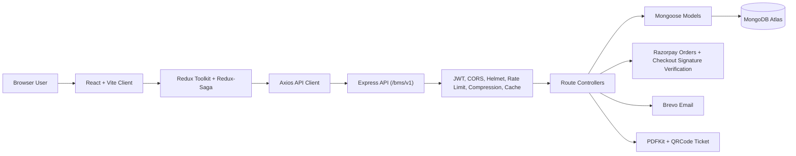
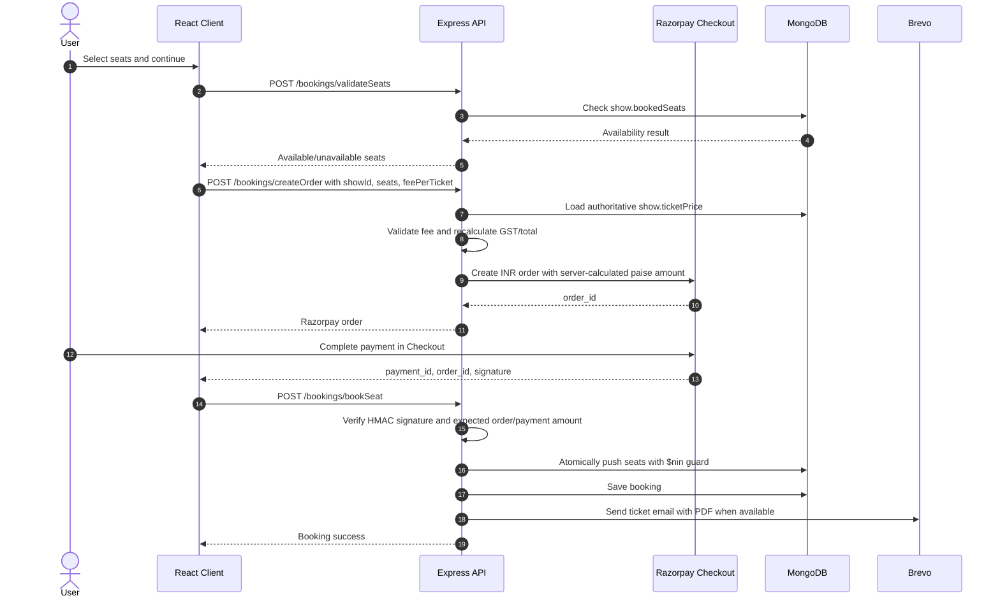

# BookMyShow - Full Stack Movie Ticket Booking Platform

BookMyShow is a production-style MERN movie ticket booking application with role-aware dashboards, movie discovery, theatre/show management, seat booking, Razorpay Checkout payments, Brevo transactional emails, and PDF ticket generation.

| Resource | Link |
| --- | --- |
| GitHub Repository | https://github.com/Shravan-509/BookMyShow |
| Live Demo | https://bkmyshow.netlify.app |
| Frontend Deployment | Netlify |
| Backend Deployment | Render |
| Database | MongoDB Atlas |

## Project Overview

The application supports three primary user roles:

| Role | Main capabilities |
| --- | --- |
| User | Register, verify email, complete 2FA, browse movies, select shows/seats, pay through Razorpay, view booking history, manage profile security |
| Admin | Manage movies, view theatres, manage users, view all bookings |
| Partner | Register/manage owned theatres, create shows, track theatre bookings and revenue |

## Key Features

- Email-based registration verification, two-factor login, password reset, email change verification, and account deletion.
- JWT authentication through HTTP-only cookies with fallback support for bearer or `x-auth-token` headers.
- Movie, theatre, show, user, and booking APIs backed by Mongoose models.
- Razorpay order creation with server-side price calculation, Checkout integration, payment signature and amount verification, atomic seat reservation, booking persistence, PDF ticket creation, and ticket email delivery.
- Redux Toolkit slices with Redux-Saga workflows for async API calls.
- React Router route guards and lazy-loaded route components.
- Helmet headers, CORS, compression, rate limiting, route-level cache middleware, and response-time logging.

## Tech Stack

| Layer | Technologies |
| --- | --- |
| Frontend | React 19, Vite 8, Redux Toolkit, Redux-Saga, React Router 7, Ant Design 6, Axios, Recharts, Tailwind CSS |
| Backend | Node.js, Express 5, Mongoose 9, MongoDB driver 7, JWT, bcrypt, cookie-parser, cors |
| Integrations | Razorpay, Brevo, PDFKit, QRCode |
| Deployment | Netlify, Render, MongoDB Atlas |

## Architecture


```mermaid
flowchart LR
    User["Browser User"] --> Client["React + Vite Client"]
    Client --> Redux["Redux Toolkit + Redux-Saga"]
    Redux --> Axios["Axios API Client"]
    Axios --> API["Express API (/bms/v1)"]
    API --> Middleware["JWT, CORS, Helmet, Rate Limit, Compression, Cache"]
    Middleware --> Controllers["Route Controllers"]
    Controllers --> Models["Mongoose Models"]
    Models --> Atlas[("MongoDB Atlas")]
    Controllers --> Razorpay["Razorpay Orders + Checkout Signature Verification"]
    Controllers --> Brevo["Brevo Email"]
    Controllers --> PDF["PDFKit + QRCode Ticket"]
```

### Payment Flow


```mermaid
sequenceDiagram
    autonumber
    actor User
    participant Client as React Client
    participant API as Express API
    participant Razorpay as Razorpay Checkout
    participant DB as MongoDB
    participant Email as Brevo

    User->>Client: Select seats and continue
    Client->>API: POST /bookings/validateSeats
    API->>DB: Check show.bookedSeats
    DB-->>API: Availability result
    API-->>Client: Available/unavailable seats
    Client->>API: POST /bookings/createOrder with showId, seats, feePerTicket
    API->>DB: Load authoritative show.ticketPrice
    API->>API: Validate fee and recalculate GST/total
    API->>Razorpay: Create INR order with server-calculated paise amount
    Razorpay-->>API: order_id
    API-->>Client: Razorpay order
    User->>Razorpay: Complete payment in Checkout
    Razorpay-->>Client: payment_id, order_id, signature
    Client->>API: POST /bookings/bookSeat
    API->>API: Verify HMAC signature and expected order/payment amount
    API->>DB: Atomically push seats with $nin guard
    API->>DB: Save booking
    API->>Email: Send ticket email with PDF when available
    API-->>Client: Booking success
```

Razorpay webhooks are not implemented in the current codebase. Asynchronous payment reconciliation is listed under future enhancements.

## Project Structure

```text
BookMyShow/
├── .github/
│   └── workflows/               # CI workflow for automated validation
│
├── Client/
│   ├── public/                  # Static frontend assets
│   ├── src/
│   │   ├── api/                 # Axios API modules
│   │   ├── assets/              # SVG/WebP and application assets
│   │   ├── components/          # Reusable layouts, seat UI, loaders, recommendations
│   │   ├── features/            # Auth, home, movies, admin, partner, profile
│   │   ├── hooks/               # Custom React hooks
│   │   ├── redux/               # Store, slices, actions, reducers, and sagas
│   │   ├── test/                # Shared Vitest/React Testing Library setup
│   │   └── utils/               # Formatting, notifications, reminders, validation
│   ├── package.json
│   └── vite.config.js
│
├── Server/
│   ├── config/                  # MongoDB configuration
│   ├── controllers/             # Auth, user, movie, theatre, show, booking logic
│   ├── middlewares/             # Authorization, error, cache, and performance middleware
│   ├── models/                  # Mongoose application schemas
│   ├── routes/                  # REST API route definitions
│   ├── tests/                   # Jest unit and integration tests
│   ├── utils/                   # Email, ID generation, PDF ticket, shared utilities
│   ├── jest.config.js           # Backend Jest configuration
│   ├── package.json
│   └── server.js                # Express application entry point
│
├── docs/
│   ├── screenshots/             # Application screenshots
│   └── ...                      # Architecture, API, database, security, deployment docs
│
├── README.md                    # Project overview and setup instructions
├── CHANGELOG.md                 # Project change history
├── CONTRIBUTING.md              # Contribution guidelines
├── SECURITY.md                  # Security policy
└── LICENSE                      # Project license
```

## Local Setup

Prerequisite Node.js version:

```text
^20.19.0 || >=22.13.0
```

This minimum is driven by Vite 8, Mongoose 9, MongoDB driver 7, and current ESLint package engine requirements.

### Environment Variables

Client `.env`:

```env
VITE_API_URL=http://localhost:3000/bms/v1
VITE_RAZORPAY_KEY_ID=<razorpay-public-key>
```

Server `.env`:

```env
PORT=3000
NODE_ENV=development
PUBLIC_APP_URL=http://localhost:5173
MONGODB_CONNECTION_STRING=<mongodb-atlas-uri>
JWT_SECRET=<long-random-secret>
RAZORPAY_KEY_ID=<razorpay-key-id>
RAZORPAY_KEY_SECRET=<razorpay-key-secret>
BREVO_API_KEY=<brevo-api-key>
BREVO_EMAIL_FROM=<verified-sender-email>
```

### Running Backend

```bash
cd Server
npm install
npm run dev
```

The API mounts routes under `http://localhost:3000/bms/v1`.

### Running Frontend

```bash
cd Client
npm install
npm run dev
```

Open `http://localhost:5173`.

## Deployment

| Surface | Configuration |
| --- | --- |
| Netlify | Base directory `Client`, build command `npm run build`, publish directory `dist` |
| Render | Base directory `Server`, build command `npm install` or `npm ci`, start command `npm start` |
| MongoDB Atlas | Use `MONGODB_CONNECTION_STRING` in Render environment variables |
| Razorpay | Use matching test/live key id on the client and key secret on the server |
| Brevo | Use a verified sender in `BREVO_EMAIL_FROM` |

Set `PUBLIC_APP_URL=https://bkmyshow.netlify.app` on Render so CORS and cookie behavior match the deployed frontend.

## API Documentation

The complete endpoint reference is maintained in [docs/API_REFERENCE.md](docs/API_REFERENCE.md).

Key groups:

| Group | Base path |
| --- | --- |
| Auth | `/bms/v1/auth` |
| Users | `/bms/v1/users` |
| Movies | `/bms/v1/movies` |
| Theatres | `/bms/v1/theatres` |
| Shows | `/bms/v1/shows` |
| Bookings | `/bms/v1/bookings` |

## Security

Implemented controls include bcrypt password hashing, JWT validation, HTTP-only auth cookies, email verification records, 2FA codes, Razorpay signature and amount verification, Helmet headers, CORS origin restriction, rate limiting, backend role checks on privileged route groups, ownership validation, and sensitive-field exclusion in selected responses.

Current authorization model:

- `validateJWT` protects users, movies, theatres, shows, and bookings route groups.
- `validateRole` is mounted on clear admin and partner route groups.
- Frontend routes are role-aware.
- Controller-level ownership checks protect selected partner-owned theatre, show, booking, and revenue workflows.
- Role intent should still be reviewed before expanding backend RBAC to additional ambiguous APIs.

NoSQL injection mitigation was evaluated as part of the security review. `express-mongo-sanitize` is identified as a recommended hardening measure but is not currently enabled in the deployed implementation.

See [docs/SECURITY.md](docs/SECURITY.md).

## Performance

Implemented performance-oriented pieces include React route lazy loading, memoized route wrappers/selectors, Redux-Saga async flows, Vite production bundling, Express compression, route-level NodeCache caching on shared catalogue GET endpoints, private no-store headers for API responses by default, rate limiting, and response-time logging.

See [docs/PERFORMANCE.md](docs/PERFORMANCE.md).

## Screenshots

`docs/screenshots/` is prepared for final submission screenshots. No real screenshots are currently committed. README and report screenshots should only be added after actual captures are placed in that folder.

Recommended capture list: [docs/SCREENSHOTS.md](docs/SCREENSHOTS.md).

## Automated Testing

The project now includes focused automated test suites for both backend and frontend layers. The suites intentionally prioritize critical payment, booking, security, authentication, and role-specific workflows rather than exhaustive coverage of every controller, saga, utility, and UI component.

### Backend

| Area | Current result |
| --- | --- |
| Framework | Jest + Supertest |
| Test suites | 5 passing |
| Tests | 43 passing, 0 failing, 0 skipped |
| Coverage | Statements 24.23%, Branches 24.72%, Functions 30.43%, Lines 24.08% |

Targeted backend coverage includes `BookingController.js` at 56.37% statements, `authorization.js` at 70.96%, `errorHandler.js` at 79.24%, `cache.js` at 72.22%, and 100% statement coverage for `AppError.js`, `asyncHandler.js`, and `idGenerator.js`.

Backend tests cover server-side payment pricing, `feePerTicket` validation, GST/total/paise calculation, Razorpay signature and amount validation, captured-payment validation, payment replay prevention, booking rollback behavior, booking authorization, admin/partner authorization, ownership checks, centralized error handling, and cache-security behavior.

### Frontend

| Area | Current result |
| --- | --- |
| Framework | Vitest + React Testing Library + jsdom |
| Test files | 12 passing |
| Tests | 28 passing, 0 failing, 0 skipped |
| Coverage | Statements 26.36%, Branches 15.13%, Functions 27.69%, Lines 26.03% |

Targeted frontend coverage includes `Checkout.jsx` at 75.94% statements, `Bookings.jsx` at 76.81%, `SeatLayout.jsx` at 61.84%, `UserManagement.jsx` at 97.29%, and `TheatreBooking.jsx` at 93.54%.

Frontend tests cover login validation, login failure behavior, forgot-password flow, seat selection, checkout pricing, Razorpay flow through mocks, booking redirect, booking failure display, booking-history fetch behavior, Redux booking state, personal profile validation, email-change modal behavior, reminder settings, admin user filtering, and partner theatre booking.

### Running Tests

```bash
cd Server
npm test
npm run test:coverage

cd ../Client
npm test
npm run test:coverage
```

## Documentation

| Document | Purpose |
| --- | --- |
| [Project Documentation](docs/PROJECT_DOCUMENTATION.md) | Complete technical documentation |
| [API Reference](docs/API_REFERENCE.md) | Endpoint reference |
| [Architecture](docs/ARCHITECTURE.md) | System architecture and flows |
| [Database Schema](docs/DATABASE_SCHEMA.md) | Mongoose model details |
| [Database](docs/DATABASE.md) | Data model and persistence notes |
| [Deployment](docs/DEPLOYMENT.md) | Hosting and environment setup |
| [Security](docs/SECURITY.md) | Implemented controls and hardening gaps |
| [Performance](docs/PERFORMANCE.md) | Optimization notes |
| [State Management](docs/STATE_MANAGEMENT.md) | Redux slices and sagas |
| [Error Handling](docs/ERROR_HANDLING.md) | Error response strategy |
| [Folder Structure](docs/FOLDER_STRUCTURE.md) | Repository layout |
| [Diagrams](docs/DIAGRAMS.md) | Mermaid diagram catalog |
| [Screenshots](docs/SCREENSHOTS.md) | Screenshot capture checklist |

## Known Limitations

- Razorpay webhook reconciliation is not implemented.
- Booking cancellation and refund lifecycle APIs are not implemented.
- Some ambiguous APIs still require manual role-intent review before additional backend RBAC is added.
- `tokenVersion` is incremented in profile/security flows but is not validated by `validateJWT`.
- Cache invalidation after movie/theatre/show mutations is not implemented.
- Automated coverage prioritizes critical workflows and is not yet exhaustive across every controller, saga, utility, and frontend component.
- Screenshots must still be captured from the running application.

## Future Enhancements

- Razorpay webhook support for asynchronous payment reconciliation.
- Broader backend role review for APIs whose intended access policy remains ambiguous.
- Expand backend coverage for full authentication/email/2FA flows.
- Add broader Movie/Theatre/Show/User CRUD controller tests.
- Add database-backed integration tests for booking concurrency.
- Add additional Redux-Saga tests.
- Add end-to-end browser testing in the future if desired.
- Booking cancellation, refund tracking, and ticket status lifecycle.
- Structured application logging and external monitoring.
- Cache invalidation hooks after write operations.

## License

This project is licensed under the MIT License. See [LICENSE](LICENSE).

## Author

Shravan Kumar Atti  
GitHub: [@Shravan-509](https://github.com/Shravan-509)
