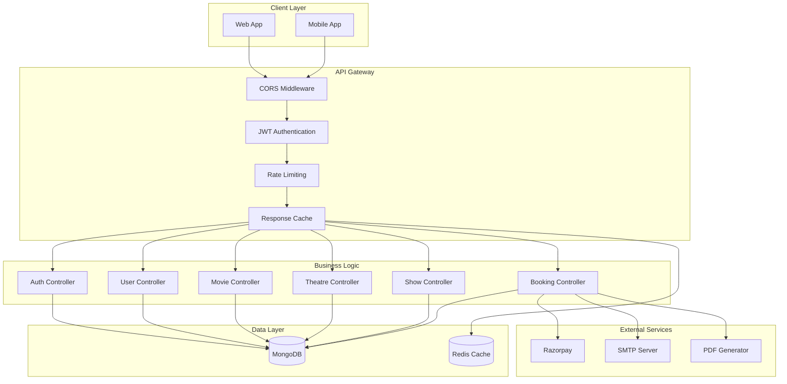
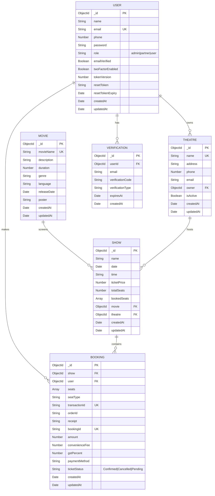
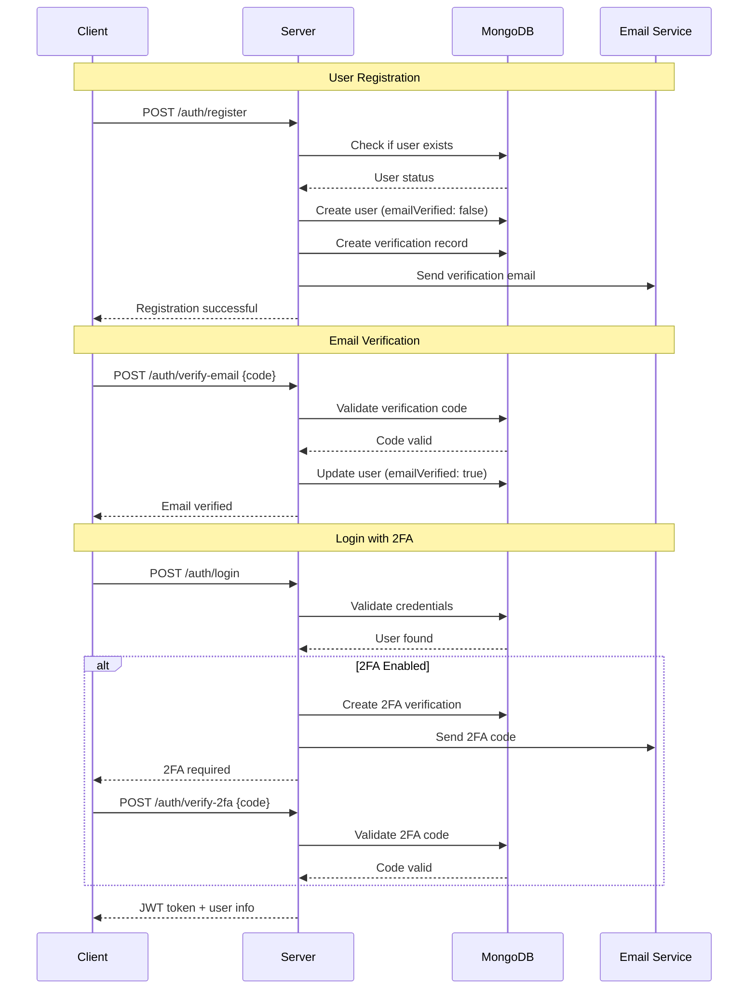
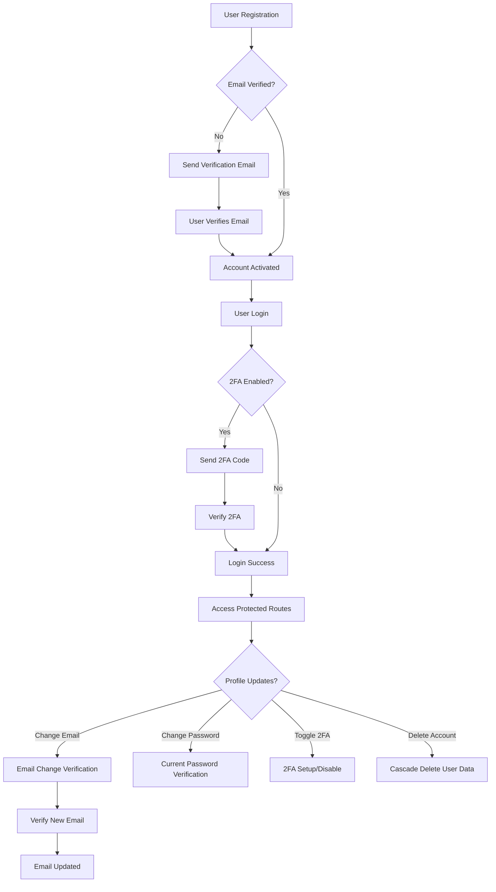
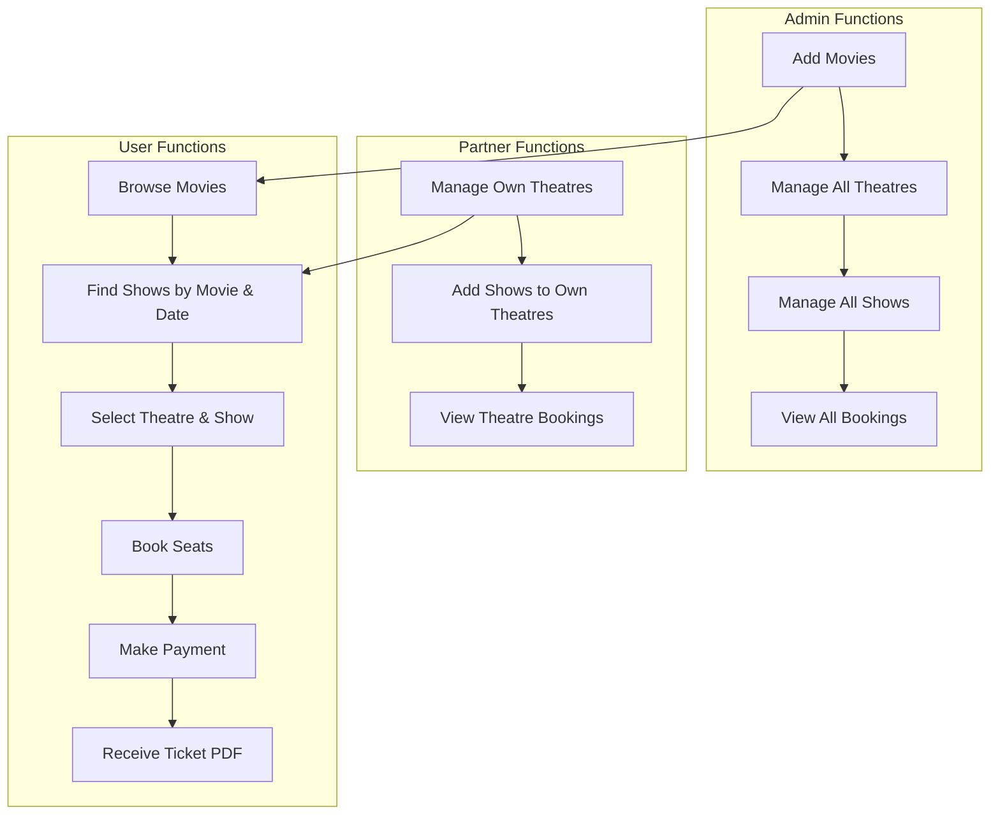
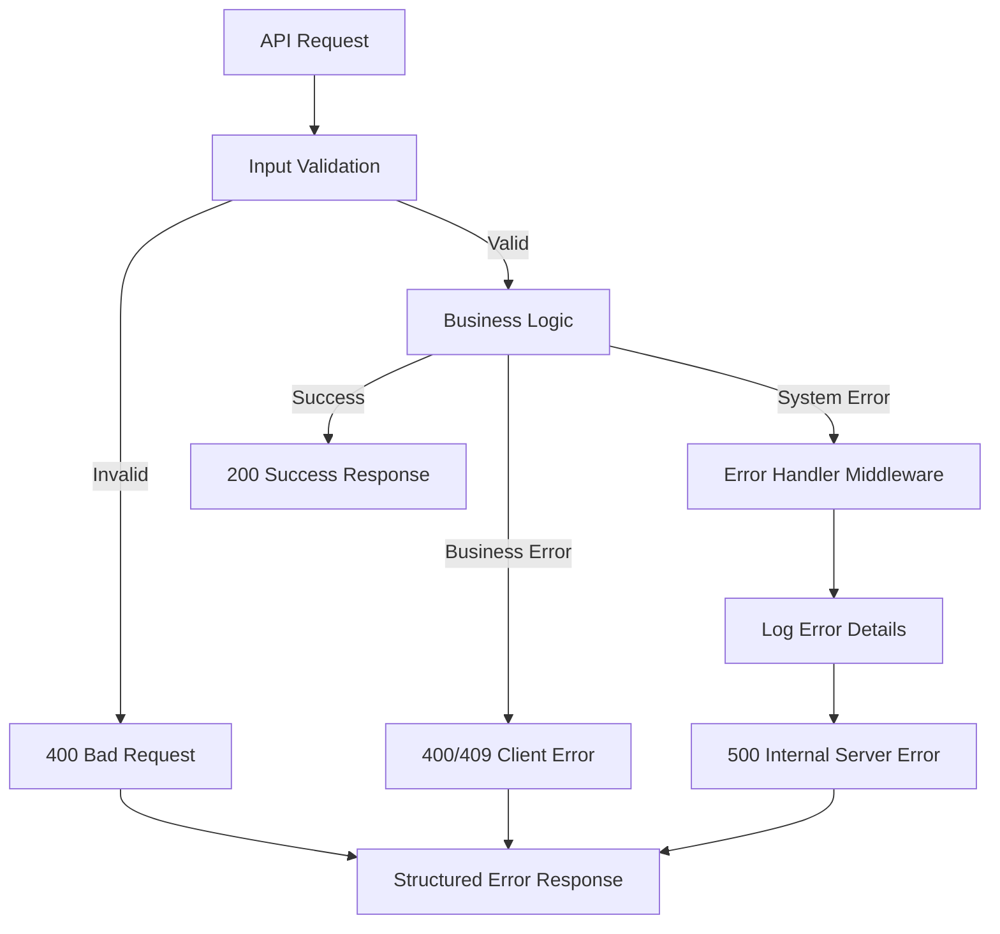
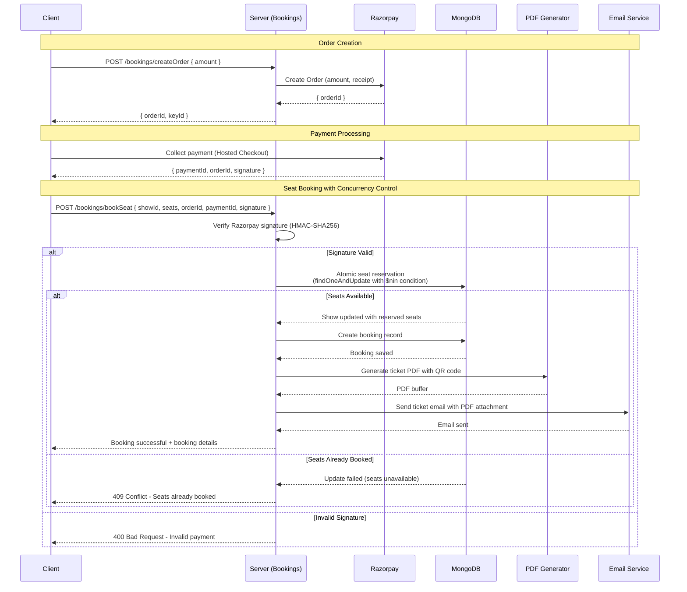
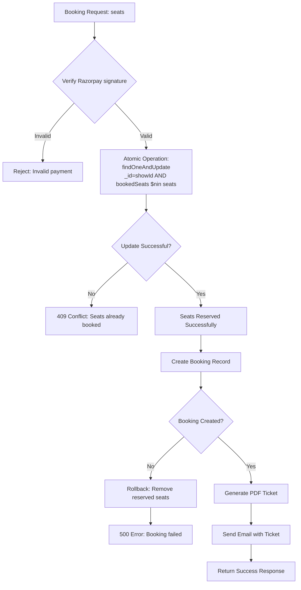
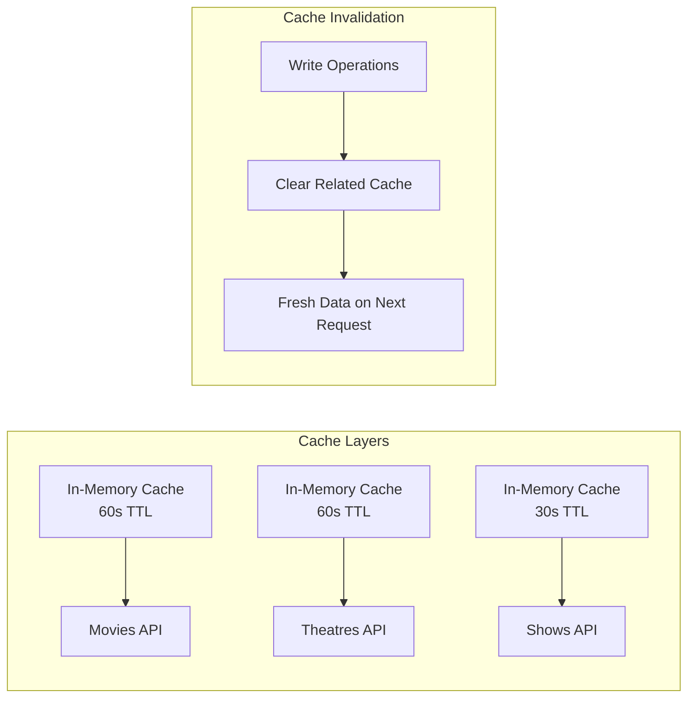

# BookMyShow Backend (Server)

## Table of Contents

1. [Project Overview](#project-overview)
2. [Setup & Installation](#setup--installation)
3. [Environment Variables](#environment-variables)
4. [Project Structure](#project-structure)
5. [Database Configuration](#database-configuration)
6. [API Endpoints](#api-endpoints)
7. [Authentication & Authorization](#authentication--authorization)
8. [Controllers & Business Logic](#controllers--business-logic)
9. [Middleware](#middleware)
10. [Error Handling](#error-handling)
11. [Email Service](#email-service)
12. [Payment Integration](#payment-integration)
13. [Development Workflow](#development-workflow)
14. [Performance Optimization](#performance-optimization)
15. [Deployment](#deployment)
16. [Troubleshooting](#troubleshooting)
17. [Future Enhancements](#future-enhancements)
18. [Acknowledgments](#acknowledgements)

---

## Project Overview

The BookMyShow server is a robust Express.js backend API that handles authentication, movie management, theatre operations, show scheduling, and ticket bookings. It features JWT authentication, Razorpay payment integration, email notifications, and comprehensive security measures.

### Tech Stack

| Technology | Version | Purpose |
|-----------|---------|---------|
| Node.js | 16+ | Runtime environment |
| Express.js | 4.x | Web framework |
| MongoDB | 5.x | NoSQL database |
| Mongoose | 7.x | ODM for MongoDB |
| JWT | - | Authentication |
| Bcrypt | 5.x | Password hashing |
| Nodemailer | 6.x | Email service |
| Razorpay | 2.x | Payment gateway |
| PDFKit | 0.13.x | PDF generation |
| Dotenv | 16.x | Environment variables |

### Key Features

- **User Management**: Registration, authentication, profile management
- **Movie Management**: CRUD operations for movies
- **Theatre Management**: Theatre registration and management
- **Show Management**: Show scheduling and seat management
- **Booking System**: Booking creation, payment processing, cancellation
- **Email Service**: Transactional emails for confirmations and notifications with templates
- **Payment Integration**: Razorpay payment gateway integration
- **Security**: JWT authentication, password hashing, email verification

### System Architecture



---

## Setup & Installation

### Prerequisites

- Node.js 16+ and npm
- MongoDB Atlas account
- Razorpay account
- SendGrid/Nodemailer email service
- Git

### Installation Steps

```bash
# Clone repository
git clone https://github.com/yourusername/bookmyshow.git
cd bookmyshow/Server

# Install dependencies
npm install

# Create environment file
cp .env.example .env

# Edit .env with your configuration
```

### Running the Server

**Development Mode:**
```bash
npm run dev
```
Uses nodemon for auto-restart on file changes

**Production Mode:**
```bash
npm start
```

---

## Environment Variables

Create a `.env` file in the Server directory with the following variables:

```env
# Server Configuration
PORT=5000
NODE_ENV=development
PUBLIC_APP_URL=http://localhost:5173

# Database
MONGODB_CONNECTION_STRING=mongodb://localhost:27017/bookmyshow

# Authentication
JWT_SECRET=your_super_secret_jwt_key_change_this_in_production
JWT_EXPIRY=7d
JWT_REFRESH_SECRET=your_refresh_token_secret
JWT_REFRESH_EXPIRY=30d

# Email Configuration (Gmail)
EMAIL_HOST=smtp.gmail.com
EMAIL_PORT=587
EMAIL_SECURE=false
EMAIL_USER=your_email@gmail.com
EMAIL_PASSWORD=your-app-specific-password
EMAIL_FROM=BookMyShow <noreply@bookmyshow.com>

# Email Service (SendGrid Email - Alternative)
SENDGRID_API_KEY=your_sendgrid_api_key
SENDGRID_FROM_EMAIL=your_sendgrid_email_id

# Email Service (Resend - Alternative)
RESEND_API_KEY=your_resend_api_key

# Payment Gateway
RAZORPAY_KEY_ID=your_razorpay_key_id
RAZORPAY_KEY_SECRET=your_razorpay_key_secret

# Cache Configuration
CACHE_TTL=3600
```

### Getting Credentials

#### Gmail App Password
1. Enable 2FA on your Google account
2. Go to [App Passwords](https://myaccount.google.com/apppasswords)
3. Generate app password for Mail
4. Use this password in `EMAIL_PASSWORD`

#### Razorpay Keys
1. Sign up at [Razorpay](https://razorpay.com)
2. Go to Settings → API Keys
3. Copy Key ID and Key Secret

#### MongoDB Connection String
1. Create cluster on [MongoDB Atlas](https://www.mongodb.com/cloud/atlas)
2. Create database user
3. Get connection string
4. Replace username and password

---
## Project Structure

### Directory Organization

```
Server/
├── config/
│   └── db.js                      # MongoDB connection configuration
│
├── controllers/                   # Business logic layer
│   ├── AuthController.js          # Authentication logic
│   │   ├── register()
│   │   ├── login()
│   │   ├── verifyEmail()
│   │   ├── resendVerification()
│   │   ├── verify2FA()
│   │   ├── resend2FA()
│   │   ├── reverifyEmail()
│   │   ├── logoutUser()
│   │   ├── forgotPassword()
│   │   └── resetPassword()
│   │
│   ├── UserController.js          # User management
│   │   ├── getProfile()
│   │   ├── updateProfile()
│   │   ├── changePassword()
│   │   ├── changeEmail()
│   │   ├── deleteAccount()
│   │   └── getReminderSettings()
│   │
│   ├── MovieController.js         # Movie operations
│   │   ├── getMovies()
│   │   ├── getMovieById()
│   │   ├── addMovie()
│   │   ├── updateMovie()
│   │   ├── deleteMovie()
│   │   └── searchMovies()
│   │
│   ├── TheatreController.js       # Theatre operations
│   │   ├── getTheatres()
│   │   ├── getTheatreById()
│   │   ├── addTheatre()
│   │   ├── updateTheatre()
│   │   └── deleteTheatre()
│   │
│   ├── ShowController.js          # Show management
│   │   ├── addShow()
│   │   ├── updateShow()
│   │   ├── deleteShow()
│   │   ├── getShowById()
│   │   ├── getAllShowsByTheatre()
│   │   └── getTheatresWithShowsByMovie()
│   │
│   └── BookingController.js       # Booking operations
│       ├── validateSeats()
│       ├── bookSeat()
│       ├── getBookingsByUserId()
│       └── createOrder()
│
├── models/                        # MongoDB schemas
│   ├── userSchema.js              # User model
│   │   ├── email (unique)
│   │   ├── password (hashed)
│   │   ├── name
│   │   ├── phone
│   │   ├── role (user/admin/partner)
│   │   ├── emailVerified
│   │   ├── twoFactorEnabled
│   │   ├── resetToken
│   │   ├── resetTokenExpiry
│   │   └── tokenVersion
│   │
│   ├── movieSchema.js             # Movie model
│   │   ├── movieName
│   │   ├── description
│   │   ├── genre
│   │   ├── language
│   │   ├── duration
│   │   ├── releaseDate
│   │   └── poster
│   │
│   ├── theatreSchema.js           # Theatre model
│   │   ├── name
│   │   ├── address
│   │   ├── phone
│   │   ├── email
│   │   ├── owner (userId)
│   │   └── isActive
│   │
│   ├── showSchema.js              # Show model
│   │   ├── movie (movieId)
│   │   ├── theatre (theatreId)
│   │   ├── name
│   │   ├── time
│   │   ├── date
│   │   ├── ticketPrice
│   │   ├── totalSeats
│   │   └── bookedSeats
│   │
│   ├── bookingSchema.js           # Booking model
│   │   ├── user (userId)
│   │   ├── show (showId)
│   │   ├── seats
|   |   ├── seatType
|   |   ├── transactionId
|   |   ├── orderId
|   |   ├── receipt
|   |   ├── bookingId
│   │   ├── amount
|   |   ├── convenienceFee
|   |   ├── gstPercent
|   |   ├── paymentMethod
│   │   └── ticketStatus (Pending/Confirmed/Cancelled)
│   │
│   └── verificationSchema.js      # Email verification model
│       ├── userId
│       ├── code
│       ├── type (email, 2fa, reverify, email-change)
│       ├── expiresAt
│       └── metadata
│
├── routes/                        # API routes
│   ├── authRoute.js               # Authentication routes
│   │   ├── POST /register
│   │   ├── POST /verify-email
│   │   ├── POST /resend-verification
│   │   ├── POST /request-reverification
│   │   ├── POST /login
│   │   ├── POST /verify-2fa
│   │   ├── POST /resend-2fa
│   │   ├── POST /forgot-password
│   │   ├── POST /reset-password
│   │   └── POST /logout
│   │
│   ├── userRoute.js               # User routes
│   │   ├── GET /profile
│   │   ├── PUT /update-profile
│   │   ├── PUT /change-password
│   │   ├── POST /request-email-change
│   │   ├── POST /verify-email-change
│   │   ├── PUT /toggle-2fa
│   │   └── DELETE /account
│   │
│   ├── movieRoute.js              # Movie routes
│   │   ├── GET /
│   │   ├── GET /:id
│   │   ├── POST / (Admin)
│   │   ├── PATCH /:id (Admin)
│   │   ├── DELETE /:id (Admin)
│   │   └── GET /search
│   │
│   ├── theatreRoute.js            # Theatre routes
│   │   ├── GET /
│   │   ├── POST / (Partner)
│   │   ├── PATCH /:id (Partner)
│   │   └── DELETE /:id (Partner)
│   │
│   ├── showRoute.js               # Show routes
│   │   ├── GET /:id
│   │   ├── POST / (Partner)
│   │   ├── PATCH /:id (Partner)
│   │   ├── DELETE /:id (Partner)
│   │   ├── GET /theatre/:id
│   │   └── POST /theatres/movie
│   │
│   └── bookingRoute.js            # Booking routes
│       ├── GET /:id
│       ├── POST /validateSeats
│       ├── POST /createOrder
│       └── POST /bookSeat
│
├── middlewares/                   # Express middlewares
│   ├── authorization.js           # JWT verification
│   │   └── validateJWT()
│   │
│   ├── errorHandler.js            # Global error handling
│   │   └── errorHandler()
│   │
│   └── cache.js                   # Response caching
│       └── cacheMiddleware()
│
├── utils/                         # Utility functions
│   ├── email.js                   # Email service
│   │   ├── sendVerificationEmail()
│   │   ├── sendPasswordResetEmail()
│   │   ├── sendTicketEmail()
│   │   └── sendSecurityNotificationEmail() 
│   │
│   ├── idGenerator.js             # ID generation
│   │   └── generateBookingId()
│   │
│   ├── ticket-pdf.js              # PDF ticket generation
│   │   └── generateTicketPDF()
│   │
│   └── email_templates/           # Email HTML templates
│       ├── account-deleted.html 
│       ├── email-change.html 
│       ├── email-changed.html 
│       ├── email-verification.html
│       ├── movie-ticket.html 
│       ├── password-changed.html
│       ├── password-reset.html
│       ├── reverification.html
│       └── two-factor-auth.html
│
├── server.js                      # Express app setup & entry point
├── package.json                   # Dependencies
├── .env.example                   # Environment variables template
└── DOCUMENTATION.md               # Server documentation
```
---

## Database Configuration

### MongoDB Connection

```javascript
// config/db.js
const connectDB = async () => {
  try {
    await mongoose.connect(process.env.MONGODB_CONNECTION_STRING, {
      useNewUrlParser: true,
      useUnifiedTopology: true
    });
    console.log('MongoDB connected successfully');
  } catch (error) {
    console.error('MongoDB connection error:', error);
    process.exit(1);
  }
};
```

### Database Indexes

```javascript
// Create indexes for frequently queried fields
userSchema.index({ email: 1 });
userSchema.index({ phone: 1 });
movieSchema.index({ movieName: 1 });
theatreSchema.index({ owner: 1 });
showSchema.index({ movie: 1 });
showSchema.index({ theatre: 1 });
showSchema.index({ date: 1 });
bookingSchema.index({ bookingId: 1 });
bookingSchema.index({ user: 1 });
bookingSchema.index({ show: 1 });
verificationSchema.index({ userId: 1 });
verificationSchema.index({ expiresAt: 1 });
```

### Database Schemas

**User Schema**
```javascript
{
  name: String (required),
  email: String (required, unique),
  phone: Number (required, unique),
  password: String (required, hashed),
  role: String (enum: ["admin", "partner", "user"]),
  emailVerified: Boolean,
  twoFactorEnabled: Boolean,
  resetToken: String,
  resetTokenExpiry: Date,
  tokenVersion: Number,
  timestamps: true
}
```

**Movie Schema**
```javascript
{
  movieName: String (required, unique),
  description: String (required),
  duration: Number (required),
  genre: Array (required),
  language: Array (required),
  releaseDate: Date (required),
  poster: String (required),
  timestamps: true
}
```

**Theatre Schema**
```javascript
{
  name: String (required),
  address: String (required),
  phone: Number (required),
  email: String (required),
  owner: ObjectId (ref: User),
  isActive: Boolean (default: false),
  timestamps: true
}
```

**Show Schema**
```javascript
{
  name: String (required),
  date: Date (required),
  time: String (required),
  movie: ObjectId (ref: Movie, required),
  ticketPrice: Number (required),
  totalSeats: Number (required),
  bookedSeats: Array (default: []),
  theatre: ObjectId (ref: Theatre, required),
  timestamps: true
}
```

**Booking Schema**
```javascript
{
  show: ObjectId (ref: Show, required),
  user: ObjectId (ref: User, required),
  seats: Array (required),
  seatType: String (default: "Standard"),
  transactionId: String (required),
  orderId: String (required),
  receipt: String (required),
  bookingId: String (required, unique, indexed),
  amount: Number (required),
  convenienceFee: Number (default: 0),
  gstPercent: Number (default: 18),
  paymentMethod: String (default: "N/A"),
  ticketStatus: String (enum: ["Confirmed", "Cancelled", "Pending"]),
  timestamps: true
}
```

**Verification Schema**
```javascript
{
  userId: ObjectId (ref: User, required),
  code: String (required, 6-digit),
  type: String (enum: ["email", "2fa", "reverify", "email-change"]),
  expiresAt: Date (required),
  timestamps: true
}
```

### Data Models


---

## API Endpoints

### Authentication Endpoints (`/bms/v1/auth`)

| Method | Endpoint | Description | Auth Required |
|--------|----------|-------------|----------------|
| POST | `/register` | Register new user | No |
| POST | `/login` | User login | No |
| POST | `/verify-email` | Verify email with code | No |
| POST | `/resend-verification` | Resend verification code | No |
| POST | `/request-reverification` | Request re-verification for unverified accounts | No |
| POST | `/verify-2fa` | Verify 2FA code | No |
| POST | `/resend-2fa` | Resend 2FA code | No |
| POST | `/logout` | User logout | Yes |
| POST | `/forgot-password` | Request password reset | No |
| POST | `/reset-password` | Reset password with token | No |

### User Endpoints (`/bms/v1/users`)

| Method | Endpoint | Description | Auth Required |
|--------|----------|-------------|----------------|
| GET | `/profile` | Get current user profile | Yes |
| PUT | `/update-profile` | Update user profile | Yes |
| POST | `/request-email-change` | Initiate email change process | Yes |
| POST | `/verify-email-change` | Complete email change with verification | Yes |
| PUT | `/toggle-2fa` | Enable/disable two-factor authentication | Yes |
| PUT | `/change-password` | Change password with verification | Yes |
| DELETE | `/delete-account` | Delete user account with cascade deletion | Yes |

### Movie Endpoints (`/bms/v1/movies`)

| Method | Endpoint | Description | Auth Required |
|--------|----------|-------------|----------------|
| GET | `/` | Get all movies (Cached 60s) | Yes |
| GET | `/:id` | Get specific movie details | Yes |
| POST | `/` | Create movie (Admin only) | Yes |
| PATCH | `/:id` | Update movie (Admin only) | Yes |
| DELETE | `/:id` | Delete movie (Admin only) | Yes |

### Theatre Endpoints (`/bms/v1/theatres`)

| Method | Endpoint | Description | Auth Required |
|--------|----------|-------------|----------------|
| GET | `/` | Get all theatres (Role-based: Admin sees all, Partners see owned) (Cached 60s) | Yes |
| POST | `/` | Create theatre (Partner only) | Yes |
| PATCH | `/:id` | Update theatre (Partner only) | Yes |
| DELETE | `/:id` | Delete theatre (Partner only) | Yes |

### Show Endpoints (`/bms/v1/shows`)

| Method | Endpoint | Description | Auth Required |
|--------|----------|-------------|----------------|
| GET | `/` | Get all shows | Yes |
| GET | `/:id` | Get specific show with movie and theatre details (Cached 30s) | Yes |
| POST | `/` | Create show (Partner only) | Yes |
| PATCH | `/:id` | Update show (Partner only) | Yes |
| DELETE | `/:id` | Delete show (Partner only) | Yes |
| GET | `/theatre/:id` | Get all shows for a specific theatre (Cached 30s) | Yes |
| POST | `/theatres/movie` | Retrieve theatres showing a specific movie on a date | Yes |


### Booking Endpoints (`/bms/v1/bookings`)

| Method | Endpoint | Description | Auth Required |
|--------|----------|-------------|----------------|
| GET | `/` | Get user bookings | Yes |
| GET | `/:id` | Get User's booking details | Yes |
| POST | `/bookSeat` | Create seat booking with payment verification | Yes |
| POST | `/createOrder` | Create Razorpay payment Orders | Yes |
| POST | `/validateSeats` | Validate Seat Availability | Yes |
| DELETE | `/:id` | Cancel booking | Yes |

---

## Authentication & Authorization

### JWT Token Structure

```javascript
{
  // Header
  {
    "alg": "HS256",
    "typ": "JWT"
  }
  
  // Payload
  {
    "userId": "507f1f77bcf86cd799439011",
    "iat": 1634567890,
    "exp": 1634654290  // 24 hours
  }
  
  // Signature
  HMACSHA256(
    base64UrlEncode(header) + "." +
    base64UrlEncode(payload),
    secret
  )
}
```

### Authentication Flow



### Role-Based Access Control

```javascript
// Middleware for role checking
const checkRole = (allowedRoles) => {
  return async (req, res, next) => {
    const user = await User.findById(req.body.userId);
    if (!allowedRoles.includes(user.role)) {
      return res.status(403).json({ message: 'Forbidden' });
    }
    next();
  };
};

// Usage
router.post('/movies', checkRole(['admin']), createMovie);
```

---

## Controllers & Business Logic

### AuthController

**Methods:**

- **register(req, res, next)** - User registration
- **verifyEmail(req, res, next)** - Email verification
- **resendVerification(req, res, next)** - Resend verification code
- **login(req, res, next)** - User login
- **verify2FA(req, res, next)** - 2FA verification
- **resend2FA(req, res, next)** - Resend 2FA code
- **reverifyEmail(req, res, next)** - Re-verification request
- **logoutUser(req, res, next)** - User logout
- **forgotPassword(req, res, next)** - Password reset request
- **resetPassword(req, res, next)** - Password reset

### UserController

Handles user profile operations:
- Get user profile
- Update user profile
- Change email
- Change password
- Delete account

### MovieController

Handles movie management (Admin only):
- Get all movies
- Get movie by ID
- Create movie
- Update movie
- Delete movie

### TheatreController

Handles theatre management (Partner only):
- Get all theatres
- Get theatre by ID
- Create theatre
- Update theatre
- Delete theatre

### ShowController

Handles show management (Partner only):
- Get all shows
- Get show by ID
- Create show
- Update show
- Delete show
- Get available seats

### BookingController

Handles booking operations:
- Get user bookings
- Get booking by ID
- Create booking
- Verify Razorpay payment
- Cancel booking
- Generate ticket PDF

## User Management Flow



## Movie & Theatre Management



---

## Middleware

### Request Flow

```
Request
    ↓
CORS Middleware
    ↓
Helmet Security Headers
    ↓
Compression
    ↓
Body Parser
    ↓
Cookie Parser
    ↓
Rate Limiter
    ↓
JWT Validation (for protected routes)
    ↓
Route Handler
    ↓
Error Handler
    ↓
Response
```

### Authorization Middleware

```javascript
const validateJWT = (req, res, next) => {
  try {
    const access_token = req.cookies.access_token || req.header("x-auth-token");
    
    if (!access_token) {
      return res.status(401).json({ message: 'Unauthorized' });
    }
    
    const decoded = jwt.verify(access_token, process.env.JWT_SECRET);
    req.body.userId = decoded.userId;
    next();
  } catch (error) {
    res.status(401);
    next(error);
  }
};
```

### Error Handler Middleware

```javascript
const errorHandler = (err, req, res, next) => {
  const status = res.statusCode || 500;
  const message = err.message || 'Internal Server Error';
  
  res.status(status).json({
    success: false,
    message,
    error: process.env.NODE_ENV === 'development' ? err : {}
  });
};
```

---

## Error Handling

### Error Response Format

```json
{
  "success": false,
  "message": "Error description",
  "error": { /* error details in development */ }
}
```

### HTTP Status Codes

- **200:** Success
- **201:** Created
- **400:** Bad Request
- **401:** Unauthorized
- **403:** Forbidden
- **404:** Not Found
- **409:** Conflict (duplicate)
- **500:** Server Error

### Error Handling Pattern

```javascript
try {
  // Business logic
  const result = await someOperation();
  res.status(200).json({ success: true, data: result });
} catch (error) {
  res.status(400);
  next(error); // Pass to error handler
}
```



---

## Email Service

### Email Providers

**SendGrid:**
- Primary email provider
- Reliable delivery
- Good for production

**Nodemailer:**
- Fallback provider
- Uses Gmail/custom SMTP
- Good for development

**Resend:**
- Alternative provider
- Modern API

### Email Templates

All templates are HTML-based with:
- Responsive design
- Branding
- Clear call-to-action
- Unsubscribe link

### Sending Emails

```javascript
const sendVerificationEmail = async (email, code, type) => {
  const template = getTemplate(type);
  const html = template.replace('{{code}}', code);
  
  try {
    await sendGridMail.send({
      to: email,
      from: process.env.EMAIL_FROM,
      subject: 'Email Verification',
      html
    });
  } catch (error) {
    // Fallback to Nodemailer
    await nodemailer.sendMail({
      to: email,
      from: process.env.NODEMAILER_EMAIL,
      subject: 'Email Verification',
      html
    });
  }
};
```

---

## Payment Integration

### Razorpay Integration

**Setup:**
1. Create Razorpay account
2. Get API keys
3. Add to environment variables

**Payment Flow:**

1. **Create Order:**
   ```javascript
   const razorpay = new Razorpay({
     key_id: process.env.RAZORPAY_KEY_ID,
     key_secret: process.env.RAZORPAY_KEY_SECRET
   });
   
   const order = await razorpay.orders.create({
     amount: amount * 100, // in paise
     currency: 'INR',
     receipt: bookingId
   });
   ```

2. **Verify Payment:**
   ```javascript
   const crypto = require('crypto');
   
   const signature = crypto
     .createHmac('sha256', process.env.RAZORPAY_KEY_SECRET)
     .update(orderId + '|' + paymentId)
     .digest('hex');
   
   if (signature === razorpaySignature) {
     // Payment verified
   }
   ```

3. **Update Booking:**
   - Mark as confirmed
   - Update seat status
   - Generate ticket
   - Send confirmation email

### Booking & Payment Flow



### Concurrency Control (Preventing Double Booking)


---

## Development Workflow

### Adding a New Endpoint

1. **Create model** (if needed):
   ```javascript
   // models/newSchema.js
   const newSchema = new mongoose.Schema({
     // fields
   });
   ```

2. **Create controller:**
   ```javascript
   // controllers/NewController.js
   const getAll = async (req, res, next) => {
     try {
       const data = await New.find();
       res.json({ success: true, data });
     } catch (error) {
       next(error);
     }
   };
   ```

3. **Create routes:**
   ```javascript
   // routes/newRoute.js
   router.get('/', getAll);
   router.post('/', create);
   ```

4. **Add to server:**
   ```javascript
   // server.js
   app.use('/bms/v1/new', validateJWT, newRoute);
   ```

### Testing Endpoints

**Using cURL:**
```bash
curl -X POST http://localhost:3000/bms/v1/auth/login \
  -H "Content-Type: application/json" \
  -d '{"email":"user@example.com","password":"password"}'
```

**Using Postman:**
1. Create collection
2. Add requests
3. Set environment variables
4. Test endpoints

---

## Performance Optimization

### Database Optimization

- **Indexing:** Create indexes on frequently queried fields
- **Aggregation:** Use MongoDB aggregation for complex queries
- **Pagination:** Implement pagination for large datasets

### API Optimization

- **Response Compression:** Enabled by default
- **Pagination:** Limit response size
- **Selective Fields:** Return only needed fields

### Caching

- **In-Memory Cache:** Use node-cache for frequently accessed data
- **Redis:** Consider Redis for distributed caching



---

## Deployment

### Environment Setup

1. Set all environment variables
2. Configure MongoDB Atlas
3. Set up email service
4. Configure Razorpay

### Production Checklist

- [ ] NODE_ENV=production
- [ ] JWT_SECRET is strong
- [ ] CORS configured correctly
- [ ] Rate limiting enabled
- [ ] Error logging configured
- [ ] Database backups enabled
- [ ] Email service configured
- [ ] Razorpay keys set
- [ ] HTTPS enabled
- [ ] Security headers configured

---

## Troubleshooting

### Common Issues

**MongoDB Connection Failed:**
- Check MONGODB_CONNECTION_STRING
- Verify IP whitelist
- Check network connectivity

**JWT Token Invalid:**
- Check JWT_SECRET
- Verify token expiry
- Check token format

**Email Not Sending:**
- Check SendGrid/Nodemailer config
- Verify API keys
- Check email templates

**Razorpay Payment Failed:**
- Check API keys
- Verify signature
- Check amount calculation

---

## Future Enhancements

### Technical Improvements
- **Webhook Integration**: Add Razorpay webhooks for real-time payment updates
- **Distributed Caching**: Implement Redis for horizontal scaling
- **Database Transactions**: Use MongoDB transactions for stronger consistency
- **API Versioning**: Implement proper API versioning strategy
- **GraphQL**: Consider GraphQL for flexible data fetching
- **Microservices**: Split into domain-specific services

### Business Features
- **Seat Selection UI**: Visual seat map for better UX
- **Dynamic Pricing**: Time-based and demand-based pricing
- **Loyalty Program**: Points and rewards system
- **Social Features**: Reviews, ratings, and recommendations
- **Mobile App**: Native mobile applications
- **Analytics Dashboard**: Business intelligence and reporting

### Security Enhancements
- **CSRF Protection**: Cross-site request forgery protection
- **API Rate Limiting**: More sophisticated rate limiting
- **Audit Logging**: Comprehensive audit trail
- **Data Encryption**: Encrypt sensitive data at rest
- **Security Scanning**: Automated vulnerability scanning

---

This comprehensive documentation covers all aspects of the BookMyShow backend system, providing detailed insights into architecture, data flow, security measures, and implementation details for developers and stakeholders.

## 

This project is open-source and available under the [MIT License](../LICENSE).

---

## Acknowledgements

This project uses the following open-source packages and services:

* [Node.js](https://nodejs.org/en) – JavaScript runtime for backend development

* [Express.js](https://expressjs.com/) – Web framework for handling HTTP routes and middleware

* [MongoDB](https://www.mongodb.com/) – NoSQL database used for storing movie and user data

* [Mongoose](https://mongoosejs.com/) – Elegant MongoDB object modeling for Node.js

* [Google Auth Library](https://github.com/googleapis/google-auth-library-nodejs) – Secure Google OAuth integration

* [jsonwebtoken (JWT)](https://github.com/auth0/node-jsonwebtoken) – Authentication token creation and validation

* [bcrypt](https://github.com/kelektiv/node.bcrypt.js) – Password hashing and verification

* [Nodemailer](https://nodemailer.com/) – Sending transactional emails from the backend

* [Axios](https://axios-http.com/) – Promise-based HTTP client for the browser and Node.js

* [Helmet](https://helmetjs.github.io/) – Secures Express apps by setting HTTP headers

* [CORS](https://github.com/expressjs/cors) – Cross-Origin Resource Sharing middleware

* [Morgan](https://github.com/expressjs/morgan) – HTTP request logger middleware for Node.js

* [dotenv](https://github.com/motdotla/dotenv) – Loads environment variables from a .env file

* [Express Rate Limit](https://www.npmjs.com/package/express-rate-limit) – Basic rate-limiting middleware

* [Compression](https://github.com/expressjs/compression) – Gzip compression middleware for Express

* [Node Cache](https://github.com/node-cache/node-cache) – Simple and fast Node.js internal caching

* [Handlebars](https://handlebarsjs.com/) – Templating engine used for generating dynamic HTML


---

## 🧠 Author

**Shravan Kumar Atti**<br>
*Pre-sales Architect | Full-stack Developer*

GitHub: [@Shravan-509](https://github.com/Shravan-509)

---
**Last Updated**: October 2024  
**Version**: 1.0.0
