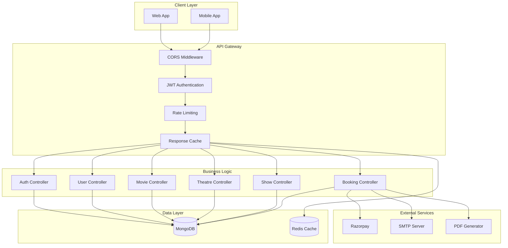
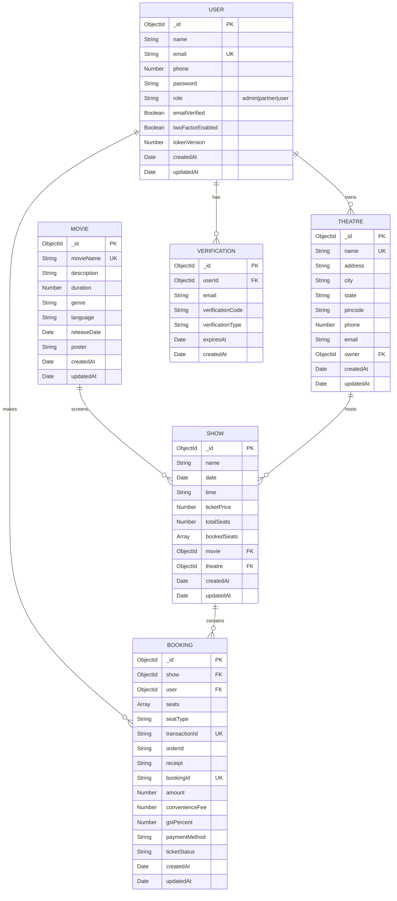
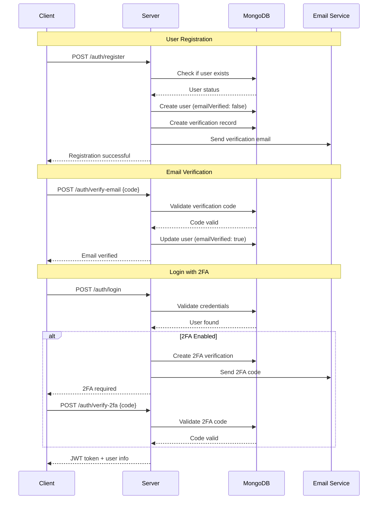
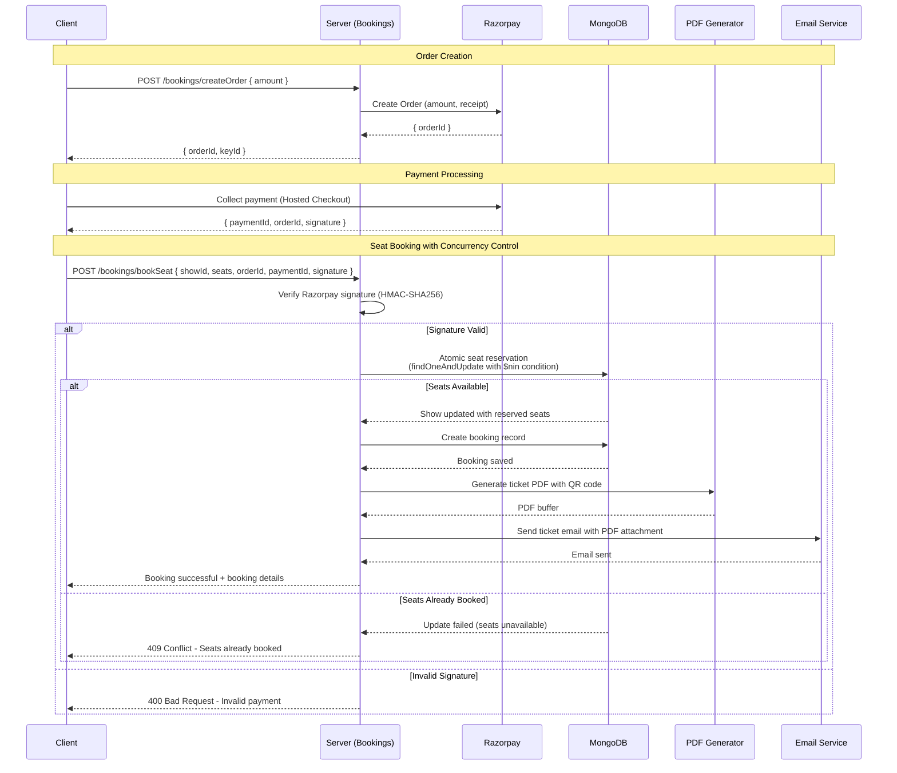
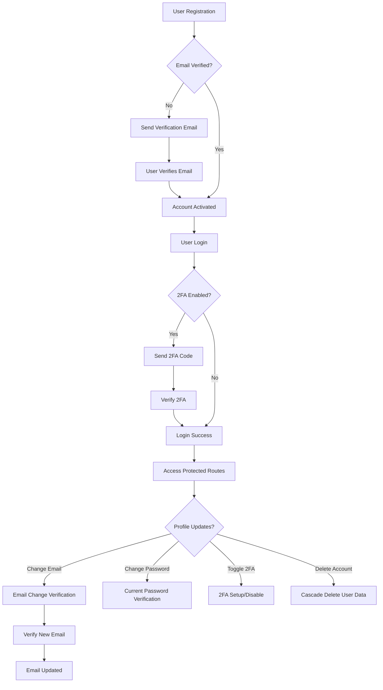
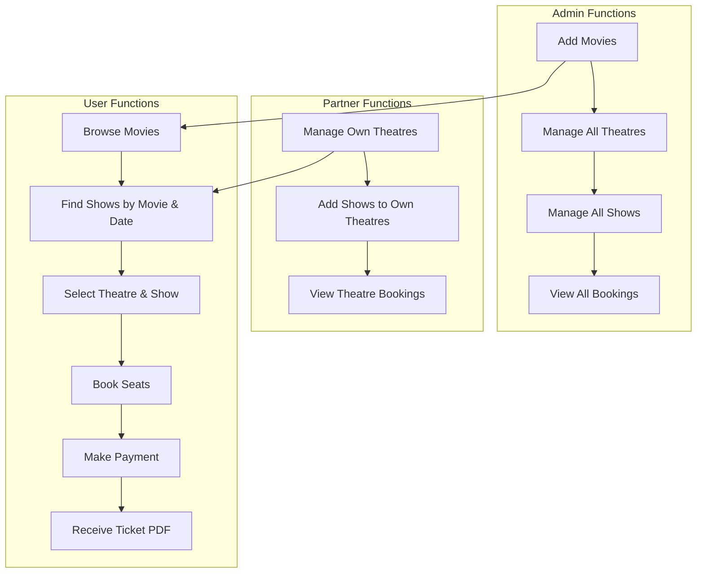
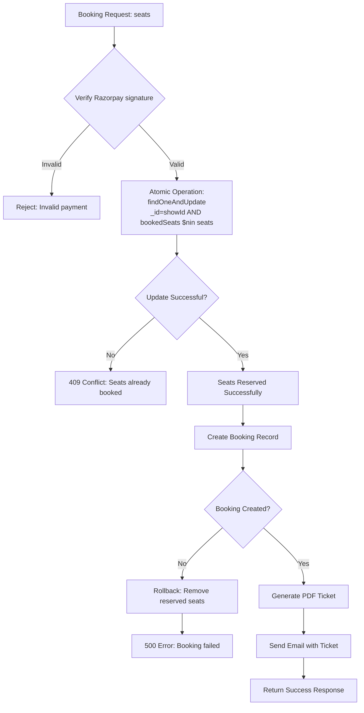
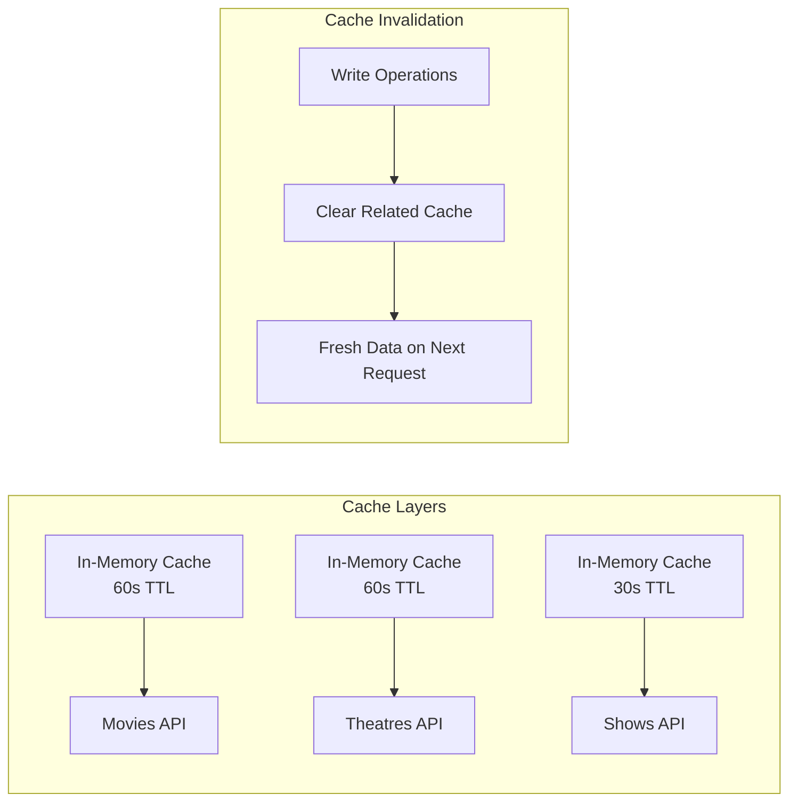
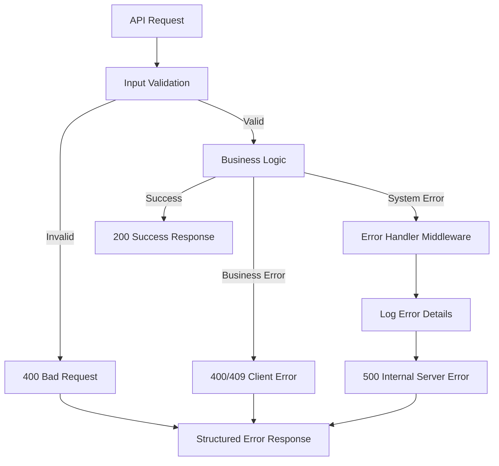

# BookMyShow Backend (Server)

Robust Node.js + Express + MongoDB backend for a BookMyShow-like ticketing system. Includes authentication, movies/theatres/shows management, bookings with Razorpay payments, automatic PDF ticketing via email, caching, and security hardening.

## Tech Stack

- Node.js, Express.js
- MongoDB + Mongoose
- Razorpay (Orders + Signature Verification)
- Nodemailer (SMTP)
- PDFKit + QRCode (PDF Ticket Generation)
- Security: helmet, rate-limiting, mongo-sanitize, CORS
- Performance: in-memory API response cache (pluggable)

## Environment Variables

```env
# Server Configuration
PORT=5000
NODE_ENV=development
PUBLIC_APP_URL=http://localhost:3000

# Database
MONGODB_URL=mongodb://localhost:27017/bookmyshow

# Authentication
JWT_SECRET=your_jwt_secret_key

# Email Configuration
EMAIL_HOST=smtp.gmail.com
EMAIL_PORT=587
EMAIL_SECURE=false
EMAIL_USER=your_email@gmail.com
EMAIL_PASSWORD=your_app_password
EMAIL_FROM=BookMyShow <noreply@bookmyshow.com>

# Payment Gateway
RAZORPAY_KEY_ID=your_razorpay_key_id
RAZORPAY_KEY_SECRET=your_razorpay_key_secret
```

## System Architecture



## API Overview

Base path: `/bms/v1/*`

### Authentication Routes (`/auth/*`)
- `POST /register` - User registration with email verification
- `POST /verify-email` - Email verification using codes
- `POST /resend-verification` - Resend verification emails
- `POST /request-reverification` - Re-verification for unverified accounts
- `POST /login` - User login with 2FA support
- `POST /verify-2fa` - Two-factor authentication verification
- `POST /resend-2fa` - Resend 2FA codes
- `POST /logout` - User logout
- `POST /forgot-password` - Password reset request
- `POST /reset-password` - Password reset with token verification

### User Management (`/users/*`) - Protected Routes
- `GET /profile` - Get user profile information
- `PUT /update-profile` - Update name and phone number
- `PUT /change-password` - Change password with verification
- `POST /request-email-change` - Initiate email change process
- `POST /verify-email-change` - Complete email change with verification
- `PUT /toggle-2fa` - Enable/disable two-factor authentication
- `DELETE /delete-account` - Delete user account with cascade deletion

### Movie Management (`/movies/*`) - Protected Routes
- `POST /` - Add new movies (Admin only, prevents duplicates)
- `GET /` - Retrieve all movies (Cached 60s)
- `PATCH /:id` - Update movie details (Admin only)
- `DELETE /:id` - Remove movies (Admin only)
- `GET /:id` - Get specific movie information

### Theatre Management (`/theatres/*`) - Protected Routes
- `POST /` - Add new theatres (Admin/Partner, prevents duplicates)
- `PATCH /:id` - Update theatre information (Admin/Owner only)
- `DELETE /:id` - Remove theatres (Admin/Owner only)
- `GET /` - Get theatres (Role-based: Admin sees all, Partners see owned) (Cached 60s)

### Show Management (`/shows/*`) - Protected Routes
- `POST /` - Create new movie shows (Admin/Theatre Partner)
- `PATCH /:id` - Update show details (Admin/Owner only)
- `DELETE /:id` - Remove shows (Admin/Owner only)
- `GET /:id` - Get specific show with movie and theatre details (Cached 30s)
- `GET /theatre/:id` - Get all shows for a specific theatre (Cached 30s)
- `POST /theatres/movie` - Get theatres showing a specific movie on a date

### Booking Management (`/bookings/*`) - Protected Routes
- `POST /createOrder` - Create Razorpay payment orders
- `POST /bookSeat` - Process seat booking with payment verification
- `GET /:id` - Get user's booking history with details

## Data Models



## Authentication Flow



## Booking & Payment Flow



## User Management Flow



## Movie & Theatre Management



## Concurrency Control (Preventing Double Booking)



## Performance Optimizations

### Caching Strategy


### Database Indexing
- `users.email` - Unique index for fast login lookups
- `theatres.name` - Unique index for duplicate prevention
- `movies.movieName` - Unique index for duplicate prevention
- `bookings.transactionId` - Unique index for payment verification
- `bookings.bookingId` - Unique index for ticket generation
- `shows.date, shows.theatre` - Compound index for show queries
- `verifications.userId, verifications.verificationType` - Compound index

## Security Features

### Authentication & Authorization
- JWT-based authentication with token versioning
- Role-based access control (Admin, Partner, User)
- Two-factor authentication support
- Password hashing with bcrypt
- Email verification for account activation

### API Security
- Helmet.js for security headers
- Rate limiting to prevent abuse
- CORS configuration with whitelist
- Input sanitization against NoSQL injection
- Request validation and error handling

### Payment Security
- Razorpay signature verification using HMAC-SHA256
- Atomic seat reservation to prevent race conditions
- Unique transaction and booking ID enforcement
- Secure webhook handling (future enhancement)

## Email & PDF Ticketing

### Ticket Generation Process
1. **Payment Verification**: Validate Razorpay signature
2. **Seat Reservation**: Atomic update with concurrency control
3. **Booking Creation**: Store booking details in database
4. **PDF Generation**: Create ticket with QR code containing:
   - Booking ID
   - Show details (movie, theatre, date, time)
   - Seat numbers
   - User information
5. **Email Delivery**: Send PDF attachment via SMTP

### Email Templates
- Registration verification
- Email change verification
- Two-factor authentication codes
- Password reset links
- Booking confirmation with PDF ticket
- Booking cancellation notifications

## Error Handling



## Deployment Considerations

### Environment Setup
- Use environment variables for all configuration
- Separate configurations for development, staging, production
- Secure storage of API keys and secrets
- Database connection pooling for production

### Monitoring & Logging
- Request/response logging
- Error tracking and alerting
- Performance monitoring
- Database query optimization
- Cache hit/miss ratios

### Scalability
- Horizontal scaling with load balancers
- Database read replicas for read-heavy operations
- Redis for distributed caching
- CDN for static assets (movie posters)
- Queue system for email processing

## Future Enhancements

### Technical Improvements
- **Webhook Integration**: Add Razorpay webhooks for real-time payment updates
- **Distributed Caching**: Implement Redis for horizontal scaling
- **Database Transactions**: Use MongoDB transactions for stronger consistency
- **API Versioning**: Implement proper API versioning strategy
- **GraphQL**: Consider GraphQL for flexible data fetching
- **Microservices**: Split into domain-specific services

### Business Features
- **Seat Selection UI**: Visual seat map for better UX
- **Dynamic Pricing**: Time-based and demand-based pricing
- **Loyalty Program**: Points and rewards system
- **Social Features**: Reviews, ratings, and recommendations
- **Mobile App**: Native mobile applications
- **Analytics Dashboard**: Business intelligence and reporting

### Security Enhancements
- **CSRF Protection**: Cross-site request forgery protection
- **API Rate Limiting**: More sophisticated rate limiting
- **Audit Logging**: Comprehensive audit trail
- **Data Encryption**: Encrypt sensitive data at rest
- **Security Scanning**: Automated vulnerability scanning

## Local Development Setup

1. **Prerequisites**
   ```bash
   # Install Node.js (v16+)
   # Install MongoDB
   # Get Razorpay test credentials
   # Setup SMTP credentials
   ```

2. **Installation**
   ```bash
   npm install
   cp .env.example .env
   # Configure environment variables
   ```

3. **Database Setup**
   ```bash
   # Start MongoDB
   # Database will be created automatically
   ```

4. **Running the Server**
   ```bash
   npm start          # Production
   npm run dev        # Development with nodemon
   ```

5. **Testing**
   ```bash
   # Use Postman collection or API testing tools
   # Test payment flow with Razorpay test mode
   ```

## API Testing

### Sample API Calls

**User Registration:**
```bash
POST /bms/v1/auth/register
{
  "name": "John Doe",
  "email": "john@example.com",
  "phone": 9876543210,
  "password": "securePassword123"
}
```

**Movie Booking:**
```bash
POST /bms/v1/bookings/bookSeat
{
  "showId": "64a1b2c3d4e5f6789012345",
  "seats": ["A1", "A2"],
  "orderId": "order_razorpay_id",
  "paymentId": "pay_razorpay_id",
  "signature": "razorpay_signature"
}
```

This comprehensive documentation covers all aspects of the BookMyShow backend system, providing detailed insights into architecture, data flow, security measures, and implementation details for developers and stakeholders.

## 

This project is open-source and available under the [MIT License](./LICENSE).

---

## 🙌 Acknowledgements

This project uses the following open-source packages and services:

* [Node.js](https://nodejs.org/en) – JavaScript runtime for backend development

* [Express.js](https://expressjs.com/) – Web framework for handling HTTP routes and middleware

* [MongoDB](https://www.mongodb.com/) – NoSQL database used for storing movie and user data

* [Mongoose](https://mongoosejs.com/) – Elegant MongoDB object modeling for Node.js

* [Google Auth Library](https://github.com/googleapis/google-auth-library-nodejs) – Secure Google OAuth integration

* [jsonwebtoken (JWT)](https://github.com/auth0/node-jsonwebtoken) – Authentication token creation and validation

* [bcrypt](https://github.com/kelektiv/node.bcrypt.js) – Password hashing and verification

* [Nodemailer](https://nodemailer.com/) – Sending transactional emails from the backend

* [Axios](https://axios-http.com/) – Promise-based HTTP client for the browser and Node.js

* [Helmet](https://helmetjs.github.io/) – Secures Express apps by setting HTTP headers

* [CORS](https://github.com/expressjs/cors) – Cross-Origin Resource Sharing middleware

* [Morgan](https://github.com/expressjs/morgan) – HTTP request logger middleware for Node.js

* [dotenv](https://github.com/motdotla/dotenv) – Loads environment variables from a .env file

* [Express Rate Limit](https://www.npmjs.com/package/express-rate-limit) – Basic rate-limiting middleware

* [Compression](https://github.com/expressjs/compression) – Gzip compression middleware for Express

* [Node Cache](https://github.com/node-cache/node-cache) – Simple and fast Node.js internal caching

* [Handlebars](https://handlebarsjs.com/) – Templating engine used for generating dynamic HTML


---

## 🧠 Author

**Shravan Kumar Atti**<br>
*Pre-sales Architect | Full-stack Developer*

GitHub: [@Shravan-509](https://github.com/Shravan-509)
