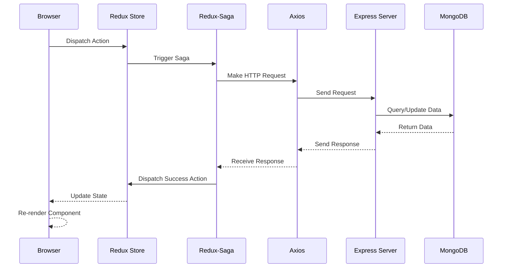
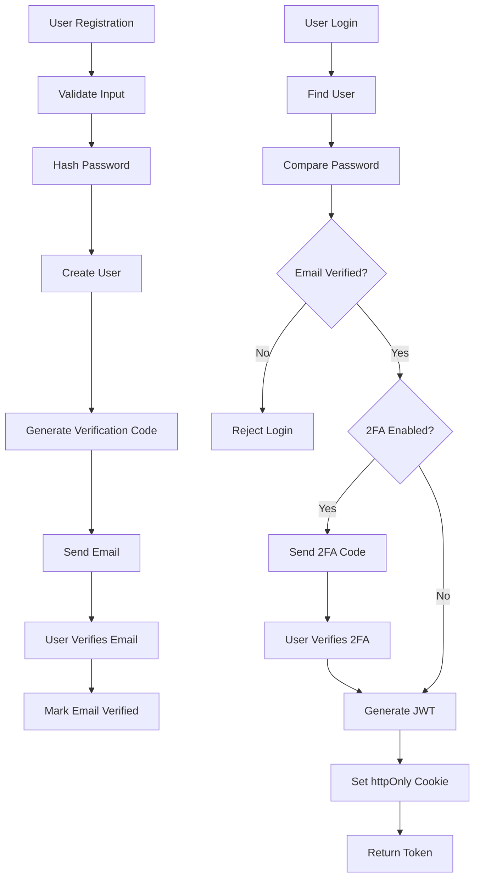

# BookMyShow - Detailed Architecture

## Table of Contents

1. [System Architecture](#system-architecture)
2. [Frontend Architecture](#frontend-architecture)
3. [Backend Architecture](#backend-architecture)
4. [Database Architecture](#database-architecture)
5. [Security Architecture](#security-architecture)
6. [Integration Architecture](#integration-architecture)

---

## System Architecture

### Three-Tier Architecture

BookMyShow follows a classic three-tier architecture:

```
┌─────────────────────────────────────────────────────────────────┐
│                    PRESENTATION LAYER                           │
│                    (React + Vite Frontend)                      │
│  - User Interface Components                                    │
│  - State Management (Redux)                                     │
│  - Client-side Routing                                          │
│  - Form Validation                                              │
└─────────────────────────────────────────────────────────────────┘
                              ↕ (HTTP/REST)
┌─────────────────────────────────────────────────────────────────┐
│                    BUSINESS LOGIC LAYER                         │
│                    (Express.js Backend)                         │
│  - API Routes & Controllers                                     │
│  - Authentication & Authorization                               │
│  - Business Logic Implementation                                │
│  - Data Validation                                              │
│  - Payment Processing                                           │
│  - Email Service                                                │
└─────────────────────────────────────────────────────────────────┘
                              ↕ (Mongoose ODM)
┌─────────────────────────────────────────────────────────────────┐
│                    DATA ACCESS LAYER                            │
│                    (MongoDB Database)                           │
│  - User Data                                                    │
│  - Movie Information                                            │
│  - Theatre Details                                              │
│  - Show Schedules                                               │
│  - Booking Records                                              │
│  - Verification Codes                                           │
└─────────────────────────────────────────────────────────────────┘
```

### Request-Response Flow



---

## Frontend Architecture

### Redux State Management

```
Redux Store
├── auth
│   ├── user: { id, name, email, role }
│   ├── isAuthenticated: boolean
│   ├── token: string
│   ├── loading: boolean
│   └── error: string
├── movies
│   ├── list: Movie[]
│   ├── selectedMovie: Movie
│   ├── loading: boolean
│   └── error: string
├── theatres
│   ├── list: Theatre[]
│   ├── selectedTheatre: Theatre
│   ├── loading: boolean
│   └── error: string
├── shows
│   ├── list: Show[]
│   ├── selectedShow: Show
│   ├── loading: boolean
│   └── error: string
├── booking
│   ├── selectedSeats: string[]
│   ├── bookingDetails: Booking
│   ├── loading: boolean
│   └── error: string
├── profile
│   ├── editMode: boolean
│   ├── changes: object
│   ├── loading: boolean
│   └── error: string
├── verification
│   ├── code: string
│   ├── userId: string
│   ├── type: string
│   ├── loading: boolean
│   └── error: string
├── forgotPassword
│   ├── email: string
│   ├── token: string
│   ├── loading: boolean
│   └── error: string
├── loader
│   └── isLoading: boolean
└── ui
    ├── modals: object
    ├── notifications: Notification[]
    └── theme: string
```

### Component Hierarchy

```
App
├── Routes
│   ├── PublicRoute
│   │   └── AuthTabs
│   │       ├── Login
│   │       └── Register
│   ├── ProtectedRoute
│   │   ├── MainLayout
│   │   │   ├── Header
│   │   │   ├── Sidebar
│   │   │   └── Content
│   │   ├── Home
│   │   ├── MovieDetails
│   │   ├── SeatSelection
│   │   ├── Checkout
│   │   ├── Profile
│   │   ├── Admin
│   │   └── Partner
│   └── ErrorBoundary
└── Providers
    ├── Redux Provider
    ├── Router Provider
    └── Theme Provider
```

### Redux-Saga Flow

```
Action Dispatched
    ↓
Saga Listener (takeEvery/takeLatest)
    ↓
Saga Generator Function
    ├── call() - Make API request
    ├── put() - Dispatch action
    ├── select() - Get state
    └── fork() - Run side effect
    ↓
Success/Failure Action
    ↓
Reducer Updates State
    ↓
Component Re-renders
```

---

## Backend Architecture

### Express.js Middleware Stack

```
Request
    ↓
CORS Middleware
    ↓
Helmet Security Headers
    ↓
Body Parser (JSON)
    ↓
Cookie Parser
    ↓
Compression
    ↓
Rate Limiter
    ↓
Route Handler
    ├── JWT Validation (if protected)
    ├── Role Check (if needed)
    └── Controller Logic
    ↓
Response
    ↓
Error Handler
    ↓
Client
```

### Controller Pattern

```javascript
// Pattern: Try-Catch with Error Handling
async function controllerMethod(req, res, next) {
  try {
    // 1. Validate input
    // 2. Check authorization
    // 3. Execute business logic
    // 4. Return response
    res.status(200).json({ success: true, data });
  } catch (error) {
    // Pass to error handler
    next(error);
  }
}
```

### Service Layer Pattern

```
Route Handler
    ↓
Controller
    ├── Input Validation
    ├── Authorization Check
    └── Call Service
    ↓
Service Layer
    ├── Business Logic
    ├── Data Transformation
    └── Call Repository
    ↓
Repository Layer
    ├── Database Query
    ├── Data Persistence
    └── Return Data
    ↓
Response to Client
```

---

## Database Architecture

### MongoDB Collections

```
bookmyshow
├── users
│   ├── _id: ObjectId
│   ├── name: String
│   ├── email: String (unique)
│   ├── phone: Number (unique)
│   ├── password: String (hashed)
│   ├── role: String (enum)
│   ├── emailVerified: Boolean
│   ├── twoFactorEnabled: Boolean
│   ├── resetToken: String
│   ├── resetTokenExpiry: Date
│   ├── tokenVersion: Number
│   ├── createdAt: Date
│   └── updatedAt: Date
│
├── movies
│   ├── _id: ObjectId
│   ├── movieName: String (unique)
│   ├── description: String
│   ├── duration: Number
│   ├── genre: Array
│   ├── language: Array
│   ├── releaseDate: Date
│   ├── poster: String
│   ├── createdAt: Date
│   └── updatedAt: Date
│
├── theatres
│   ├── _id: ObjectId
│   ├── name: String
│   ├── address: String
│   ├── phone: Number
│   ├── email: String
│   ├── owner: ObjectId (ref: users)
│   ├── isActive: Boolean
│   ├── createdAt: Date
│   └── updatedAt: Date
│
├── shows
│   ├── _id: ObjectId
│   ├── name: String
│   ├── date: Date
│   ├── time: String
│   ├── movie: ObjectId (ref: movies)
│   ├── ticketPrice: Number
│   ├── totalSeats: Number
│   ├── bookedSeats: Array
│   ├── theatre: ObjectId (ref: theatres)
│   ├── createdAt: Date
│   └── updatedAt: Date
│
├── bookings
│   ├── _id: ObjectId
│   ├── show: ObjectId (ref: shows)
│   ├── user: ObjectId (ref: users)
│   ├── seats: Array
│   ├── seatType: String
│   ├── transactionId: String
│   ├── orderId: String
│   ├── receipt: String
│   ├── bookingId: String (unique, indexed)
│   ├── amount: Number
│   ├── convenienceFee: Number
│   ├── gstPercent: Number
│   ├── paymentMethod: String
│   ├── ticketStatus: String (enum)
│   ├── createdAt: Date
│   └── updatedAt: Date
│
└── verifications
    ├── _id: ObjectId
    ├── userId: ObjectId (ref: users)
    ├── code: String
    ├── type: String (enum)
    ├── expiresAt: Date
    ├── createdAt: Date
    └── updatedAt: Date
```

### Database Indexes

```javascript
// Performance optimization indexes
users.index({ email: 1 });
users.index({ phone: 1 });
movies.index({ movieName: 1 });
theatres.index({ owner: 1 });
shows.index({ movie: 1 });
shows.index({ theatre: 1 });
shows.index({ date: 1 });
bookings.index({ bookingId: 1 });
bookings.index({ user: 1 });
bookings.index({ show: 1 });
verifications.index({ userId: 1 });
verifications.index({ expiresAt: 1 });
```

---

## Security Architecture

### Authentication Flow



### JWT Token Structure

```javascript
{
  // Header
  {
    "alg": "HS256",
    "typ": "JWT"
  }
  
  // Payload
  {
    "userId": "507f1f77bcf86cd799439011",
    "iat": 1634567890,
    "exp": 1634654290  // 24 hours
  }
  
  // Signature
  HMACSHA256(
    base64UrlEncode(header) + "." +
    base64UrlEncode(payload),
    secret
  )
}
```

### Password Security

```
User Password
    ↓
Validate Strength
    ↓
Generate Salt (10 rounds)
    ↓
Hash with bcrypt
    ↓
Store in Database
    ↓
On Login: Compare with bcrypt
```

### Role-Based Access Control

```
User Roles:
├── admin
│   ├── Manage movies
│   ├── Manage theatres
│   ├── View all bookings
│   └── User management
├── partner
│   ├── Manage own theatres
│   ├── Create shows
│   ├── View theatre bookings
│   └── Revenue tracking
└── user
    ├── Browse movies
    ├── Book tickets
    ├── View own bookings
    └── Manage profile
```

---

## Integration Architecture

### Payment Integration (Razorpay)

```
Client
    ↓
Initiate Payment
    ↓
Server: Create Order
    ↓
Razorpay: Generate Order ID
    ↓
Client: Open Payment Gateway
    ↓
User: Complete Payment
    ↓
Razorpay: Webhook Notification
    ↓
Server: Verify Signature
    ↓
Update Booking Status
    ↓
Send Confirmation Email
```

### Email Service Integration

```
Server
    ├── SendGrid (Primary)
    │   ├── API Key
    │   └── Email Templates
    ├── Nodemailer (Fallback)
    │   ├── SMTP Config
    │   └── Email Templates
    └── Resend (Alternative)
        ├── API Key
        └── Email Templates

Email Types:
├── Email Verification
├── 2FA Code
├── Password Reset
├── Booking Confirmation
├── Ticket PDF
├── Email Change
├── Password Change
├── Account Deletion
└── Re-verification
```

---

## Performance Optimization

### Frontend Optimization

- **Code Splitting:** Lazy load components
- **Memoization:** React.memo, useMemo, useCallback
- **Redux Selectors:** Prevent unnecessary re-renders
- **Image Optimization:** Compress and lazy load images
- **Bundle Analysis:** Monitor bundle size

### Backend Optimization

- **Database Indexing:** Index frequently queried fields
- **Response Compression:** gzip compression
- **Caching:** In-memory cache with node-cache
- **Pagination:** Limit response size
- **Rate Limiting:** Prevent abuse

### Database Optimization

- **Indexes:** Create indexes on foreign keys and frequently queried fields
- **Aggregation:** Use MongoDB aggregation pipeline
- **Projection:** Return only needed fields
- **Connection Pooling:** Reuse database connections

---

## Scalability Considerations

### Horizontal Scaling

- **Load Balancer:** Distribute traffic across multiple servers
- **Database Replication:** MongoDB replica sets
- **Caching Layer:** Redis for distributed caching
- **CDN:** Serve static assets globally

### Vertical Scaling

- **Server Resources:** Increase CPU, RAM
- **Database Optimization:** Query optimization, indexing
- **Code Optimization:** Reduce computational complexity

---

## Monitoring & Logging

### Application Monitoring

- **Error Tracking:** Sentry or similar
- **Performance Monitoring:** New Relic or similar
- **Uptime Monitoring:** Pingdom or similar
- **Log Aggregation:** ELK stack or similar

### Metrics to Track

- **API Response Time:** Average, P95, P99
- **Error Rate:** 4xx, 5xx errors
- **Database Query Time:** Slow queries
- **User Engagement:** Active users, bookings
- **Payment Success Rate:** Transaction success/failure

---

## Disaster Recovery

### Backup Strategy

- **Database Backups:** Daily automated backups
- **Code Backups:** Git repository
- **Configuration Backups:** Environment variables

### Recovery Plan

- **RTO (Recovery Time Objective):** < 1 hour
- **RPO (Recovery Point Objective):** < 1 day
- **Failover:** Automated failover to backup systems
- **Testing:** Regular disaster recovery drills

---

**Last Updated:** October 2024  
**Version:** 1.0.0
