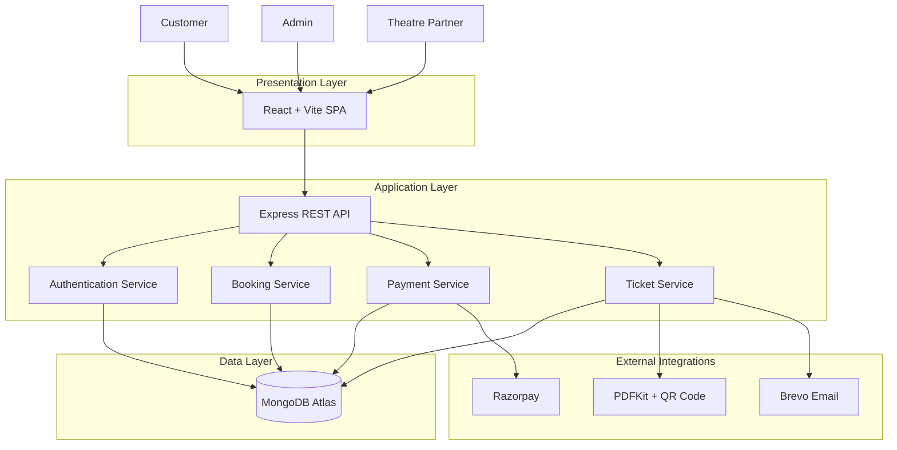
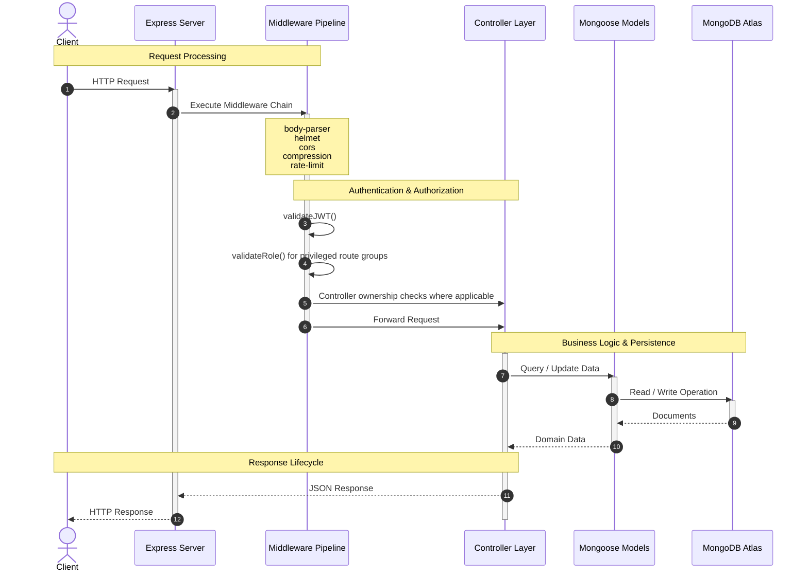
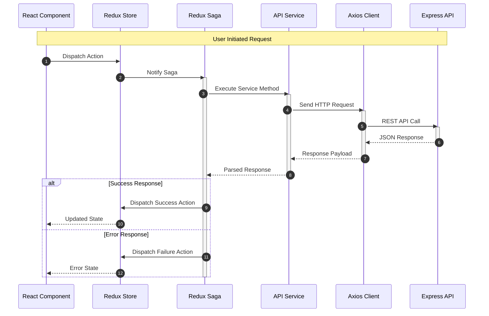
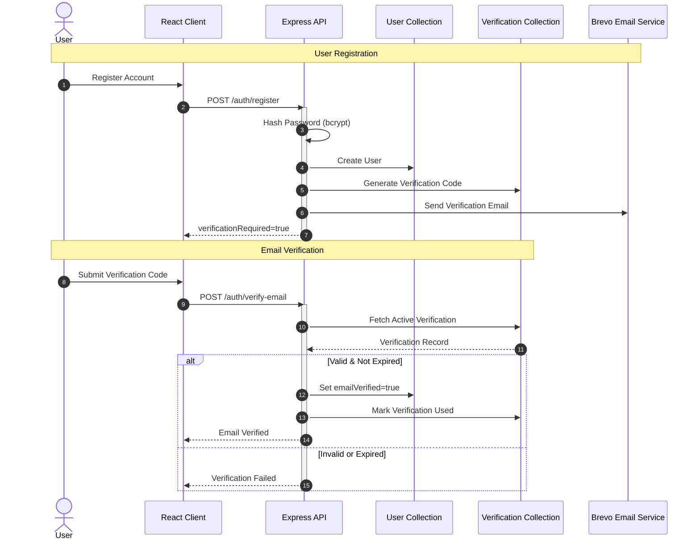
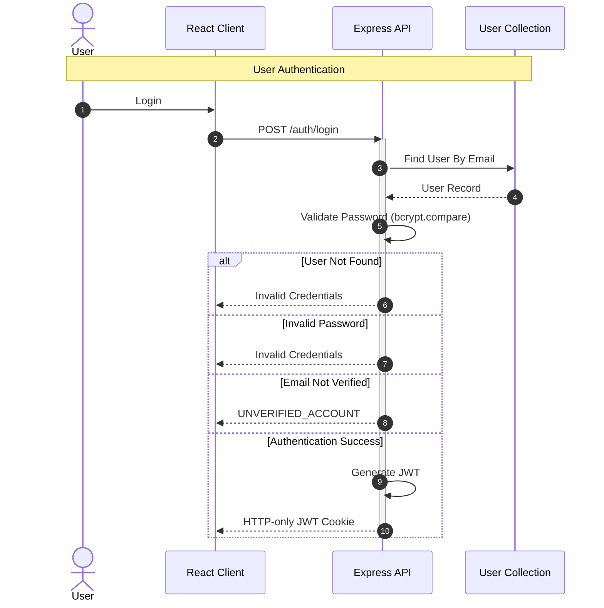
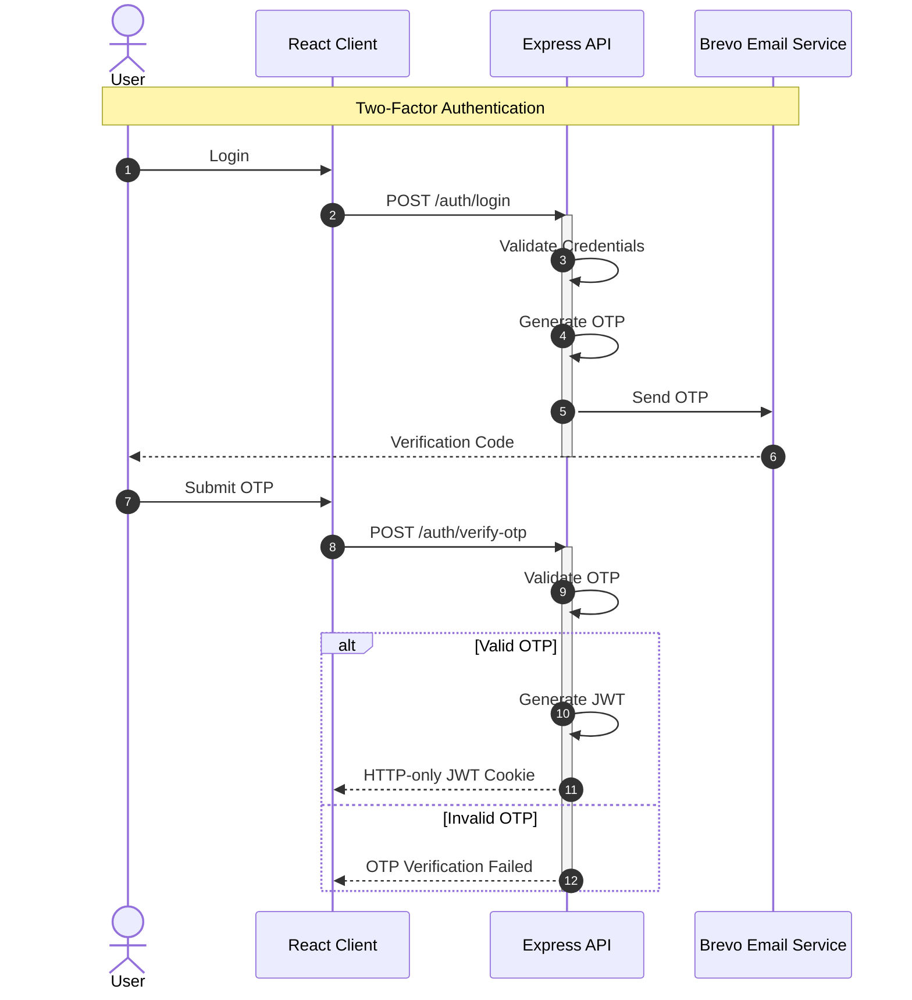
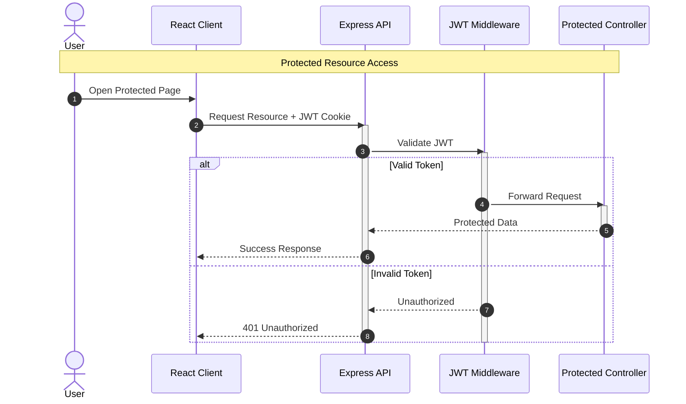
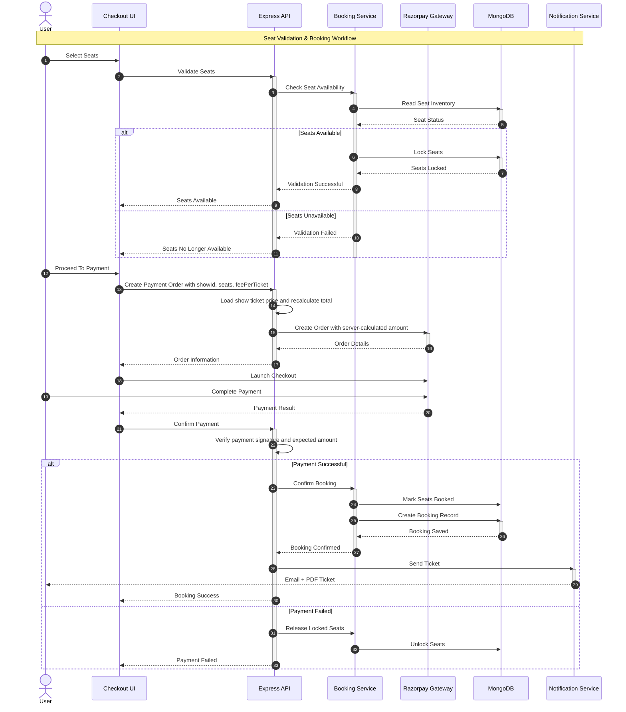
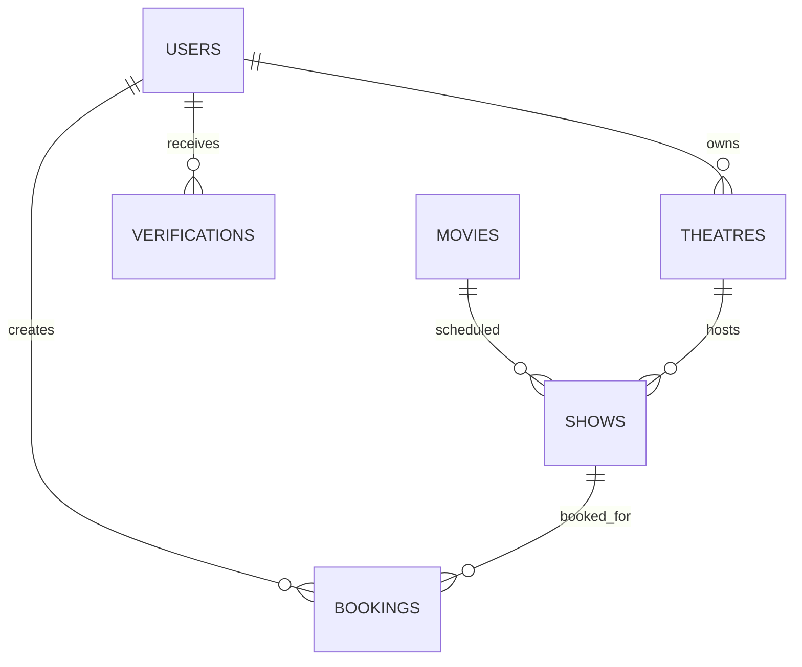
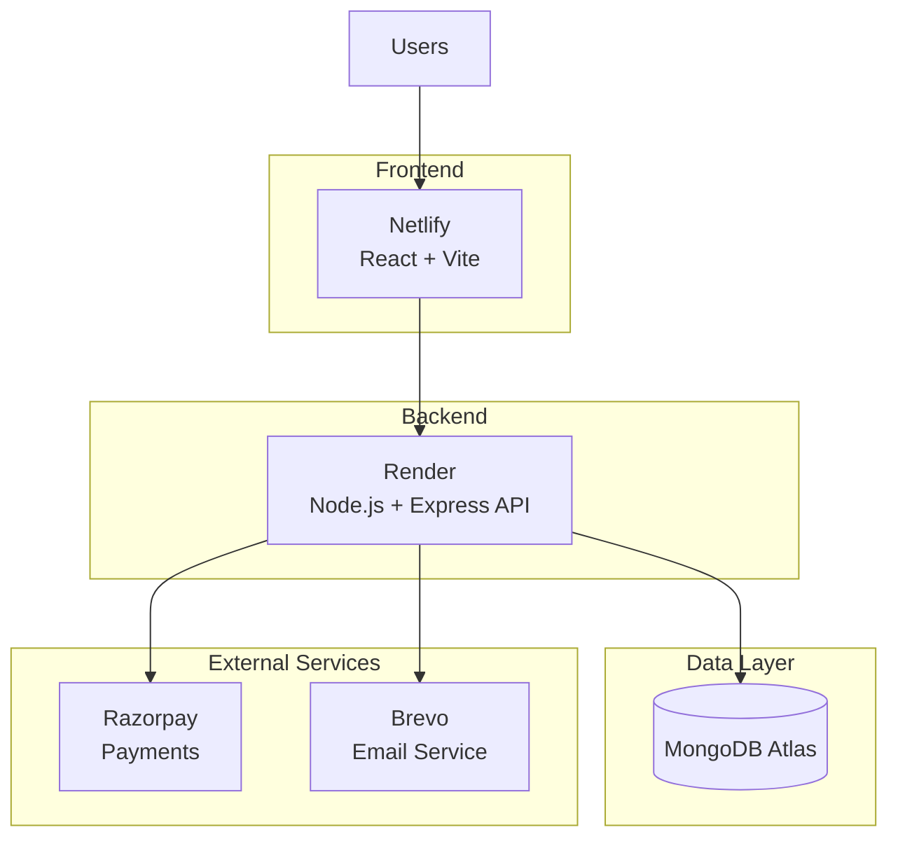

# BookMyShow Architecture

This document describes the architecture implemented in the current codebase. For full onboarding documentation, see [PROJECT_DOCUMENTATION.md](./PROJECT_DOCUMENTATION.md).

## System Context

```mermaid
flowchart TB

    %% ==================================================
    %% Actors
    %% ==================================================

    Customer["Customer"]
    Admin["Admin"]
    Partner["Theatre Partner"]

    %% ==================================================
    %% Presentation Layer
    %% ==================================================

    subgraph PRESENTATION["Presentation Layer"]
        Client["React + Vite SPA"]
    end

    %% ==================================================
    %% Application Layer
    %% ==================================================

    subgraph APPLICATION["Application Layer"]

        API["Express REST API"]

        BookingService["Booking Service"]

        AuthService["Authentication Service"]

        PaymentService["Payment Service"]

        TicketService["Ticket Service"]
    end

    %% ==================================================
    %% Data Layer
    %% ==================================================

    subgraph DATA["Data Layer"]
        MongoDB[("MongoDB Atlas")]
    end

    %% ==================================================
    %% External Integrations
    %% ==================================================

    subgraph INTEGRATIONS["External Integrations"]

        Razorpay["Razorpay"]

        Brevo["Brevo Email"]

        PDF["PDFKit + QR Code"]
    end

    %% ==================================================
    %% User Interactions
    %% ==================================================

    Customer --> Client
    Admin --> Client
    Partner --> Client

    %% ==================================================
    %% Frontend to Backend
    %% ==================================================

    Client --> API

    %% ==================================================
    %% Internal Services
    %% ==================================================

    API --> AuthService
    API --> BookingService
    API --> PaymentService
    API --> TicketService

    %% ==================================================
    %% Database Access
    %% ==================================================

    AuthService --> MongoDB
    BookingService --> MongoDB
    PaymentService --> MongoDB
    TicketService --> MongoDB

    %% ==================================================
    %% Third-Party Integrations
    %% ==================================================

    PaymentService --> Razorpay

    TicketService --> PDF

    TicketService --> Brevo
```

## Application Layers

| Layer | Main files | Responsibility |
| --- | --- | --- |
| Presentation | `Client/src/features`, `Client/src/components`, `Client/src/App.jsx` | UI, route guards, role-aware navigation, booking screens |
| Client state | `Client/src/redux` | Redux Toolkit slices, persisted root reducer, Redux-Saga side effects |
| API client | `Client/src/api` | Axios calls grouped by backend domain |
| HTTP API | `Server/server.js`, `Server/routes` | Middleware and route mounting |
| Business logic | `Server/controllers` | Auth, users, movies, theatres, shows, bookings, payments |
| Data model | `Server/models` | Mongoose schemas and relations |
| Integrations | `Server/utils/email.js`, `Server/utils/ticket-pdf.js`, Razorpay SDK | Email, PDF ticket, payment gateway |

## Backend Request Flow

```mermaid
sequenceDiagram
    autonumber

    actor Client

    participant Express as Express Server
    participant Middleware as Middleware Pipeline
    participant Controller as Controller Layer
    participant Model as Mongoose Models
    participant MongoDB as MongoDB Atlas

    %% ==========================================
    %% Request Processing
    %% ==========================================

    Note over Client,Middleware: Request Processing

    Client->>Express: HTTP Request
    activate Express

    Express->>Middleware: Execute Middleware Chain
    activate Middleware

    Note over Middleware: body-parser<br/>helmet<br/>cors<br/>compression<br/>rate-limit

    %% ==========================================
    %% Authentication
    %% ==========================================

    Note over Middleware,Controller: Authentication & Authorization

    Middleware->>Middleware: validateJWT()
    Middleware->>Middleware: validateRole() for privileged route groups
    Middleware->>Controller: Controller ownership checks where applicable

    Middleware->>Controller: Forward Request
    deactivate Middleware

    %% ==========================================
    %% Business Logic
    %% ==========================================

    Note over Controller,MongoDB: Business Logic & Persistence

    activate Controller

    Controller->>Model: Query / Update Data
    activate Model

    Model->>MongoDB: Read / Write Operation
    activate MongoDB

    MongoDB-->>Model: Documents
    deactivate MongoDB

    Model-->>Controller: Domain Data
    deactivate Model

    %% ==========================================
    %% Response Generation
    %% ==========================================

    Note over Controller,Client: Response Lifecycle

    Controller-->>Express: JSON Response

    Express-->>Client: HTTP Response

    deactivate Controller
    deactivate Express
```

## Frontend Request Flow

```mermaid
sequenceDiagram
    autonumber

    participant Component as React Component
    participant Store as Redux Store
    participant Saga as Redux Saga
    participant Service as API Service
    participant Axios as Axios Client
    participant API as Express API

    Note over Component,API: User Initiated Request

    Component->>Store: Dispatch Action

    Store->>Saga: Notify Saga

    activate Saga

    Saga->>Service: Execute Service Method

    activate Service

    Service->>Axios: Send HTTP Request

    activate Axios

    Axios->>API: REST API Call

    activate API

    API-->>Axios: JSON Response

    deactivate API

    Axios-->>Service: Response Payload

    deactivate Axios

    Service-->>Saga: Parsed Response

    deactivate Service

    alt Success Response

        Saga->>Store: Dispatch Success Action

        Store-->>Component: Updated State

    else Error Response

        Saga->>Store: Dispatch Failure Action

        Store-->>Component: Error State

    end

    deactivate Saga
```

## Authentication Flow

#### Registration & Email Verification Flow

```mermaid
sequenceDiagram
    autonumber

    actor User

    participant Client as React Client
    participant API as Express API
    participant UserDB as User Collection
    participant VerificationDB as Verification Collection
    participant Email as Brevo Email Service

    Note over User,Email: User Registration

    User->>Client: Register Account

    Client->>API: POST /auth/register

    activate API

    API->>API: Hash Password (bcrypt)

    API->>UserDB: Create User

    API->>VerificationDB: Generate Verification Code

    API->>Email: Send Verification Email

    API-->>Client: verificationRequired=true

    deactivate API

    Note over User,VerificationDB: Email Verification

    User->>Client: Submit Verification Code

    Client->>API: POST /auth/verify-email

    activate API

    API->>VerificationDB: Fetch Active Verification

    VerificationDB-->>API: Verification Record

    alt Valid & Not Expired

        API->>UserDB: Set emailVerified=true

        API->>VerificationDB: Mark Verification Used

        API-->>Client: Email Verified

    else Invalid or Expired

        API-->>Client: Verification Failed

    end

    deactivate API
```

#### Login & Authentication Flow

```mermaid
sequenceDiagram
    autonumber

    actor User

    participant Client as React Client
    participant API as Express API
    participant UserDB as User Collection

    Note over User,UserDB: User Authentication

    User->>Client: Login

    Client->>API: POST /auth/login

    activate API

    API->>UserDB: Find User By Email

    UserDB-->>API: User Record

    API->>API: Validate Password (bcrypt.compare)

    alt User Not Found

        API-->>Client: Invalid Credentials

    else Invalid Password

        API-->>Client: Invalid Credentials

    else Email Not Verified

        API-->>Client: UNVERIFIED_ACCOUNT

    else Authentication Success

        API->>API: Generate JWT

        API-->>Client: HTTP-only JWT Cookie

    end

    deactivate API
```

#### Two-Factor Authentication Flow

```mermaid
sequenceDiagram
    autonumber

    actor User

    participant Client as React Client
    participant API as Express API
    participant Email as Brevo Email Service

    Note over User,Email: Two-Factor Authentication

    User->>Client: Login

    Client->>API: POST /auth/login

    activate API

    API->>API: Validate Credentials

    API->>API: Generate OTP

    API->>Email: Send OTP

    Email-->>User: Verification Code

    deactivate API

    User->>Client: Submit OTP

    Client->>API: POST /auth/verify-otp

    activate API

    API->>API: Validate OTP

    alt Valid OTP

        API->>API: Generate JWT

        API-->>Client: HTTP-only JWT Cookie

    else Invalid OTP

        API-->>Client: OTP Verification Failed

    end

    deactivate API
```

#### Authorization & Protected Route Flow

```mermaid
sequenceDiagram
    autonumber

    actor User

    participant Client as React Client
    participant API as Express API
    participant Auth as JWT Middleware
    participant Controller as Protected Controller

    Note over User,Controller: Protected Resource Access

    User->>Client: Open Protected Page

    Client->>API: Request Resource + JWT Cookie

    activate API

    API->>Auth: Validate JWT

    activate Auth

    alt Valid Token

        Auth->>Controller: Forward Request

        activate Controller

        Controller-->>API: Protected Data

        deactivate Controller

        API-->>Client: Success Response

    else Invalid Token

        Auth-->>API: Unauthorized

        API-->>Client: 401 Unauthorized

    end

    deactivate Auth

    deactivate API
```

## Payment and Booking Flow

```mermaid
sequenceDiagram
    autonumber

    actor User

    participant UI as Checkout UI
    participant API as Express API
    participant Booking as Booking Service
    participant Razorpay as Razorpay Gateway
    participant DB as MongoDB
    participant Notify as Notification Service

    Note over User,Notify: Seat Validation & Booking Workflow

    User->>UI: Select Seats

    UI->>API: Validate Seats

    activate API

    API->>Booking: Check Seat Availability

    activate Booking

    Booking->>DB: Read Seat Inventory

    activate DB

    DB-->>Booking: Seat Status

    deactivate DB

    alt Seats Available

        Booking->>DB: Lock Seats

        activate DB

        DB-->>Booking: Seats Locked

        deactivate DB

        Booking-->>API: Validation Successful

        API-->>UI: Seats Available

    else Seats Unavailable

        Booking-->>API: Validation Failed

        API-->>UI: Seats No Longer Available

    end

    deactivate Booking
    deactivate API

    User->>UI: Proceed To Payment

    UI->>API: Create Payment Order with showId, seats, feePerTicket

    activate API

    API->>API: Load show ticket price and recalculate total
    API->>Razorpay: Create Order with server-calculated amount

    activate Razorpay

    Razorpay-->>API: Order Details

    deactivate Razorpay

    API-->>UI: Order Information

    deactivate API

    UI->>Razorpay: Launch Checkout

    User->>Razorpay: Complete Payment

    Razorpay-->>UI: Payment Result

    UI->>API: Confirm Payment

    activate API

    API->>API: Verify payment signature and expected amount

    alt Payment Successful

        API->>Booking: Confirm Booking

        activate Booking

        Booking->>DB: Mark Seats Booked

        Booking->>DB: Create Booking Record

        activate DB

        DB-->>Booking: Booking Saved

        deactivate DB

        Booking-->>API: Booking Confirmed

        deactivate Booking

        API->>Notify: Send Ticket

        activate Notify

        Notify-->>User: Email + PDF Ticket

        deactivate Notify

        API-->>UI: Booking Success

    else Payment Failed

        API->>Booking: Release Locked Seats

        Booking->>DB: Unlock Seats

        API-->>UI: Payment Failed

    end

    deactivate API
```

## Middleware Stack

| Order | Middleware | Purpose |
| --- | --- | --- |
| 1 | `express.json`, `express.urlencoded`, `cookieParser` | Request body and cookie parsing |
| 2 | Helmet security headers | CSP, frameguard, HSTS, no-sniff, referrer policy |
| 3 | Compression | Gzip compression for responses larger than 1KB |
| 4 | Response-time and request logging | `X-Response-Time` plus console request duration logs |
| 5 | Static/API cache headers | Static asset cache headers and private no-store API defaults |
| 6 | General rate limiter | Global request throttling |
| 7 | CORS | Allows `PUBLIC_APP_URL` with credentials |
| 8 | Route-specific middleware | Auth limiter, JWT validation, role checks, booking limiter, selected shared catalogue cache |
| 9 | Error handler | Final JSON error response |

## Route Groups

| Base path | Router | Protection |
| --- | --- | --- |
| `/bms/v1/auth` | `authRoute.js` | Public with auth rate limiter |
| `/bms/v1/users` | `userRoute.js` | JWT; admin role for user list |
| `/bms/v1/movies` | `movieRoute.js` | JWT; admin role for mutations |
| `/bms/v1/theatres` | `theatreRoute.js` | JWT; admin/partner role and partner ownership checks |
| `/bms/v1/shows` | `showRoute.js` | JWT; admin/partner role for management and partner ownership checks |
| `/bms/v1/bookings` | `bookingRoute.js` | JWT plus booking rate limiter; admin/partner roles and ownership checks on privileged booking views |

## Data Relationships

```mermaid
erDiagram

    USERS ||--o{ THEATRES : owns
    USERS ||--o{ BOOKINGS : creates
    USERS ||--o{ VERIFICATIONS : receives

    MOVIES ||--o{ SHOWS : scheduled
    THEATRES ||--o{ SHOWS : hosts

    SHOWS ||--o{ BOOKINGS : booked_for
```

## Deployment Architecture

```mermaid
flowchart TB

    %% ==========================================
    %% Users
    %% ==========================================

    User["Users"]

    %% ==========================================
    %% Frontend
    %% ==========================================

    subgraph FRONTEND["Frontend"]
        Netlify["Netlify<br/>React + Vite"]
    end

    %% ==========================================
    %% Backend
    %% ==========================================

    subgraph BACKEND["Backend"]
        Render["Render<br/>Node.js + Express API"]
    end

    %% ==========================================
    %% Data Layer
    %% ==========================================

    subgraph DATA["Data Layer"]
        Atlas[("MongoDB Atlas")]
    end

    %% ==========================================
    %% External Integrations
    %% ==========================================

    subgraph INTEGRATIONS["External Services"]

        Razorpay["Razorpay<br/>Payments"]

        Brevo["Brevo<br/>Email Service"]
    end

    %% ==========================================
    %% Request Flow
    %% ==========================================

    User --> Netlify

    Netlify --> Render

    Render --> Atlas

    Render --> Razorpay

    Render --> Brevo
```

Required production alignment:

| Setting | Requirement |
| --- | --- |
| `PUBLIC_APP_URL` | Must match frontend origin for CORS and password reset links |
| `VITE_API_URL` | Must point to backend `/bms/v1` |
| HTTPS | Required for production cross-site secure cookies |
| Razorpay keys | Client public key and server secret must belong to same environment |
| Brevo sender | `BREVO_EMAIL_FROM` must be verified/configured |
