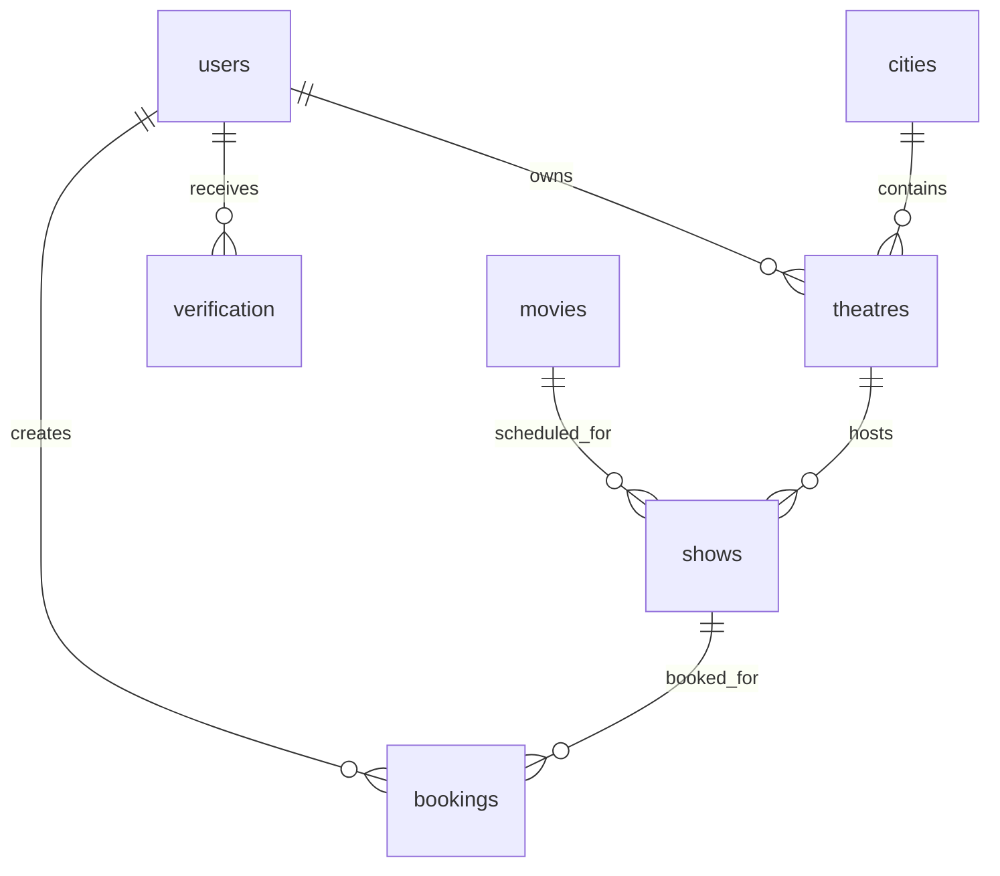

# Database Documentation

The canonical schema reference is [DATABASE_SCHEMA.md](./DATABASE_SCHEMA.md). This file exists as the reviewer-facing database entry point requested in the project checklist.

## Database Technology

| Item | Value |
| --- | --- |
| Database | MongoDB / MongoDB Atlas |
| ODM | Mongoose |
| Connection | `Server/config/db.js` |
| Environment variable | `MONGODB_CONNECTION_STRING` |

## Collections

| Collection | Model file | Purpose |
| --- | --- | --- |
| `users` | `Server/models/userSchema.js` | Users, roles, password hash, verification state, 2FA state |
| `movies` | `Server/models/movieSchema.js` | Movie catalog records |
| `cities` | `Server/models/citySchema.js` | Active/inactive city catalog records for theatre mapping |
| `theatres` | `Server/models/theatreSchema.js` | Theatre records owned by partners |
| `shows` | `Server/models/showSchema.js` | Scheduled movie shows and booked seats |
| `bookings` | `Server/models/bookingSchema.js` | Confirmed ticket bookings and payment metadata |
| `verification` | `Server/models/verificationSchema.js` | Email verification, 2FA, reverification, and email-change codes |

## ER Diagram

## Data Integrity Notes

- Seat booking uses an atomic `Show.findOneAndUpdate` condition so the same seat cannot be booked twice during concurrent payment callbacks.
- `cities` uses a compound unique index on `cityName`, `state`, and `country`, an optional unique sparse `cityCode` index, and a `2dsphere` index for GeoJSON `location`.
- `cities.cityCode`, `cities.tier`, and `cities.location` are optional Phase 1.1 metadata fields so existing Phase 1 city documents remain valid before backfill.
- `theatres.city` is optional for backward compatibility with existing theatre documents and is not required until a future migration policy makes it safe.
- `bookingId` is unique and indexed for public ticket references.
- Account deletion cascades verification records, bookings, and theatres owned by the deleted user.
- Movie, theatre, and show deletion currently do not cascade dependent records; this is a known limitation and future improvement area.
