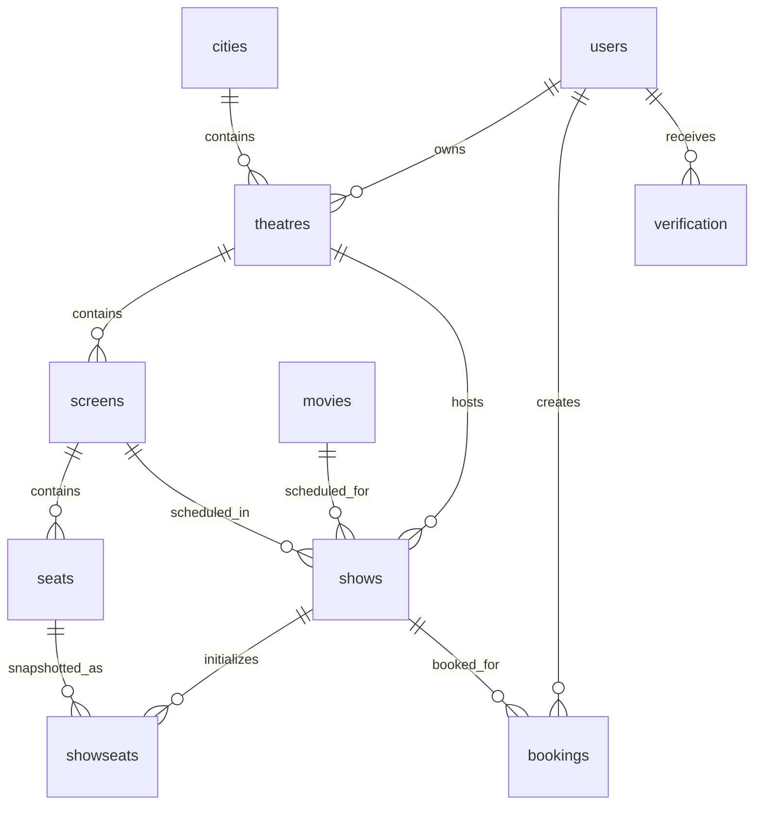

# Database Documentation

The canonical schema reference is [DATABASE_SCHEMA.md](./DATABASE_SCHEMA.md). This file exists as the reviewer-facing database entry point requested in the project checklist.

## Database Technology

| Item | Value |
| --- | --- |
| Database | MongoDB / MongoDB Atlas |
| ODM | Mongoose |
| Connection | `Server/config/db.js` |
| Environment variable | `MONGODB_CONNECTION_STRING` |

## Collections

| Collection | Model file | Purpose |
| --- | --- | --- |
| `users` | `Server/models/userSchema.js` | Users, roles, password hash, verification state, 2FA state |
| `movies` | `Server/models/movieSchema.js` | Movie catalog records |
| `cities` | `Server/models/citySchema.js` | Active/inactive city catalog records for theatre mapping |
| `theatres` | `Server/models/theatreSchema.js` | Theatre records owned by partners |
| `screens` | `Server/models/screenSchema.js` | Physical auditoriums configured under theatres |
| `seats` | `Server/models/seatSchema.js` | Persistent physical Seat layout records under Screens |
| `shows` | `Server/models/showSchema.js` | Scheduled movie shows and booked seats |
| `showseats` | `Server/models/showSeatSchema.js` | Per-Show inventory snapshots generated from physical Seats |
| `bookings` | `Server/models/bookingSchema.js` | Confirmed ticket bookings and payment metadata |
| `verification` | `Server/models/verificationSchema.js` | Email verification, 2FA, reverification, and email-change codes |

## ER Diagram

## Data Integrity Notes

- Seat booking uses an atomic `Show.findOneAndUpdate` condition so the same seat cannot be booked twice during concurrent payment callbacks.
- `cities` uses a compound unique index on `cityName`, `state`, and `country`, an optional unique sparse `cityCode` index, and a `2dsphere` index for GeoJSON `location`.
- `cities.cityCode`, `cities.tier`, and `cities.location` are optional Phase 1.1 metadata fields so existing Phase 1 city documents remain valid before backfill.
- `theatres.city` is optional for backward compatibility with existing theatre documents and is not required until a future migration policy makes it safe.
- Every Theatre conceptually has at least one Screen; Screen records must be manually configured with actual capacity.
- `screens` uses a unique compound index on `theatre` and `screenNumber`.
- `seats` stores one physical Seat per document under a Screen. Seat labels are unique within a Screen through `{ screen, seatNumber }`, and row/column positions are unique through `{ screen, row, column }`.
- Active Seat count must remain less than or equal to `screens.capacity`. Screen capacity cannot be reduced below the number of active Seats, and Seats are not automatically deleted or disabled during capacity changes.
- Seat layout status is `INCOMPLETE` when active Seat count is below capacity and `COMPLETE` when it exactly matches capacity.
- `shows.screen` is optional for legacy compatibility while `shows.theatre` remains required for booking flows.
- `showseats` stores per-Show snapshots of active physical Seats. The indexes are unique `{ show, seat }`, `{ show, status }`, and `{ show, seatNumber }`.
- New screen-aware Show creation requires a complete physical Seat layout where active Seat count equals `screens.capacity`. Show creation and ShowSeat initialization run in one transaction, and `shows.totalSeats` remains a compatibility snapshot derived from `screens.capacity`.
- Phase 4A historical migration initialized 382 Shows and 243,728 ShowSeat documents, including 13 `BOOKED` ShowSeats mapped from legacy booked labels. The final audit state is 382 `ALREADY_INITIALIZED`, 0 `READY`, and 0 migration errors or warnings.
- `shows.ticketPrice` remains the required default price, while optional `shows.ticketPricing.STANDARD`, `PREMIUM`, and `RECLINER` override specific seat types.
- New bookings store `bookings.ticketAmount` and `bookings.seatPricing[]` as immutable purchased-seat price snapshots. `bookings.amount` remains the final paid amount used by revenue aggregation.
- The ShowSeat model currently supports `AVAILABLE` and `BOOKED`. `LOCKED`, lock owner, lock expiry, and TTL indexes are not implemented until a future locking phase.
- `bookingId` is unique and indexed for public ticket references.
- Account deletion cascades verification records, bookings, and theatres owned by the deleted user.
- Movie and theatre deletion currently do not cascade dependent records; initialized Show deletion removes related ShowSeat inventory, while existing Booking records are not cascaded.

Physical Seats and ShowSeats now drive customer booking for initialized screen-aware Shows. The customer availability endpoint returns sanitized ShowSeat labels, rows, columns, seat types, and statuses; booking confirmation updates `Show.bookedSeats`, matching ShowSeats, and the Booking record transactionally. Legacy no-screen Shows remain compatible with generated labels and `Show.bookedSeats` only. `Booking.seats` remains a string array.
