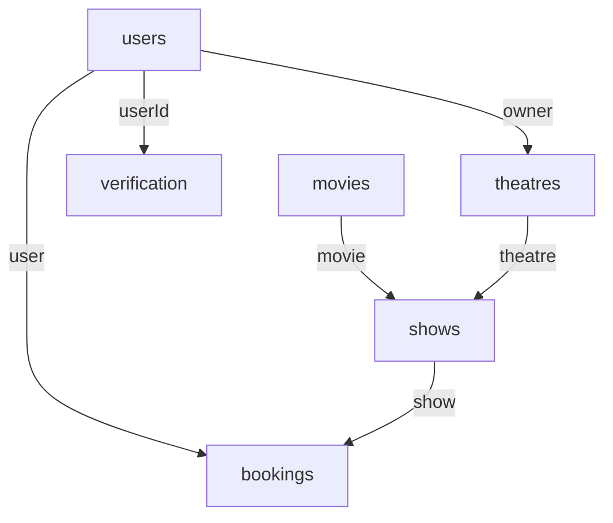

# Database Schema

The backend uses MongoDB through Mongoose. All schemas are timestamped except where noted by Mongoose defaults. Collection names are explicitly lower-case plural names through `mongoose.model()`.

## users

Source: `Server/models/userSchema.js`

| Field | Type | Required | Constraints / Default | Notes |
| --- | --- | --- | --- | --- |
| `name` | `String` | Yes | - | Display name |
| `email` | `String` | Yes | `unique` | Login identifier and email delivery target |
| `phone` | `Number` | Yes | `unique` | Profile phone number |
| `password` | `String` | Yes | - | bcrypt hash, never returned by profile APIs |
| `role` | `String` | Yes | enum `admin`, `partner`, `user`; default `user` | Drives navigation and dashboard behavior |
| `emailVerified` | `Boolean` | No | default `false` | Required before normal login |
| `twoFactorEnabled` | `Boolean` | No | default `true` | Email 2FA toggle |
| `resetToken` | `String` | No | - | Password reset JWT |
| `resetTokenExpiry` | `Date` | No | - | Password reset expiry |
| `tokenVersion` | `Number` | No | default `0` | Incremented on password/email changes |
| `createdAt`, `updatedAt` | `Date` | Auto | timestamps | Managed by Mongoose |

## movies

Source: `Server/models/movieSchema.js`

| Field | Type | Required | Constraints / Default | Notes |
| --- | --- | --- | --- | --- |
| `movieName` | `String` | Yes | `unique` | Duplicate checked before creation |
| `description` | `String` | Yes | - | Synopsis/details |
| `duration` | `Number` | Yes | - | Duration in minutes |
| `genre` | `Array` | Yes | - | Stored as array |
| `language` | `Array` | Yes | - | Stored as array |
| `releaseDate` | `Date` | Yes | - | Movie list sorted descending by this field |
| `poster` | `String` | Yes | - | Poster URL |
| `createdAt`, `updatedAt` | `Date` | Auto | timestamps | Managed by Mongoose |

## theatres

Source: `Server/models/theatreSchema.js`

| Field | Type | Required | Constraints / Default | Notes |
| --- | --- | --- | --- | --- |
| `name` | `String` | Yes | - | Duplicate checked before creation |
| `address` | `String` | Yes | - | Used in tickets and display |
| `phone` | `Number` | Yes | - | Theatre contact |
| `email` | `String` | Yes | - | Theatre contact |
| `owner` | `ObjectId` | No | ref `users` | Partner owner |
| `isActive` | `Boolean` | No | default `false` | Theatre status |
| `createdAt`, `updatedAt` | `Date` | Auto | timestamps | Managed by Mongoose |

## shows

Source: `Server/models/showSchema.js`

| Field | Type | Required | Constraints / Default | Notes |
| --- | --- | --- | --- | --- |
| `name` | `String` | Yes | - | Show label |
| `date` | `Date` | Yes | - | Used with movie id to fetch theatres/shows |
| `time` | `String` | Yes | - | Display and ticket time |
| `movie` | `ObjectId` | Yes | ref `movies` | Populated in show and booking APIs |
| `ticketPrice` | `Number` | Yes | - | Per-seat price |
| `totalSeats` | `Number` | Yes | - | Seat layout capacity |
| `bookedSeats` | `[String]` | No | default `[]` | Seat ids like `A1`, `A2`; updated atomically during booking |
| `theatre` | `ObjectId` | Yes | ref `theatres` | Populated in show and booking APIs |
| `createdAt`, `updatedAt` | `Date` | Auto | timestamps | Managed by Mongoose |

## bookings

Source: `Server/models/bookingSchema.js`

| Field | Type | Required | Constraints / Default | Notes |
| --- | --- | --- | --- | --- |
| `show` | `ObjectId` | Yes | ref `shows` | Booked show |
| `user` | `ObjectId` | Yes | ref `users` | Booking owner |
| `seats` | `[String]` | Yes | - | Seat ids |
| `seatType` | `String` | No | default `Standard` | Seat category label |
| `transactionId` | `String` | Yes | - | Razorpay payment id |
| `orderId` | `String` | Yes | - | Razorpay order id |
| `receipt` | `String` | Yes | - | Razorpay receipt |
| `bookingId` | `String` | Yes | `unique`, indexed | 7-character public reference |
| `amount` | `Number` | Yes | - | Stored in rupees after server divides paise by 100 |
| `convenienceFee` | `Number` | No | default `0` | Fee component |
| `gstPercent` | `Number` | No | default `18` | GST applied to convenience fee calculations |
| `paymentMethod` | `String` | No | default `N/A` | Client-selected payment method label |
| `ticketStatus` | `String` | No | enum `Confirmed`, `Cancelled`, `Pending`; default `Confirmed` | Booking status |
| `createdAt`, `updatedAt` | `Date` | Auto | timestamps | Managed by Mongoose |

## verification

Source: `Server/models/verificationSchema.js`

| Field | Type | Required | Constraints / Default | Notes |
| --- | --- | --- | --- | --- |
| `userId` | `ObjectId` | Yes | ref `users` | User receiving verification |
| `code` | `String` | Yes | - | 6-digit code generated in `email.js` |
| `type` | `String` | Yes | enum `email`, `2fa`, `reverify`, `email-change` | Verification workflow type |
| `metadata` | `Mixed` | No | default `{}` | Stores email-change metadata such as old/new email |
| `expiresAt` | `Date` | Yes | - | Set to 10 minutes after creation |
| `createdAt`, `updatedAt` | `Date` | Auto | timestamps | Managed by Mongoose |

## Relationship Notes

Deletion behavior in controllers:

| Action | Controller behavior |
| --- | --- |
| Delete account | Deletes verification records, bookings, and theatres owned by the user, then deletes the user |
| Delete movie | Deletes the movie document only; related shows/bookings are not cascaded in current code |
| Delete theatre | Deletes the theatre document only; related shows/bookings are not cascaded in current code |
| Delete show | Deletes the show document only; related bookings are not cascaded in current code |
