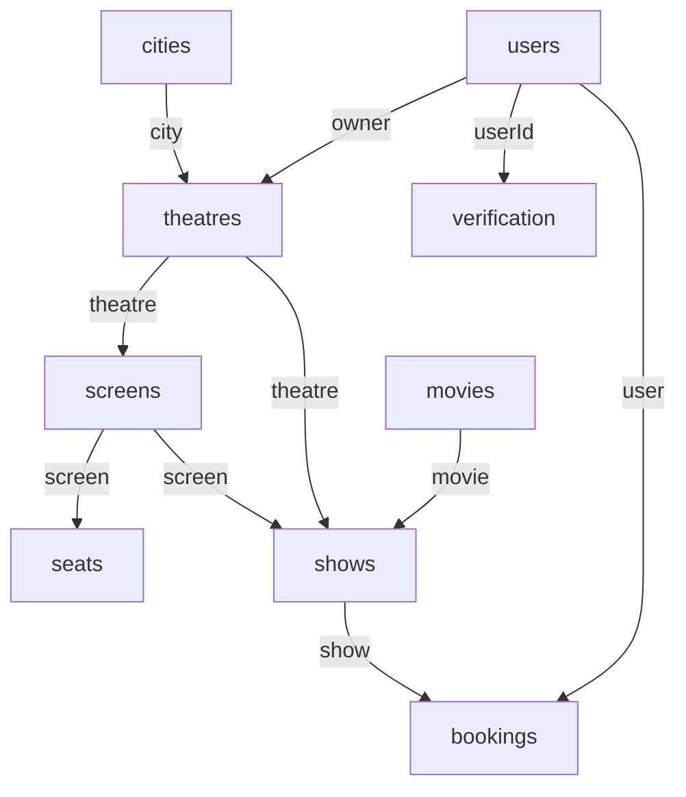

# Database Schema

The backend uses MongoDB through Mongoose. All schemas are timestamped except where noted by Mongoose defaults. Collection names are explicitly lower-case plural names through `mongoose.model()`.

## users

Source: `Server/models/userSchema.js`

| Field | Type | Required | Constraints / Default | Notes |
| --- | --- | --- | --- | --- |
| `name` | `String` | Yes | - | Display name |
| `email` | `String` | Yes | `unique` | Login identifier and email delivery target |
| `phone` | `Number` | Yes | `unique` | Profile phone number |
| `password` | `String` | Yes | - | bcrypt hash, never returned by profile APIs |
| `role` | `String` | Yes | enum `admin`, `partner`, `user`; default `user` | Drives navigation and dashboard behavior |
| `emailVerified` | `Boolean` | No | default `false` | Required before normal login |
| `twoFactorEnabled` | `Boolean` | No | default `true` | Email 2FA toggle |
| `resetToken` | `String` | No | - | Password reset JWT |
| `resetTokenExpiry` | `Date` | No | - | Password reset expiry |
| `tokenVersion` | `Number` | No | default `0` | Incremented on password/email changes |
| `createdAt`, `updatedAt` | `Date` | Auto | timestamps | Managed by Mongoose |

## movies

Source: `Server/models/movieSchema.js`

| Field | Type | Required | Constraints / Default | Notes |
| --- | --- | --- | --- | --- |
| `movieName` | `String` | Yes | `unique` | Duplicate checked before creation |
| `description` | `String` | Yes | - | Synopsis/details |
| `duration` | `Number` | Yes | - | Duration in minutes |
| `genre` | `Array` | Yes | - | Stored as array |
| `language` | `Array` | Yes | - | Stored as array |
| `releaseDate` | `Date` | Yes | - | Movie list sorted descending by this field |
| `poster` | `String` | Yes | - | Poster URL |
| `createdAt`, `updatedAt` | `Date` | Auto | timestamps | Managed by Mongoose |

## cities

Source: `Server/models/citySchema.js`

| Field | Type | Required | Constraints / Default | Notes |
| --- | --- | --- | --- | --- |
| `cityCode` | `String` | No | trimmed, uppercase, unique sparse, `2-5` letters | Business identifier such as `BLR`; MongoDB `_id` remains the primary reference |
| `cityName` | `String` | Yes | trimmed | Display city name |
| `state` | `String` | Yes | trimmed | State or region |
| `country` | `String` | Yes | trimmed | Country |
| `isActive` | `Boolean` | No | default `true` | Inactive cities remain stored but are blocked for new theatre mapping |
| `tier` | `String` | No | enum `TIER_1`, `TIER_2`, `TIER_3` | Stored for catalogue classification; not used for pricing |
| `location` | GeoJSON `Point` | No | coordinates `[longitude, latitude]` | Optional 2dsphere-indexed city location |
| `createdAt`, `updatedAt` | `Date` | Auto | timestamps | Managed by Mongoose |

Indexes:

```js
{ cityName: 1, state: 1, country: 1 } // unique
{ cityCode: 1 } // unique, sparse
{ location: "2dsphere" }
```

`cityCode`, `tier`, and `location` are optional for backward compatibility with City records created before Phase 1.1.

## theatres

Source: `Server/models/theatreSchema.js`

| Field | Type | Required | Constraints / Default | Notes |
| --- | --- | --- | --- | --- |
| `name` | `String` | Yes | - | Duplicate checked before creation |
| `address` | `String` | Yes | - | Used in tickets and display |
| `phone` | `Number` | Yes | - | Theatre contact |
| `email` | `String` | Yes | - | Theatre contact |
| `owner` | `ObjectId` | No | ref `users` | Partner owner |
| `city` | `ObjectId` | No | ref `City` | Optional Phase 1 city mapping; not required for legacy theatres |
| `isActive` | `Boolean` | No | default `false` | Theatre status |
| `createdAt`, `updatedAt` | `Date` | Auto | timestamps | Managed by Mongoose |

## screens

Source: `Server/models/screenSchema.js`

| Field | Type | Required | Constraints / Default | Notes |
| --- | --- | --- | --- | --- |
| `theatre` | `ObjectId` | Yes | ref `theatres` | Parent Theatre |
| `name` | `String` | Yes | trimmed | Auditorium label such as `Screen 1` or `Audi 1` |
| `screenNumber` | `Number` | Yes | positive integer | Unique within the Theatre |
| `capacity` | `Number` | Yes | positive integer | Configured auditorium capacity; not derived from Seat documents |
| `isActive` | `Boolean` | No | default `true` | Deactivated screens remain available for historical Show references |
| `createdAt`, `updatedAt` | `Date` | Auto | timestamps | Managed by Mongoose |

Index:

```js
{ theatre: 1, screenNumber: 1 } // unique
```

`Screen.capacity` is the source of truth for physical auditorium capacity. Active Seat documents for a Screen must remain less than or equal to this value. Seat creation, bulk creation, and re-enable operations cannot exceed capacity, and Screen capacity cannot be reduced below the current active Seat count. Seats are not automatically deleted or disabled when capacity changes.

## seats

Source: `Server/models/seatSchema.js`

| Field | Type | Required | Constraints / Default | Notes |
| --- | --- | --- | --- | --- |
| `screen` | `ObjectId` | Yes | ref `Screen` | Parent physical auditorium |
| `seatNumber` | `String` | Yes | trimmed, uppercase | Stable physical Seat label such as `A1` |
| `row` | `String` | Yes | trimmed, uppercase letters | Physical row label |
| `column` | `Number` | Yes | positive integer | Physical column within the row |
| `seatType` | `String` | Yes | enum `STANDARD`, `PREMIUM`, `RECLINER`; default `STANDARD` | Physical Seat category |
| `isActive` | `Boolean` | No | default `true` | Disabled Seats remain stored and can be re-enabled |
| `createdAt`, `updatedAt` | `Date` | Auto | timestamps | Managed by Mongoose |

Indexes:

```js
{ screen: 1, seatNumber: 1 } // unique
{ screen: 1, row: 1, column: 1 } // unique
```

Seat labels are unique within a Screen, not globally. `seatNumber` follows the canonical rule `seatNumber = row + column`, for example `A + 1 = A1` and `AA + 15 = AA15`.

Layout status is derived from active Seat count:

| State | Rule | Meaning |
| --- | --- | --- |
| `INCOMPLETE` | `activeSeatCount < Screen.capacity` | Physical layout is still being configured |
| `COMPLETE` | `activeSeatCount === Screen.capacity` | Physical layout is fully configured |
| Invalid | `activeSeatCount > Screen.capacity` | Prevented by service-level validation |

## shows

Source: `Server/models/showSchema.js`

| Field | Type | Required | Constraints / Default | Notes |
| --- | --- | --- | --- | --- |
| `name` | `String` | Yes | - | Show label |
| `date` | `Date` | Yes | - | Used with movie id to fetch theatres/shows |
| `time` | `String` | Yes | - | Display and ticket time |
| `movie` | `ObjectId` | Yes | ref `movies` | Populated in show and booking APIs |
| `ticketPrice` | `Number` | Yes | - | Per-seat price |
| `totalSeats` | `Number` | Yes | - | Seat layout capacity |
| `bookedSeats` | `[String]` | No | default `[]` | Seat ids like `A1`, `A2`; updated atomically during booking |
| `theatre` | `ObjectId` | Yes | ref `theatres` | Populated in show and booking APIs |
| `screen` | `ObjectId` | No | ref `Screen` | Optional for legacy Shows; new UI submits it explicitly |
| `createdAt`, `updatedAt` | `Date` | Auto | timestamps | Managed by Mongoose |

## bookings

Source: `Server/models/bookingSchema.js`

| Field | Type | Required | Constraints / Default | Notes |
| --- | --- | --- | --- | --- |
| `show` | `ObjectId` | Yes | ref `shows` | Booked show |
| `user` | `ObjectId` | Yes | ref `users` | Booking owner |
| `seats` | `[String]` | Yes | - | Seat ids |
| `seatType` | `String` | No | default `Standard` | Seat category label |
| `transactionId` | `String` | Yes | - | Razorpay payment id |
| `orderId` | `String` | Yes | - | Razorpay order id |
| `receipt` | `String` | Yes | - | Razorpay receipt |
| `bookingId` | `String` | Yes | `unique`, indexed | 7-character public reference |
| `amount` | `Number` | Yes | - | Stored in rupees after server divides paise by 100 |
| `convenienceFee` | `Number` | No | default `0` | Fee component |
| `gstPercent` | `Number` | No | default `18` | GST applied to convenience fee calculations |
| `paymentMethod` | `String` | No | default `N/A` | Client-selected payment method label |
| `ticketStatus` | `String` | No | enum `Confirmed`, `Cancelled`, `Pending`; default `Confirmed` | Booking status |
| `createdAt`, `updatedAt` | `Date` | Auto | timestamps | Managed by Mongoose |

## verification

Source: `Server/models/verificationSchema.js`

| Field | Type | Required | Constraints / Default | Notes |
| --- | --- | --- | --- | --- |
| `userId` | `ObjectId` | Yes | ref `users` | User receiving verification |
| `code` | `String` | Yes | - | 6-digit code generated in `email.js` |
| `type` | `String` | Yes | enum `email`, `2fa`, `reverify`, `email-change` | Verification workflow type |
| `metadata` | `Mixed` | No | default `{}` | Stores email-change metadata such as old/new email |
| `expiresAt` | `Date` | Yes | - | Set to 10 minutes after creation |
| `createdAt`, `updatedAt` | `Date` | Auto | timestamps | Managed by Mongoose |

## Relationship Notes



Deletion behavior in controllers:

| Action | Controller behavior |
| --- | --- |
| Delete account | Deletes verification records, bookings, and theatres owned by the user, then deletes the user |
| Delete movie | Deletes the movie document only; related shows/bookings are not cascaded in current code |
| Delete theatre | Deletes the theatre document only; related shows/bookings are not cascaded in current code |
| Delete screen | Hard-deletes screens with no Show references; deactivates screens referenced by Shows |
| Delete seat | Logically disables the Seat by setting `isActive=false`; physical identity is retained |
| Delete show | Deletes the show document only; related bookings are not cascaded in current code |

Physical Seat documents are currently used for Admin/Partner Screen configuration. Customer booking remains compatible with the existing dynamic `SeatLayout.jsx` path: `Booking.seats` and `Show.bookedSeats` continue storing string labels, and customer Seat selection does not yet read the physical Seat collection.
