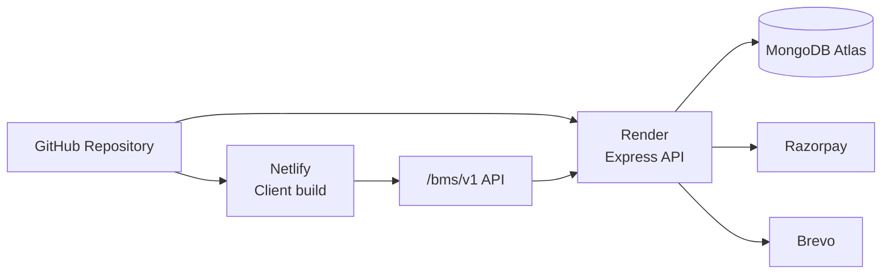

# Deployment Guide

## Live Environments

| Surface | URL |
| --- | --- |
| GitHub repository | https://github.com/Shravan-509/BookMyShow |
| Live frontend | https://bkmyshow.netlify.app |
| Frontend host | Netlify |
| Backend host | Render |
| Database | MongoDB Atlas |

## Deployment Architecture



## Frontend Deployment

| Setting | Value |
| --- | --- |
| Base directory | `Client` |
| Build command | `npm run build` |
| Publish directory | `dist` |
| SPA fallback | `Client/public/_redirects` |

Required variables:

```env
VITE_API_URL=https://<render-backend-domain>/bms/v1
VITE_RAZORPAY_KEY_ID=<razorpay-public-key>
```

## Backend Deployment

| Setting | Value |
| --- | --- |
| Base directory | `Server` |
| Build command | `npm install` or `npm ci` |
| Start command | `npm start` |
| Runtime | Node.js |

Required variables:

```env
PORT=3000
NODE_ENV=production
PUBLIC_APP_URL=https://bkmyshow.netlify.app
MONGODB_CONNECTION_STRING=<mongodb-atlas-uri>
JWT_SECRET=<long-random-secret>
RAZORPAY_KEY_ID=<razorpay-key-id>
RAZORPAY_KEY_SECRET=<razorpay-secret>
BREVO_API_KEY=<brevo-key>
BREVO_EMAIL_FROM=<verified-sender>
```

## Production Checklist

- Configure HTTPS on both frontend and backend.
- Confirm CORS `PUBLIC_APP_URL` matches the Netlify origin exactly.
- Use live/test Razorpay keys consistently across client and server.
- Verify Brevo sender and templates.
- Keep secrets out of Git and only in hosting provider environment variables.
- Confirm MongoDB Atlas network access and database user permissions.

