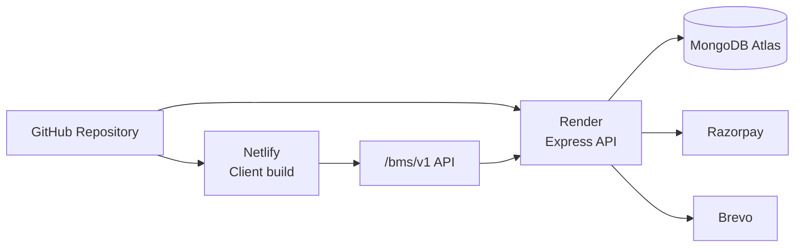

# Deployment Guide

## Live Environments

| Surface | URL |
| --- | --- |
| GitHub repository | https://github.com/Shravan-509/BookMyShow |
| Live frontend | https://bkmyshow.netlify.app |
| Frontend host | Netlify |
| Backend host | Render |
| Database | MongoDB Atlas |

## Deployment Architecture



## Frontend Deployment

| Setting | Value |
| --- | --- |
| Base directory | `Client` |
| Build command | `npm run build` |
| Publish directory | `dist` |
| SPA fallback | `Client/public/_redirects` |

Required variables:

```env
VITE_API_URL=/api
VITE_RAZORPAY_KEY_ID=<razorpay-public-key>
```

## Backend Deployment

| Setting | Value |
| --- | --- |
| Base directory | `Server` |
| Build command | `npm install` or `npm ci` |
| Start command | `npm start` |
| Runtime | Node.js |

Required variables:

```env
PORT=3000
NODE_ENV=production
PUBLIC_APP_URL=https://bkmyshow.netlify.app
CORS_ALLOWED_ORIGINS=https://bkmyshow.netlify.app
MONGODB_CONNECTION_STRING=<mongodb-atlas-uri>
JWT_SECRET=<long-random-secret>
RAZORPAY_KEY_ID=<razorpay-key-id>
RAZORPAY_KEY_SECRET=<razorpay-secret>
BREVO_API_KEY=<brevo-key>
BREVO_EMAIL_FROM=<verified-sender>
```

## Production Checklist

- Configure HTTPS on both frontend and backend.
- Confirm CORS `PUBLIC_APP_URL` matches the Netlify origin exactly.
- Use optional `CORS_ALLOWED_ORIGINS` for additional comma-separated preview or custom domains.
- If Netlify is configured with a same-site `/api/*` proxy to Render, set production `VITE_API_URL=/api`.
- Use live/test Razorpay keys consistently across client and server.
- Verify Brevo sender and templates.
- Keep secrets out of Git and only in hosting provider environment variables.
- Confirm MongoDB Atlas network access and database user permissions.

## City Migration

BookMyShow v2 Phase 1 adds optional `theatres.city` references. Existing theatre records continue to work without a city, so this migration is not required before deployment.

The backfill script is dry-run by default and skips ambiguous records rather than guessing from free-form addresses:

```bash
cd Server
node scripts/backfillTheatreCities.js --dry-run
node scripts/backfillTheatreCities.js --apply
```

Run `--apply` only after reviewing the dry-run summary and confirming legacy theatre records contain explicit `cityName`, `state`, and `country` fields.

## City Metadata Import

BookMyShow v2 Phase 1.1 adds optional `cityCode`, `tier`, and GeoJSON `location` metadata to City records. Existing City records remain valid without these fields.

The Indian city seed/import script accepts JSON or CSV input, defaults to dry-run mode, validates each record, and only writes when `--apply` is explicitly supplied:

```bash
cd Server
node scripts/importCities.js --file ./path/to/indian-cities.json
node scripts/importCities.js --file ./path/to/indian-cities.csv --apply
```

Review invalid, skipped, inserted, updated, and reused counts before running `--apply`. After all existing production cities have valid unique `cityCode` values, `cityCode` can be evaluated for a future required-field migration.

## Screen Configuration

BookMyShow v2 Phase 2 adds the Screen domain under Theatre. No automatic Screen migration is provided because existing Theatre and Show records do not contain reliable auditorium names, screen numbers, or capacities.

After deployment, configure real Screen records from the Admin/Partner Theatre screen management UI before creating new Screen-aware Shows. Existing Shows and Bookings continue to work because `Show.theatre` remains required and `Show.screen` is optional for legacy records.

## Show Screen Backfill

After real Screen records are configured, legacy Shows can be backfilled only when the relationship is deterministic. The script assigns `Show.screen` only for Theatres with exactly one active Screen and skips zero-screen or multi-screen Theatres:

```bash
cd Server
node scripts/backfillShowScreens.js
node scripts/backfillShowScreens.js --apply
```

The script is dry-run by default, does not create Screens or capacities, does not modify `Show.theatre` or Booking records, and is idempotent.
