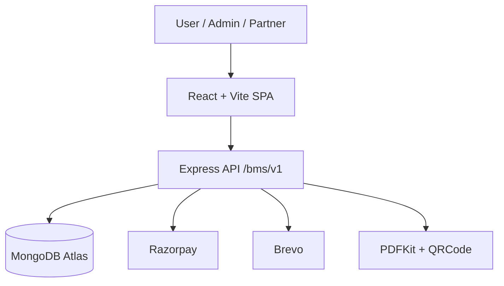
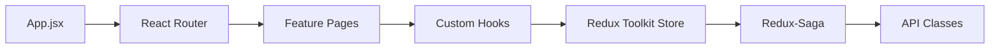
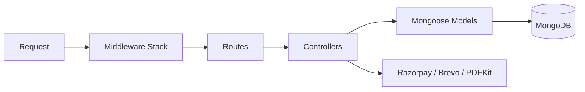
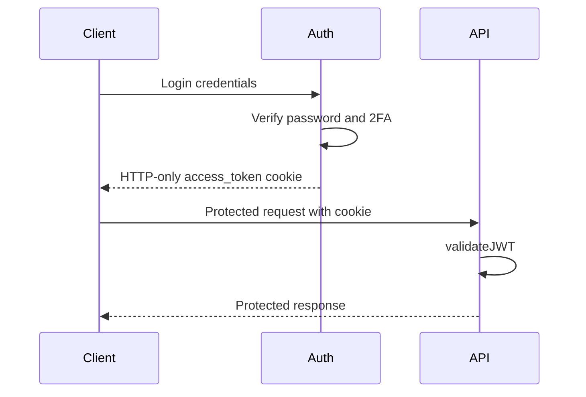
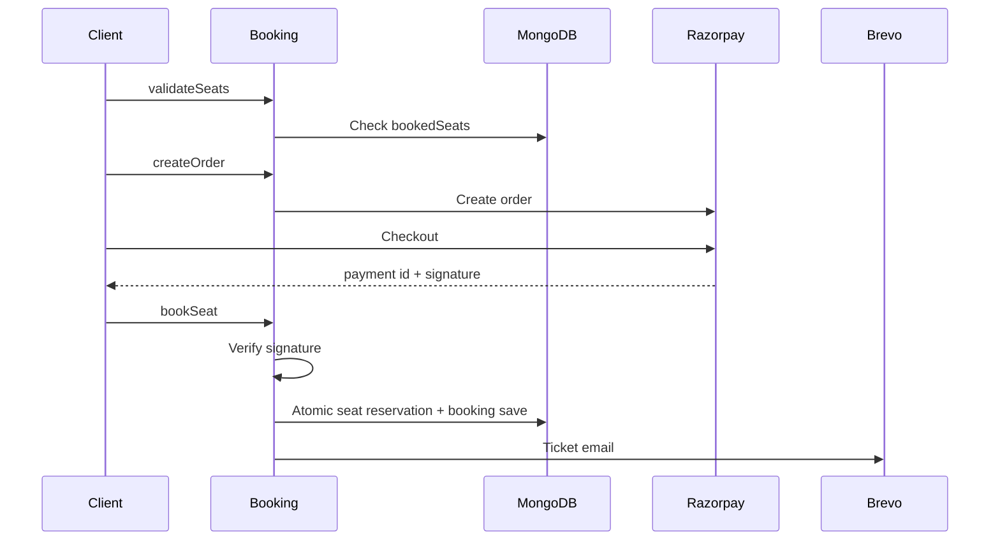
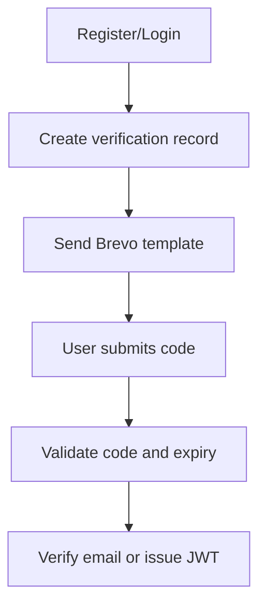
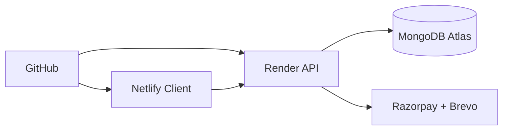

# Diagram Catalog

This file collects the core Mermaid diagrams reviewers expect for the project.

## System Architecture

## Frontend Architecture

## Backend Architecture

## JWT Flow

## Booking and Payment Flow

## Email Verification and 2FA

## Deployment Architecture

