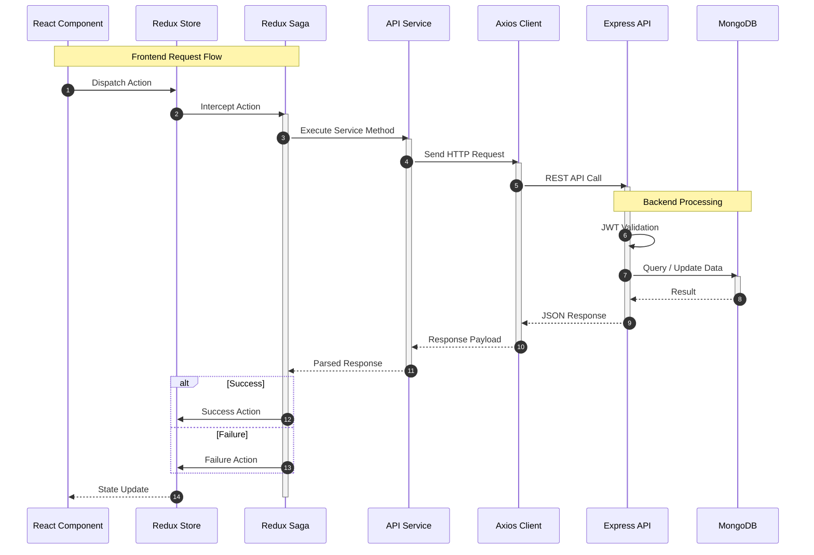
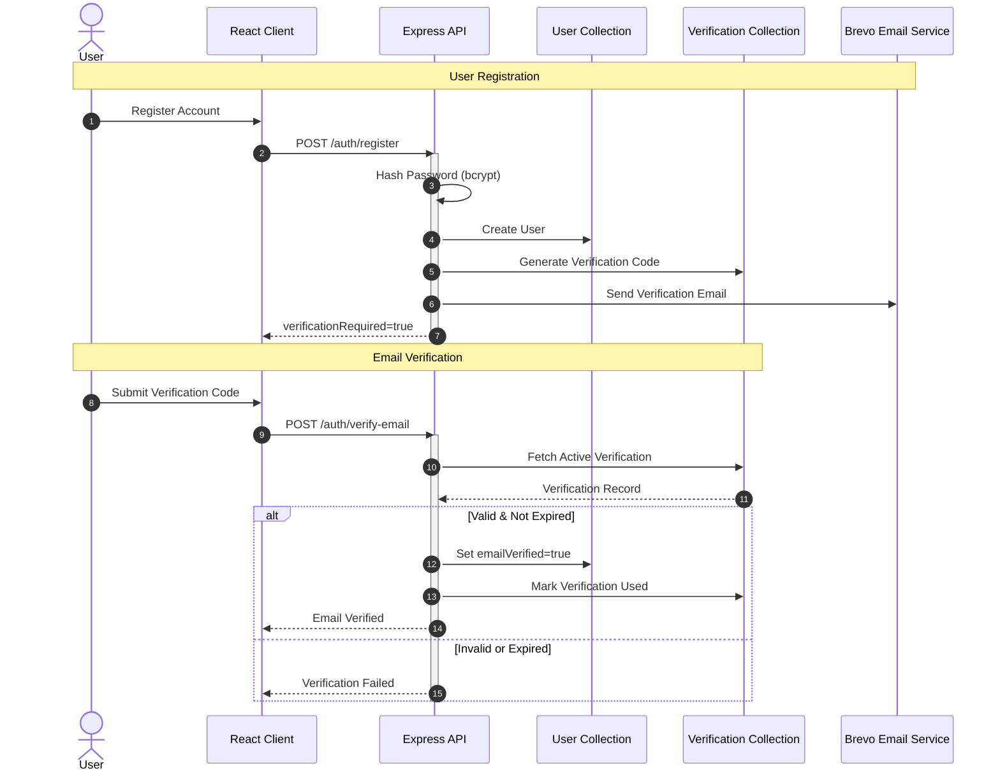
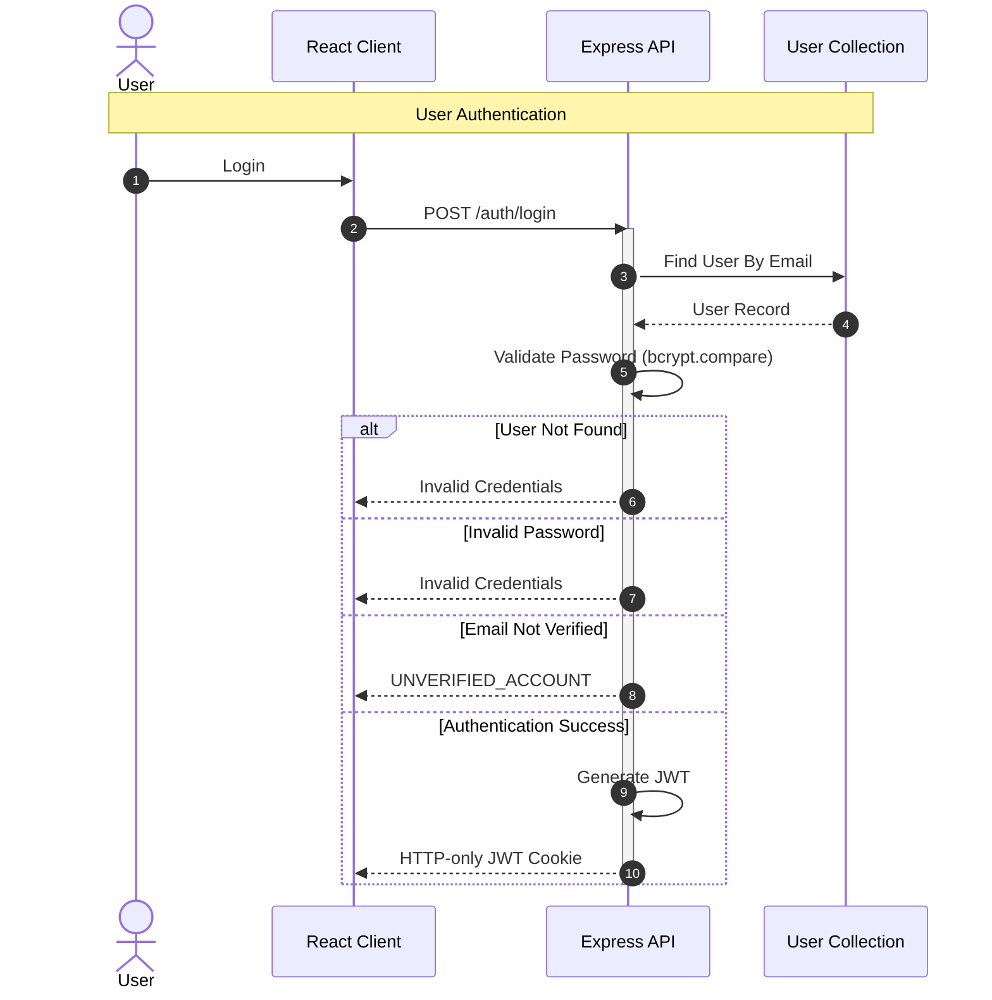
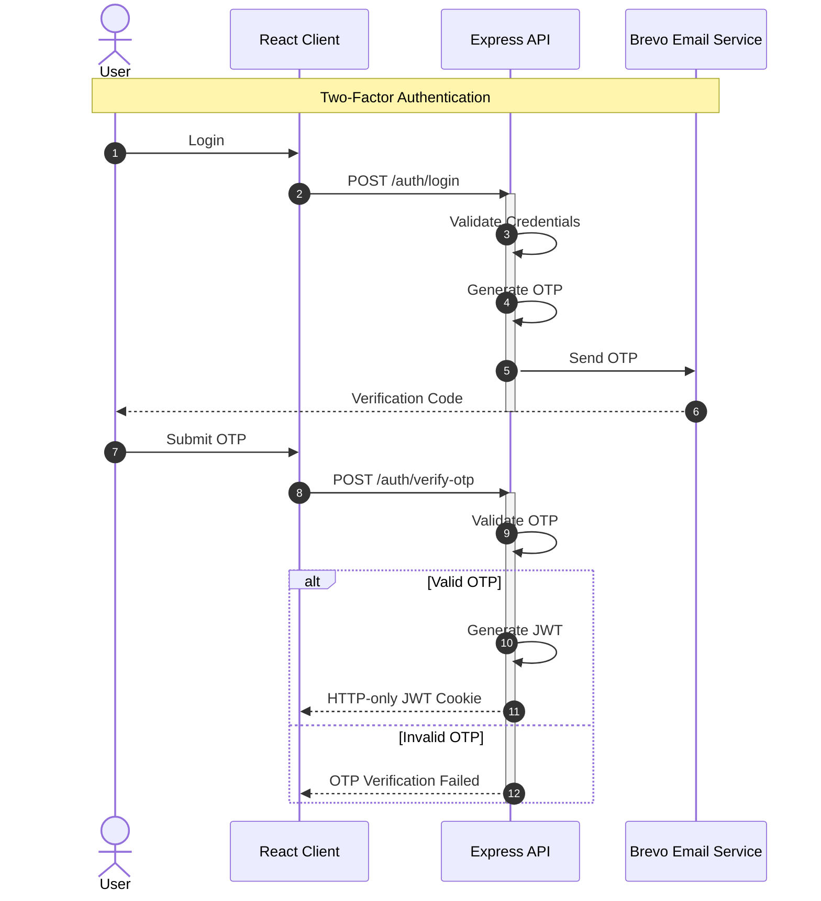
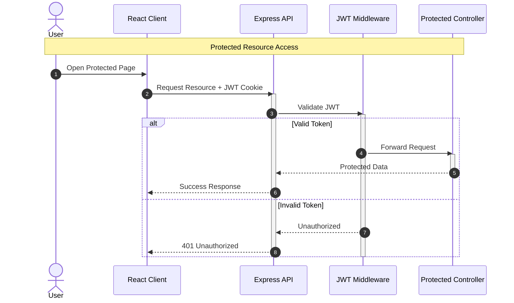
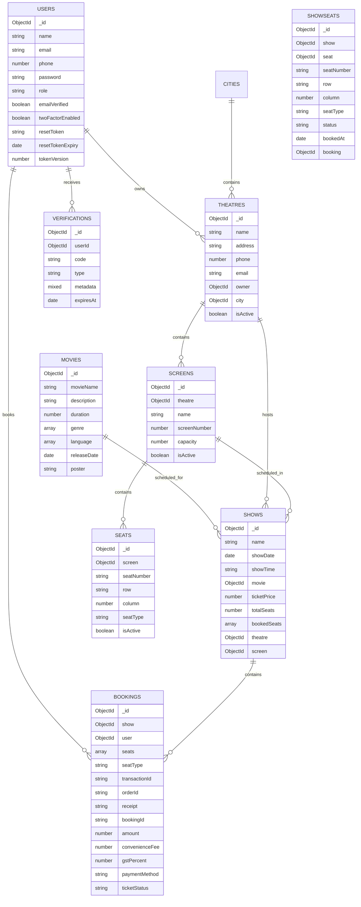
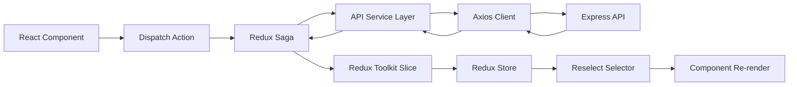
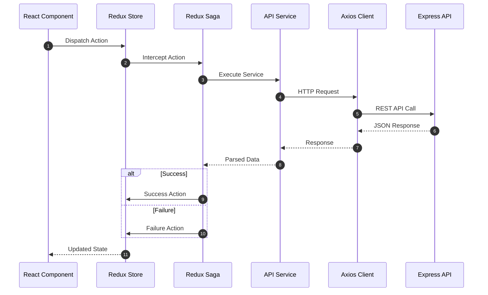
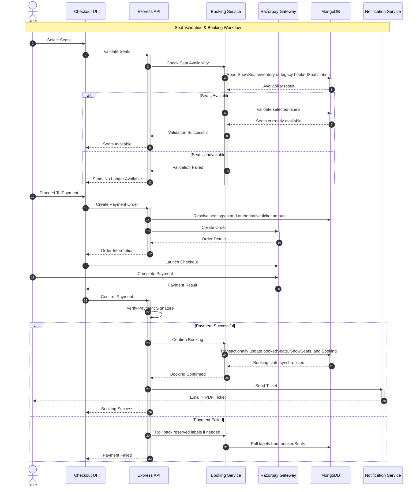

# BookMyShow Technical Project Documentation

## 1. Project Overview

BookMyShow is a MERN movie-ticket booking application with role-aware dashboards for customers, theatre partners, and administrators. The implementation includes authentication with email verification and optional two-factor authentication, movie, city, and theatre management, show scheduling, seat validation, Razorpay payments, booking persistence, ticket PDF generation, and transactional emails through Brevo.

The project is split into:

| Layer | Location | Responsibility |
| --- | --- | --- |
| Frontend | `Client/` | React + Vite UI, route guards, Redux Toolkit state, Redux-Saga side effects, Ant Design UI, Razorpay checkout launch |
| Backend | `Server/` | Express API, MongoDB access through Mongoose, JWT auth, payment verification, booking/ticket workflows |
| Shared documentation | `README.md`, `docs/` | Onboarding, architecture, API, schema, setup, and operational reference |

Primary user roles:

| Role | Capabilities in the current implementation |
| --- | --- |
| `user` | Browse movies, view shows, select seats, pay, receive tickets, view booking history, manage profile/security settings |
| `partner` | Manage theatres owned by the partner, optionally map theatres to active cities, manage screens, configure physical Seats, manage shows, view theatre bookings and revenue metrics |
| `admin` | Manage movies, cities, theatres, users, and all bookings |

## 2. Architecture Overview

```mermaid
flowchart LR

    %% ==========================================
    %% Frontend
    %% ==========================================

    User["User"]

    React["React + Vite"]

    Router["React Router"]

    Redux["Redux Toolkit"]

    Saga["Redux Saga"]

    ServiceClient["API Service Layer"]

    Axios["Axios"]

    %% ==========================================
    %% Backend
    %% ==========================================

    API["Express API"]

    Middleware["Security Middleware"]

    Controllers["Controllers"]

    Services["Business Services"]

    Repositories["Repositories"]

    %% ==========================================
    %% Database
    %% ==========================================

    MongoDB[("MongoDB Atlas")]

    %% ==========================================
    %% External Systems
    %% ==========================================

    Razorpay["Razorpay"]

    Brevo["Brevo"]

    PDF["PDFKit + QR Generator"]

    %% ==========================================
    %% Frontend Flow
    %% ==========================================

    User --> React

    React --> Router

    React --> Redux

    Redux --> Saga

    Saga --> ServiceClient

    ServiceClient --> Axios

    Axios --> API

    %% ==========================================
    %% Backend Flow
    %% ==========================================

    API --> Middleware

    Middleware --> Controllers

    Controllers --> Services

    Services --> Repositories

    Repositories --> MongoDB

    %% ==========================================
    %% Integrations
    %% ==========================================

    Services --> Razorpay

    Services --> Brevo

    Services --> PDF
```




BookMyShow v2 Phase 1 introduces the City domain as the first incremental service/repository-backed module. Phase 1.1 adds optional City metadata fields: `cityCode`, `tier`, and GeoJSON `location`. Phase 2 introduces the Screen domain as the physical auditorium inside a Theatre. Phase 3 introduces persistent physical Seat configuration under each Screen. Phase 4A introduces per-Show ShowSeat inventory snapshots initialized from physical Seats. Phase 4B connects customer booking to ShowSeat availability and per-show seat-type pricing.

Implemented v2 domain hierarchy:

```text
City -> Theatre -> Screen -> Seat
Movie -> Show -> Screen
Show -> ShowSeat -> Seat
Show -> ticketPricing
Show -> Booking
Booking -> seats String[]
Booking -> ticketAmount + seatPricing[]
```

Each Screen owns its own physical layout:

```text
Theatre
├── Screen 1
│   ├── A1
│   ├── A2
│   └── ...
└── Screen 2
    ├── A1
    ├── A2
    └── ...
```

Seat numbers are unique within a Screen, not globally. `Seat` represents persistent physical auditorium configuration, while `ShowSeat` represents the per-Show inventory snapshot copied from active physical Seats. `Show.theatre` remains required for booking compatibility and `Show.screen` remains optional for legacy Shows.

Phase status:

| Phase | Status |
| --- | --- |
| Phase 1 - City | Complete |
| Phase 2 - Screen | Complete |
| Phase 3 - Physical Seat Management | Complete |
| Phase 4A - ShowSeat Inventory Foundation | Complete |
| Phase 4B - Customer ShowSeat Booking + Pricing | Complete |
| Phase 5 - Seat Locking | Planned / Not Started |

Request flow:




## 3. Frontend Structure

The client is a React 19 application created around Vite. It uses feature folders for screens and global folders for API clients, reusable components, Redux, hooks, utilities, and assets.

| Path | Purpose |
| --- | --- |
| `Client/src/App.jsx` | Defines lazy-loaded routes, route guards, and initial auth check |
| `Client/src/api/` | Axios-backed API classes grouped by domain |
| `Client/src/components/` | Shared UI such as `MainLayout`, physical/legacy `SeatLayout`, `SeatRecommendation`, skeleton loaders |
| `Client/src/features/auth/pages/` | Login, registration, email verification, 2FA, password reset, reverification |
| `Client/src/features/home/pages/Home.jsx` | Authenticated movie listing/home experience |
| `Client/src/features/movies/pages/` | Movie details, show times, seat selection, checkout, booking history |
| `Client/src/features/profile/pages/` | Profile, password, email, security, reminder, and danger-zone tabs |
| `Client/src/features/admin/pages/` | Admin dashboard, movie management, theatre list, users, bookings |
| `Client/src/features/partner/pages/` | Partner dashboard, theatre management, screen management, physical Seat management, shows, theatre bookings, revenue |
| `Client/src/redux/` | Store, reducers, slices, sagas, action orchestration, including ShowSeat availability state |
| `Client/src/hooks/` | Domain hooks wrapping selectors and dispatches |
| `Client/src/utils/` | Date formatting, notifications, reminders, security validation, optimized image helpers, screen display helpers, and ticket pricing helpers |

Important frontend implementation details:

| Area | Implementation |
| --- | --- |
| Code splitting | `App.jsx` uses `React.lazy` and `Suspense` for major page bundles |
| Auth bootstrap | On mount, `App.jsx` dispatches `checkAuthStatus()` and lets the backend validate the HTTP-only auth cookie |
| Route protection | `ProtectedRoute` requires authentication; `PublicRoute` redirects authenticated users to `/home`; `UserRoute` blocks non-customer roles from customer booking routes |
| UI framework | Ant Design components and icons, with global styles in `App.css` and Tailwind utility classes |
| API transport | `axiosInstance` uses `VITE_API_URL` as base URL and `withCredentials: true` for cookie-based auth |

## 4. Backend Structure

The backend is an Express app mounted under `/bms/v1`.

| Path | Purpose |
| --- | --- |
| `Server/server.js` | App bootstrap, middleware stack, DB connection, route mounting, server startup |
| `Server/config/db.js` | Mongoose connection using `MONGODB_CONNECTION_STRING` |
| `Server/routes/` | Express routers for auth, users, movies, cities, theatres, screens, seats, shows, bookings |
| `Server/controllers/` | Request validation, business workflows, database operations, booking/payment synchronization, and external integrations |
| `Server/services/` | City, Screen, Seat, ShowSeat, and Show pricing business rules, Theatre ownership validation, capacity invariants, and reference validation |
| `Server/repositories/` | City, Screen, Seat, and ShowSeat database operations |
| `Server/models/` | Mongoose schemas for users, movies, cities, theatres, screens, seats, shows, showseats, bookings, verification codes |
| `Server/middlewares/authorization.js` | JWT validation and role-check helper |
| `Server/middlewares/performanceOptimization.js` | Helmet, compression, rate limiting, request timing/logging, cache headers |
| `Server/middlewares/cache.js` | Route-level in-memory GET response cache via `node-cache` |
| `Server/utils/email.js` | Verification, 2FA, password reset, security notification, and ticket emails |
| `Server/utils/ticket-pdf.js` | PDF ticket generation with PDFKit and QR codes |
| `Server/utils/idGenerator.js` | 7-character booking reference generation |

Middleware order in `server.js`:

1. JSON/urlencoded parsing and cookies.
2. Helmet security headers, compression, response-time header, request logging, cache headers.
3. Global rate limiter.
4. CORS with explicit allowed origins and credentials enabled.
5. Route mounting.
6. Central error handler.

## 5. Authentication & Authorization Flow

Authentication uses bcrypt password hashing, email-based verification codes, optional 2FA codes, JWTs, and an HTTP-only `access_token` cookie.

#### Registration & Email Verification Flow



#### Login & Authentication Flow



#### Two-Factor Authentication Flow



#### Authorization & Protected Route Flow


Authorization details:

| Mechanism | Current behavior |
| --- | --- |
| JWT validation | `validateJWT` reads `req.cookies.access_token`, `Authorization: Bearer`, or `x-auth-token`, verifies with `JWT_SECRET`, loads the user role, and sets `req.userId`/`req.user.role` |
| Cookie flags | `httpOnly`; `secure` only in production; `sameSite=None` in production and `Lax` locally |
| Route protection | Users, movies, theatres, shows, and bookings are protected in `server.js` |
| Role authorization | `validateRole(roles)` is mounted on clear admin/partner route groups, with controller-level partner ownership checks for theatre, show, booking, and revenue workflows |
| Session invalidation intent | `tokenVersion` is incremented on password/email changes, but JWT validation currently verifies only `userId` from token payload |

## 6. API Documentation

All backend routes are mounted under `/bms/v1`. Local development can set `VITE_API_URL` to `http://localhost:3000/bms/v1`; production should use `/api` when the Netlify proxy forwards `/api/*` to the Render backend.

Focused endpoint reference is maintained in [API_REFERENCE.md](./API_REFERENCE.md).

High-level route groups:

| Group | Base path | Protection |
| --- | --- | --- |
| Auth | `/auth` | Public, with stricter auth rate limiter |
| Users | `/users` | JWT required |
| Movies | `/movies` | JWT required |
| Theatres | `/theatres` | JWT required |
| Cities | `/cities` | JWT required for reads; admin role required for create/update/deactivate |
| Screens | `/screens` and `/theatres/:theatreId/screens` | JWT plus admin/partner role; partner access derives from Theatre ownership |
| Seats | `/seats` and `/screens/:screenId/seats` | JWT plus admin/partner role; partner access derives from Screen -> Theatre ownership |
| Shows | `/shows` | JWT required |
| Bookings | `/bookings` | JWT required plus stricter booking rate limiter |

## 7. Database Schema / Models

Focused model reference is maintained in [DATABASE_SCHEMA.md](./DATABASE_SCHEMA.md).



## 8. State Management (Redux)

Redux Toolkit handles state updates and Redux-Saga handles side effects. `redux-persist` persists the combined root reducer to browser storage. On `logout`, the root reducer resets all slices.

| Slice | Main responsibility |
| --- | --- |
| `auth` | Login/signup/check-auth/logout status, user identity, auth errors |
| `verification` | Email verification, 2FA, reverification modals, resend countdown |
| `forgotPassword` | Forgot/reset password request state |
| `profile` | Profile fetch/update, password/email changes, 2FA toggle, account deletion |
| `movie` | Movie list, selected movie, CRUD state |
| `theatre` | Theatre list and CRUD state |
| `screen` | Theatre-specific Screen list and Screen create/update/delete workflows |
| `seat` | Physical Seat list and Screen layout summary by Screen; Seat create/update/disable/re-enable and bulk layout workflows |
| `show` | Show CRUD, selected show, theatres with shows for a movie |
| `booking` | Seat validation, booking creation, booking lists, revenue, Razorpay order state |
| `user` | Admin user listing |
| `ui` | Auth tab and login UI errors |
| `loader` | Global loading flag |

### Saga orchestration:
#### Overview
Redux Saga serves as the orchestration layer for managing asynchronous workflows across the BookMyShow application. Instead of allowing React components to directly interact with backend APIs, components dispatch Redux actions that are intercepted by Saga watchers. These watchers coordinate API communication, handle side effects, process responses, and update the Redux store.

This architecture provides a clear separation between the presentation layer, business workflows, and API communication, making the application easier to maintain, test, and scale.

#### Architecture Flow
The following diagram illustrates how different application layers interact during asynchronous operations.



#### Request Lifecycle
The following sequence diagram demonstrates the runtime execution flow of an asynchronous request.



#### Benefits

- Centralized management of asynchronous workflows.
- Consistent API request and response handling.
- Reduced complexity in React components.
- Improved maintainability and testability.
- Clear separation between UI, business logic, and API communication.
- Scalable architecture for complex workflows such as authentication, booking, and payments.

## 9. Routing Flow

Frontend route table:

| Route | Component | Guard |
| --- | --- | --- |
| `/` | `AuthTabs` | Public only |
| `/no-auth/reset-password` | `ResetPassword` | Public |
| `/home` | `Home` | Authenticated |
| `/my-profile/edit` | `Profile` | Authenticated |
| `/admin` | `Admin` | Authenticated |
| `/partner` | `Partner` | Authenticated |
| `/movie/:id/:date` | `MovieDetails` | Authenticated `user` role |
| `/booking/:id` | `SeatSelection` | Authenticated `user` role |
| `/my-profile/purchase-history` | `Bookings` | Authenticated `user` role |
| `*` | Redirect to `/` | Fallback |

The `MainLayout` adapts navigation by user role:

| Role | Main role navigation |
| --- | --- |
| `admin` | Admin Dashboard |
| `partner` | Partner Dashboard |
| `user` | My Bookings |

### Seat Management Flow

Admin and Partner users manage physical Seats from Partner Theatre Management through `ScreenManagement.jsx` and `SeatManagement.jsx`. Partner access remains limited to Screens that belong to their owned Theatres; admin users can manage Seats for any applicable Screen.

| Operation | Behavior |
| --- | --- |
| Create Seat | Creates one physical Seat for the selected Screen; the UI derives `seatNumber` from row and column |
| Edit Seat | Updates row, column, seat type, or status while preserving the Screen relationship |
| Disable Seat | Logical delete only; sets `isActive=false` and retains physical identity |
| Re-enable Seat | Restores `isActive=true` only if active Seat count remains within Screen capacity |
| Manual bulk rows | Creates irregular row layouts with start/end columns, seat type, and optional excluded columns |
| Sequential rows | Generates large regular layouts such as `A1-A30` through `AX1-AX30` and submits the same bulk API payload |

Sequential row generation uses spreadsheet-style row names: `A ... Z`, then `AA ... AZ`, `BA`, and beyond. Excluded columns represent consistent gaps or aisles and reduce the actual generated Seat count.

### ShowSeat Customer Booking

Phase 4A adds per-Show inventory snapshots, and Phase 4B uses those snapshots in customer booking for initialized screen-aware Shows.

| Aspect | Current implementation |
| --- | --- |
| Physical hierarchy | `City -> Theatre -> Screen -> Seat` |
| Per-Show inventory | `Show -> ShowSeat -> Seat` |
| Status values | `AVAILABLE`, `BOOKED` |
| Indexes | Unique `{ show, seat }`, `{ show, status }`, `{ show, seatNumber }` |
| New Show creation | Screen-aware Shows require a complete active Seat layout and initialize ShowSeats in the same MongoDB transaction as Show creation |
| Capacity snapshot | `Show.totalSeats` remains a compatibility snapshot derived from `Screen.capacity` |
| Update invariant | `Show.screen` cannot be changed after ShowSeat inventory exists |
| Delete behavior | Hard-deleting an initialized Show removes its ShowSeats in the same transaction |
| Customer availability | `GET /bms/v1/shows/:showId/seats` returns sanitized ShowSeat inventory for initialized Shows and `LEGACY` for no-screen Shows |
| Customer layout | `SeatLayout.jsx` renders actual ShowSeat rows, physical columns, missing-column gaps, booked/available states, and large-screen pan/zoom controls |
| Booking synchronization | Final booking updates `Show.bookedSeats`, matching ShowSeats, and Booking in one transaction for initialized Shows |
| Pricing | `Show.ticketPrice` remains the default; optional `Show.ticketPricing` overrides `STANDARD`, `PREMIUM`, and `RECLINER` |
| Booking price snapshot | New bookings store `ticketAmount` and `seatPricing[]`; `Booking.seats` remains `String[]` |
| Locking | No `LOCKED` status, lock owner, lock expiry, or TTL index exists yet |

Historical migration initialized 382 Shows into 243,728 ShowSeat documents. The final audit state is 382 `ALREADY_INITIALIZED`, 0 `READY`, 13 `BOOKED` ShowSeats, and 0 migration errors or warnings.

Customer `selectedSeats` and `Booking.seats` remain seat-label string arrays such as `["A1", "B11"]`; the frontend does not submit ShowSeat ids or authoritative prices. Checkout, booking history, PDF tickets, and email confirmations display Booking price snapshots where available and fall back to legacy `ticketPrice` calculations for older bookings.

The scheduler remains compatible with this model because it continues submitting `ticketPrice`; it does not explicitly configure `ticketPricing` yet, so scheduled Shows use the backend base-price fallback for all seat types.

## 10. Payment Integration

Razorpay is integrated with an order-create, server-side price calculation, signature verification, and amount-verification flow.



Payment implementation notes:

| Concern | Implementation |
| --- | --- |
| Order creation | `createOrder` accepts `showId`, `seats`, and `feePerTicket`; it resolves initialized ShowSeat seat types or legacy seats, applies `Show.ticketPricing` with `Show.ticketPrice` fallback, validates the ₹15-₹20 fee, recalculates GST/total, and creates a Razorpay order with the server-calculated paise amount |
| Client checkout | `Checkout.jsx` loads `https://checkout.razorpay.com/v1/checkout.js` dynamically and uses `VITE_RAZORPAY_KEY_ID` |
| Signature verification | `bookSeat` verifies `orderId|transactionId` with `RAZORPAY_KEY_SECRET`, fetches Razorpay order/payment data, and confirms the paid amount matches server-calculated pricing |
| Double-booking prevention | Initialized Shows use a MongoDB transaction plus conditional ShowSeat booking updates; legacy Shows use `Show.findOneAndUpdate({ _id, bookedSeats: { $nin: seats } }, { $push: { bookedSeats: { $each: seats } } })` |
| Rollback | Initialized Show booking failures roll back the transaction; legacy booking save failures pull labels back from `bookedSeats` |
| Ticket delivery | PDF generation and email prefer Booking price snapshots and are attempted after booking; failures are logged and do not cancel the booking |

## 11. Performance Optimizations

| Area | Implementation |
| --- | --- |
| Frontend code splitting | Lazy imports for major routes in `App.jsx` |
| Frontend perceived performance | Ant Design `Skeleton` and `Spin` loading states on selected movie, show, seat, and booking screens |
| Frontend render performance | `memo`, `useMemo`, `useCallback`, and Reselect selectors are used in several shared components/slices |
| Backend compression | `compression` middleware with threshold of 1KB |
| Backend cache headers | Static resources receive long-lived immutable cache headers; API responses default to `private, no-store` |
| Route-level cache | `node-cache` middleware remains on shared catalogue GET routes such as `GET /movies` and `GET /shows/:id`; role-dependent theatre/show-owner responses are not shared-cached |
| Rate limiting | General limiter plus stricter auth and booking limiters |
| Seat booking atomicity | MongoDB atomic update prevents concurrent booking of the same seats |

## 12. Security Enhancements

| Security area | Implementation |
| --- | --- |
| Password storage | bcrypt salt + hash in registration, password change, and reset |
| Email verification | 6-digit code stored in `verification` with 10-minute expiry |
| Two-factor authentication | Email 2FA code by default, toggleable from profile |
| JWT handling | HTTP-only cookie plus support for authorization headers |
| NoSQL injection mitigation | Evaluated as a recommended hardening measure; `express-mongo-sanitize` is not currently enabled |
| Headers | Helmet CSP, frameguard deny, no-sniff, XSS filter, HSTS, referrer policy |
| Rate limiting | `express-rate-limit` for global, auth, and booking routes |
| Payment verification | Razorpay HMAC signature verification plus expected order/payment amount verification on booking confirmation |
| Account lifecycle | Password/email changes clear auth cookie; account deletion cascades verification, booking, and owned theatre records |
| Client validation utilities | Email, phone, password strength, redirect URL, length, and sanitization helpers in `securityValidation.js` |

## 13. Environment Variables

Backend:

| Variable | Required | Used by | Purpose |
| --- | --- | --- | --- |
| `PORT` | No | `server.js` | API port, defaults to `3000` |
| `NODE_ENV` | No | server/auth/profile | Production cookie and security behavior |
| `PUBLIC_APP_URL` | Yes | CORS, password reset | Primary allowed frontend origin and reset-link base URL |
| `CORS_ALLOWED_ORIGINS` | No | CORS | Additional comma-separated frontend origins for previews or custom domains |
| `MONGODB_CONNECTION_STRING` | Yes | `config/db.js` | MongoDB connection |
| `JWT_SECRET` | Yes | auth/authorization | JWT signing and verification |
| `RAZORPAY_KEY_ID` | Yes for payments | booking controller | Razorpay server key id |
| `RAZORPAY_KEY_SECRET` | Yes for payments | booking controller | Razorpay signing secret |
| `BREVO_API_KEY` | Yes for email | email utility | Brevo transactional email API key |
| `BREVO_EMAIL_FROM` | Yes for email | email utility | Sender email address |

Frontend:

| Variable | Required | Used by | Purpose |
| --- | --- | --- | --- |
| `VITE_API_URL` | Yes | `Client/src/api/index.js` | Axios base URL, usually backend origin plus `/bms/v1`; use `/api` when a same-site proxy forwards to the backend |
| `VITE_RAZORPAY_KEY_ID` | Yes for payments | `Checkout.jsx` | Public Razorpay checkout key |

Example local values:

```env
# Server/.env
PORT=3000
NODE_ENV=development
PUBLIC_APP_URL=http://localhost:5173
CORS_ALLOWED_ORIGINS=http://localhost:5173
MONGODB_CONNECTION_STRING=mongodb://localhost:27017/bookmyshow
JWT_SECRET=replace-with-a-long-random-secret
RAZORPAY_KEY_ID=rzp_test_xxxxx
RAZORPAY_KEY_SECRET=xxxxx
BREVO_API_KEY=xxxxx
BREVO_EMAIL_FROM=noreply@example.com
```

```env
# Client/.env
VITE_API_URL=http://localhost:3000/bms/v1
VITE_RAZORPAY_KEY_ID=rzp_test_xxxxx
```

City backfill:

```bash
cd Server
node scripts/backfillTheatreCities.js --dry-run
node scripts/backfillTheatreCities.js --apply
```

The script is idempotent, defaults to dry-run behavior, reuses existing City records through upsert, preserves legacy theatre location/address data, and skips ambiguous records that do not contain explicit `cityName`, `state`, and `country` fields.

City metadata import:

```bash
cd Server
node scripts/importCities.js --file ./path/to/indian-cities.json
node scripts/importCities.js --file ./path/to/indian-cities.csv --apply
```

The metadata importer defaults to dry-run mode, accepts JSON or CSV input, maps `city_id` to `cityCode`, maps `city_name` to `cityName`, stores GeoJSON coordinates as `[longitude, latitude]`, and reports inserted, updated, reused, skipped, and invalid records.

Show screen backfill:

```bash
cd Server
node scripts/backfillShowScreens.js
node scripts/backfillShowScreens.js --apply
```

The Show screen backfill is dry-run by default and updates only `Show.screen` when a legacy Show belongs to a Theatre with exactly one active Screen. It skips already assigned Shows, Theatres with no active Screens, and multi-screen Theatres where the correct Screen cannot be determined safely.

## 14. Folder Structure

```text
BookMyShow/
├── .github/
│   ├── ISSUE_TEMPLATE/
│   ├── workflows/
│   │   └── ci.yml
│   ├── PULL_REQUEST_TEMPLATE.md
│   └── dependabot.yml
│
├── Client/
│   ├── public/
│   ├── src/
│   │   ├── api/
│   │   ├── assets/
│   │   ├── components/
│   │   ├── features/
│   │   │   ├── admin/
│   │   │   ├── auth/
│   │   │   ├── home/
│   │   │   ├── movies/
│   │   │   ├── partner/
│   │   │   └── profile/
│   │   ├── hooks/
│   │   ├── redux/
│   │   │   ├── actions/
│   │   │   ├── reducers/
│   │   │   ├── sagas/
│   │   │   ├── slices/
│   │   │   └── store.js
│   │   ├── test/
│   │   │   ├── setup.js
│   │   │   └── renderWithProviders.jsx
│   │   ├── utils/
│   │   ├── App.jsx
│   │   ├── App.test.jsx
│   │   └── main.jsx
│   ├── eslint.config.js
│   ├── package.json
│   └── vite.config.js
│
├── Server/
│   ├── config/
│   ├── controllers/
│   ├── middlewares/
│   ├── models/
│   ├── repositories/
│   ├── routes/
│   ├── scripts/
│   ├── services/
│   ├── tests/
│   │   ├── helpers/
│   │   ├── integration/
│   │   └── unit/
│   ├── utils/
│   │   └── email_templates/
│   ├── jest.config.js
│   ├── package.json
│   └── server.js
│
├── docs/
│   ├── screenshots/
│   ├── API_REFERENCE.md
│   ├── ARCHITECTURE.md
│   ├── DATABASE.md
│   ├── DATABASE_SCHEMA.md
│   ├── DEPLOYMENT.md
│   ├── DIAGRAMS.md
│   ├── ERROR_HANDLING.md
│   ├── FOLDER_STRUCTURE.md
│   ├── PERFORMANCE.md
│   ├── PROJECT_DOCUMENTATION.md
│   ├── SCREENSHOTS.md
│   ├── SECURITY.md
│   └── STATE_MANAGEMENT.md
│
├── .gitignore
├── CHANGELOG.md
├── CODE_OF_CONDUCT.md
├── CONTRIBUTING.md
├── LICENSE
├── README.md
└── SECURITY.md
```

## 15. Reusable Components & Utilities

| Module | Responsibility |
| --- | --- |
| `MainLayout.jsx` | Authenticated shell with role-aware navigation, drawer menu, header, footer, logout |
| `SeatLayout.jsx` | Interactive seat grid, booked/selected states, mouse/touch pan, wheel/pinch zoom |
| `SeatRecommendation.jsx` | Scores seat groups based on center position, viewing distance, aisle/back preferences |
| `SeatManagement.jsx` | Admin/Partner physical Seat configuration UI under Screen Management |
| `seatManagementUtils.js` | Seat label derivation, excluded-column parsing, sequential row generation, and preview calculations |
| `notificationUtils.js` | Unified Ant Design `message`/`notification` helper |
| `dateFormatter.js` | date-fns helpers replacing heavier date libraries |
| `format-duration.js` | Converts movie duration minutes into `xh ym` display |
| `reminderUtils.js` | LocalStorage booking reminders and notification trigger checks |
| `securityValidation.js` | Client-side validation/sanitization helpers |
| `reduxSelectors.js` | Shared memoized selectors for auth, movies, shows, theatres, bookings, and users |

Backend utilities:

| Module | Responsibility |
| --- | --- |
| `email.js` | Verification, 2FA, reset, security, and ticket emails with HTML templates |
| `ticket-pdf.js` | Generates a styled e-ticket PDF with movie details, QR code, seats, and payment summary |
| `idGenerator.js` | Generates 7-character alphanumeric booking IDs |

## 16. Deployment Details

The codebase is structured for separate frontend and backend deployments.

| Target | Expected deployment |
| --- | --- |
| Frontend | Static Vite build from `Client/`, commonly Netlify. `Client/public/_redirects` supports SPA fallback routing. |
| Backend | Node service from `Server/`, commonly Render or similar. |
| Database | MongoDB Atlas or another MongoDB-compatible deployment. |
| External services | Razorpay account for payments, Brevo account for transactional email. |

Deployment checklist:

1. Set `PUBLIC_APP_URL` on the server to the deployed frontend origin.
2. Add any preview/custom frontend origins to `CORS_ALLOWED_ORIGINS` as a comma-separated list.
3. Set production `VITE_API_URL=/api` so Netlify forwards `/api/*` to `https://bookmyshow-sycx.onrender.com/bms/v1/*`.
4. Enable HTTPS for production so `secure` cookies and `sameSite=None` work correctly.
5. Configure Razorpay test/live keys consistently on client and server.
6. Configure Brevo sender verification and `BREVO_EMAIL_FROM`.
7. Confirm CORS allows only the intended deployed frontend origins.

## 17. Error Handling Strategy

Backend controllers use `try/catch`, set an HTTP status where needed, and pass unexpected errors to `next(error)`. Known domain failures are usually returned directly from controllers with a consistent `success: false` and `message` shape.

The central `errorHandler` normalizes uncaught backend errors into the frontend-compatible shape:

```json
{
  "success": false,
  "message": "error message",
  "code": "OPTIONAL_SAFE_CODE"
}
```

It maps common Mongoose validation, invalid-id, duplicate-key, JWT, JSON parsing, Razorpay SDK, and API 404 cases to safe responses without exposing stack traces or provider/database internals. Examples include invalid credentials, unverified email, expired verification codes, unavailable seats, missing fields, payment replay, and duplicate movie/theatre/user records.

Frontend sagas normalize API errors by reading `error.response?.data?.message` where available, dispatching failure actions, and showing Ant Design notifications for important user-visible failures.

## 18. Logging / Monitoring

The current implementation includes lightweight application logging rather than a dedicated monitoring stack.

| Area | Current behavior |
| --- | --- |
| Request logging | `requestLogger` logs method, path, status code, and duration in milliseconds |
| Response timing | `X-Response-Time` header is added to responses |
| Cache visibility | Cached GET responses set `X-Cache: HIT` or `MISS` |
| Email/PDF failures | Ticket PDF and ticket email failures are logged and do not block successful booking persistence |
| Startup | DB connection success/failure and server port are logged |

No external observability provider, structured log sink, tracing, or alerting integration is currently present.

## 19. Future Enhancements

Implementation-aligned enhancements:

| Area | Enhancement |
| --- | --- |
| Authorization | Continue manual role-intent review for APIs whose backend access policy remains ambiguous |
| Token invalidation | Include and verify `tokenVersion` in JWT payloads after password/email changes |
| Booking lifecycle | Add cancellation/refund APIs and explicit payment status transitions |
| Webhooks | Add Razorpay webhook support for asynchronous payment reconciliation |
| Seat locking | Add `LOCKED` status, lock owner, lock expiry, conflict handling, and TTL cleanup |
| Booking analytics | Add screen, auditorium, seat-type revenue, occupancy, utilization, and dynamic-pricing analytics |
| Cache invalidation | Clear route-level caches after movie/theatre/show mutations |
| Tests | Add controller, saga, and route integration tests around auth, payments, and seat concurrency |
| Monitoring | Add structured logging, error tracking, and metrics dashboards |
| Reminders | Move reminder persistence from localStorage to backend-backed scheduled reminders |
| Data model | Add city/state/screens/amenities to theatres and cast/director/rating to movies if required by product scope |

## 20. Setup & Installation Instructions

Prerequisites:

| Tool | Purpose |
| --- | --- |
| Node.js `^20.19.0 || >=22.13.0` | Runtime for both client and server |
| npm | Dependency installation and scripts |
| MongoDB | Local or Atlas database |
| Razorpay account | Payment testing |
| Brevo account | Transactional email testing |

Backend setup:

```bash
cd Server
npm install
cp .env.example .env  # create manually if .env.example is not present
npm run dev
```

Frontend setup:

```bash
cd Client
npm install
cp .env.example .env  # create manually if .env.example is not present
npm run dev
```

Build commands:

```bash
cd Client
npm run build
npm run preview
```

```bash
cd Server
npm start
```

Verification checklist:

1. Open the Vite client, usually `http://localhost:5173`.
2. Register a user and confirm Brevo sends an email verification code.
3. Verify email, log in, and complete 2FA if enabled.
4. Seed or create movies, theatres, and shows through admin/partner screens.
5. Select a show, validate seats, create a Razorpay test payment, and confirm booking.
6. Confirm booking appears in purchase history and ticket email is sent.
