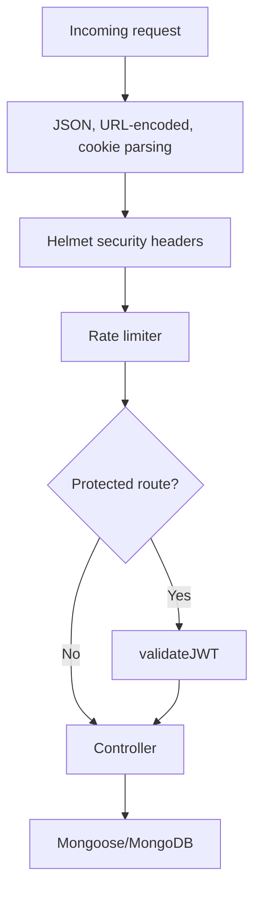

# Security Review

## Implemented Controls

| Area | Implementation |
| --- | --- |
| Password hashing | bcrypt salt and hash before storage |
| JWT | Signed token, validated by backend middleware |
| Cookie security | HTTP-only cookie, secure in production, SameSite tuned by environment |
| Rate limiting | General limiter, stricter auth limiter, stricter booking limiter |
| Security headers | Helmet with CSP, frameguard, HSTS, no-sniff, referrer policy |
| Payment verification | Razorpay HMAC signature and expected order/payment amount verification before booking persistence |
| Email verification | Short-lived verification records for email, 2FA, password reset, and email change flows |
| Sensitive response fields | Password and reset fields excluded from profile/admin user responses |

## Security Flow

## Authorization Model

The application implements role-aware frontend routing, backend role middleware on clear privileged route groups, and selected controller-level ownership validation.

| Layer | Current behavior |
| --- | --- |
| Frontend | `App.jsx` redirects unauthenticated users and restricts customer-only booking routes through `UserRoute` |
| JWT middleware | `validateJWT` protects users, movies, theatres, shows, and bookings route groups and attaches the authenticated user role |
| Backend role middleware | `validateRole(roles)` protects admin user/booking lists, movie administration, theatre management, show management, partner theatre bookings, and partner revenue routes |
| Ownership validation | Partner theatre/show/booking/revenue controllers verify authenticated ownership where applicable |

## Explicit Non-Claims

NoSQL injection mitigation was evaluated as part of the security review. `express-mongo-sanitize` is identified as a recommended hardening measure but is not currently enabled in the deployed implementation.

Razorpay webhook reconciliation is not implemented. The current payment flow verifies the Checkout signature and expected Razorpay order/payment amount during booking confirmation.

## Review Findings

| Priority | Finding | Recommendation |
| --- | --- | --- |
| Medium | `tokenVersion` is incremented but not validated in JWT middleware | Include token version in JWT payload and compare with user document |
| Medium | Cache invalidation is not triggered after movie/theatre/show mutations | Clear related node-cache entries after writes |
| Medium | No Razorpay webhook route exists for asynchronous reconciliation | Add webhook signature verification and payment reconciliation |
| Low | Console logs remain in selected frontend pages and non-critical backend paths | Replace with structured logger or remove non-actionable logs |

## Secret Handling

Never commit:

- `JWT_SECRET`
- `MONGODB_CONNECTION_STRING`
- `RAZORPAY_KEY_SECRET`
- `BREVO_API_KEY`
- Production `.env` files
