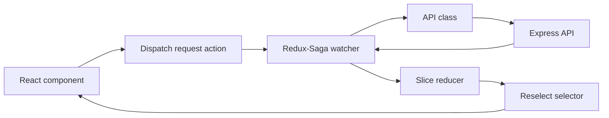

# State Management

The frontend uses Redux Toolkit with Redux-Saga and redux-persist.

## Store Lifecycle

## Slices

| Slice | Responsibility |
| --- | --- |
| `auth` | Login, signup, auth status check, user state, logout |
| `verification` | Email verification, 2FA, reverification, resend countdown |
| `forgotPassword` | Forgot password and reset password |
| `profile` | Profile, password/email changes, 2FA toggle, account deletion |
| `movie` | Movie list and CRUD state |
| `city` | Shared City list and admin City create/update/deactivate workflows |
| `theatre` | Theatre list and CRUD state |
| `screen` | Theatre-specific Screen list and Screen create/update/delete workflows |
| `seat` | Physical Seat list and layout summary by Screen; Seat create/update/disable/re-enable and bulk layout workflows |
| `show` | Show list, selected show, screen-aware show create/edit, theatre-by-movie results |
| `showSeat` | Customer ShowSeat availability inventory for a selected Show; cleared between Shows and populated by `/shows/:showId/seats` |
| `booking` | Seat validation, Razorpay order, booking creation, bookings, revenue |
| `user` | Admin user listing |
| `ui` | Auth tab and login error state |
| `loader` | Global loading flag |

## Booking Journey State

The Phase 4C booking journey keeps selected seats as string labels. `SeatSelection.jsx` owns the transient selection and ticket-count UI, while `showSeat` stores the fetched availability layout for the current Show. `Checkout.jsx` dispatches seat validation, Razorpay order creation, and booking confirmation through `bookingSlice` actions and navigates to `/booking-confirmation/:bookingId` only after `booking.bookingData` is populated by `bookSeatsSuccess`.

`BookingConfirmation.jsx` can read the most recent `booking.bookingData`, but its primary data path is React Router navigation state containing the returned Booking plus checkout Show context. Direct refresh without that state falls back to My Bookings because there is no single-booking retrieval action or customer-safe API endpoint.

## Persisted State

The root reducer is wrapped with `redux-persist`. On `logout`, the root reducer resets all slices by returning `undefined` state to the combined reducer.
