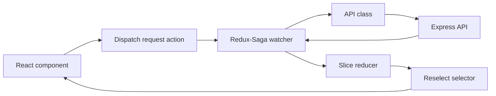

# State Management

The frontend uses Redux Toolkit with Redux-Saga and redux-persist.

## Store Lifecycle

## Slices

| Slice | Responsibility |
| --- | --- |
| `auth` | Login, signup, auth status check, user state, logout |
| `verification` | Email verification, 2FA, reverification, resend countdown |
| `forgotPassword` | Forgot password and reset password |
| `profile` | Profile, password/email changes, 2FA toggle, account deletion |
| `movie` | Movie list and CRUD state |
| `theatre` | Theatre list and CRUD state |
| `show` | Show list, selected show, theatre-by-movie results |
| `booking` | Seat validation, Razorpay order, booking creation, bookings, revenue |
| `user` | Admin user listing |
| `ui` | Auth tab and login error state |
| `loader` | Global loading flag |

## Persisted State

The root reducer is wrapped with `redux-persist`. On `logout`, the root reducer resets all slices by returning `undefined` state to the combined reducer.

